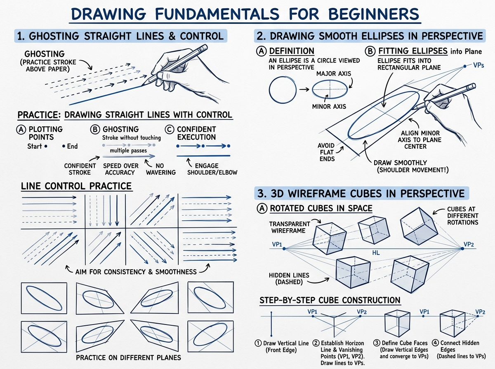

# บทเรียนที่ 0.1: การควบคุมเส้นและโครงสร้างกล่อง 3 มิติ (Line Quality & 3D Box Construction)

สวัสดีจ้ะน้องรัก! ยินดีต้อนรับเข้าสู่ก้าวแรกของการเป็นนักวาดนะจ๊ะ พี่สาว Art Mentor อยู่ตรงนี้เพื่อช่วยจับมือพาทำทีละสเต็ป ไม่ต้องกลัวว่าจะวาดไม่ตรงหรือเส้นเบี้ยวเลยนะ ศิลปะไม่ใช่เวทมนตร์ แต่เป็น "ทักษะของกล้ามเนื้อและการสังเกต (Motor Skill & Spatial Perception)" ที่ทุกคนฝึกฝนและเก่งขึ้นได้แน่นอนจ้ะ!

ก่อนที่เราจะไปวาดฉากอลังการ ออกแบบพรอพเท่ๆ หรือวาดตัวละครน่ารักๆ รากฐานที่แข็งแกร่งที่สุดเริ่มต้นจาก **"เส้นที่มั่นใจ (Confident Lines)"** และ **"ความเข้าใจในปริมาตร 3 มิติ (3D Volume)"** ผ่านรูปทรงเรขาคณิตพื้นฐานอย่าง "กล่องสี่เหลี่ยม (Box)" และ "วงรี (Ellipse)" นั่นเอง

---

## 📌 สรุปหลักการสำคัญ (Core Concepts)

### 1. การควบคุมเส้นและการใช้ข้อต่อร่างกาย (Drawing from Shoulder & Elbow)
เวลาวาดรูปคนส่วนใหญ่มักชินกับการเขียนหนังสือด้วย "ข้อมือ (Wrist)" แต่การเขียนหนังสือขยับพื้นที่เพียงไม่กี่เซนติเมตร ในขณะที่การวาดรูปต้องการเส้นที่ยาว นุ่มนวล และมั่นใจ

- **นิ้วและข้อมือ (Fingers & Wrist)**: ใช้เฉพาะการเก็บดีเทลเล็กจิ๋วหรือการสะกิดไฮไลต์เท่านั้น
- **ข้อศอก (Elbow)**: เหมาะสำหรับเส้นโค้งขนาดกลาง วงรีขนาดกลาง และการสะบัดแรเงา
- **หัวไหล่ทั้งแขน (Whole Arm from Shoulder)**: **นี่คือหัวใจหลัก!** ใช้หัวไหล่เป็นจุดหมุน ล็อคข้อมือให้นิ่ง ปล่อยให้แขนทั้งท่อนเคลื่อนไหวอิสระ เส้นจะตรง ทรงพลัง ไม่หยักสั่นคลอน

---

### 2. เทคนิค Ghosting Method (การซ้อมทาบวิถีก่อนลงมือจริง)
อย่าเพิ่งจรดปากกา/สไตลัสลงบนผืนผ้าใบหรือกระดาษทันที ให้ใช้เทคนิค 3 จังหวะนี้:
1. **Mark (กำหนดจุด)**: จุดจุดเริ่มต้น (Start Point) และจุดสิ้นสุด (End Point)
2. **Ghost (ซ้อมทาบ)**: ยกหัวปากกาลอยเหนือพื้นผิวเล็กน้อย แล้วกวัดแกว่งแขนจากจุดเริ่มไปยังจุดจบ 2-4 ครั้ง ซ้อมจังหวะความเร็วและทิศทางให้กล้ามเนื้อจดจำ (Muscle Memory)
3. **Commit (ลากจริงอย่างเด็ดขาด)**: จรดหัวปากกาแล้วลากผ่านในจังหวะเดียวด้วยความเร็วสม่ำเสมอ *ห้ามลังเล ห้ามย้ำเส้น* ถึงจะเบี้ยวก็ปล่อยผ่านแล้ววิเคราะห์เพื่อปรับปรุงในเส้นถัดไป

---

### 3. การวาดวงรีในเปอร์สเปกทีฟ (Ellipses in Perspective)
*(ดูภาพประกอบด้านบน: โซน 2 "Drawing Smooth Ellipses in Perspective")*

วงรีไม่ใช่แค่วงกลมบี้แบน แต่วงรีคือ "วงกลมสมบูรณ์ที่นอนอยู่ในระนาบ 3 มิติ" โดยมีองค์ประกอบสำคัญ 2 แกน:

- **Major Axis (แกนเอก)**: ด้านที่ยาวที่สุดของวงรี แบ่งวงรีออกเป็นซีกบน-ล่างที่สมมาตรกัน
- **Minor Axis (แกนโท)**: ด้านที่สั้นที่สุด ตั้งฉากกับ Major Axis เสมอ แกนนี้จะชี้ตรงไปยังทิศทางแกนหมุนของรูปทรงกระบอก (Cylinder Core)
- **Degree of Ellipse (ความอ้วนผอมของวงรี)**:
  - วงรีที่อยู่ในระดับสายตา (Horizon / Eye Level) จะมองเห็นเป็นเส้นตรง (Degree = 0°)
  - ยิ่งวงรีเคลื่อนตัวห่างออกจากระดับสายตา (มองต่ำลงไป หรือมองสูงขึ้นไป) วงรีจะยิ่งกลมอ้วนขึ้นเรื่อยๆ (Degree เพิ่มขึ้น) ตามมุมก้ม/เงยของสายตา

---

### 4. การหมุนกล่อง 3D ในอวกาศ (Rotated Cubes with Vanishing Points)
*(ดูภาพประกอบด้านบน: โซน 3 "3D Wireframe Cubes in Perspective")*

กล่องคือ "อิฐบล็อกก้อนแรกของจักรวาลการวาด" ทุกสิ่งในโลกสามารถย่อส่วนให้เป็นกล่องได้

- **กฎของการลู่เข้า (Convergence)**: เส้นคู่ขนานในโลกความจริง เมื่อทอดยาวออกไปในระยะ 3D **ต้องลู่เข้าหากันเสมอ** สู่จุดรวมสายตา (Vanishing Point - VP1, VP2)
- **เทคนิค Y-Method สำหรับขึ้นกล่อง 3 มิติ (Step-by-Step Cube Construction)**:
  1. **Draw Vertical Line**: วาดเส้นแนวดิ่งเป็นขอบหน้าสุดของกล่อง (Front Edge)
  2. **Establish Horizon Line & VPs**: กำหนดเส้นระดับสายตาและจุดรวมสายตาซ้าย-ขวา (VP1, VP2)
  3. **Define Cube Faces**: ลากเส้นด้านข้างสอบเข้าหาจุด VP ทั้งสองด้าน
  4. **Connect Hidden Edges**: ลากเส้นประทะลุด้านหลัง (Transparent Wireframe) เพื่อฝึกมองทะลุ 3 มิติ
- **Foreshortening (การย่นระยะ)**: ด้านที่หันเข้าหาผู้ดูจะกว้างและสั้นลงตามองศาการหมุน

---

## ⚠️ ข้อผิดพลาดที่พบบ่อย (Common Pitfalls)

1. **เส้นขนหมา (Hairy Lines / Chicken Scratching)**: 
   - *อาการ*: ลากเส้นสั้นๆ ย้ำๆ ถูไปมาเพราะกลัวเส้นไม่ตรง ทำให้งานดูรก ไม่สะอาด และสูญเสียไดนามิก
   - *วิธีแก้*: ใช้ Ghosting method ซ้อม 3 ครั้งในอากาศ แล้วลากช็อตเดียวจบ ถ้าเบี้ยวให้ลากเส้นใหม่ข้างๆ อย่าถูทับ
2. **วงรีปลายแหลมเป็นลูกรักบี้ (Pointy / Football Ellipses)**:
   - *อาการ*: หัวมุมของวงรีแหลมเหมือนเมล็ดข้าวหรือลูกรักบี้ เกิดจากการขยับมือกลับทิศทางกระทันหัน
   - *วิธีแก้*: หมุนแขนเป็นวงกลมต่อเนื่อง 2 รอบก่อนจรดปลายปากกา ให้ปลายทั้งสองข้างโค้งมนนุ่มนวลเสมอ (Curved turns, not sharp corners)
3. **การมองกล่องแบน 2D และเส้นบานออก (Divergent Perspective)**:
   - *อาการ*: เส้นขอบกล่องด้านหลังกว้างกว่าด้านหน้า ทำให้กล่องดูบิดเบี้ยว หลอกตา หรือก้นบาน
   - *วิธีแก้*: ตรวจสอบเสมอว่า "เส้นคู่ขนานที่ถอยห่างจากตาเรา จะต้องแคบลง (Converge) เสมอ" ห้ามขนานหรือบานออกเป็นรูปพัดเด็ดขาด

---

## ✏️ แบบฝึกหัดพัฒนาฝีมือ (Actionable Daily Drills)

แบ่งเวลาตามความสะดวกของน้องๆ ในแต่ละวันได้เลยจ้ะ ฝึกสม่ำเสมอดีกว่าหักโหมวันเดียวนะ!

### 🟢 Level 1: วอร์มอัพปูพื้นฐาน (15 นาที)
- **5 นาที - Ghosted Lines**: วาดจุด 2 จุดสุ่มบนหน้ากระดาษ 15 คู่ แล้วใช้ Ghosting method ลากเส้นตรงเชื่อมจุดจากหัวไหล่ ห้ามงอข้อมือ
- **10 นาที - Ellipse Tables**: ตีตารางสี่เหลี่ยมผืนผ้า แล้ววาดวงรีบรรจุในช่องให้ขอบสัมผัสทั้ง 4 ด้านพอดี ลองไล่จากวงรีผอม (15°) ไปจนถึงวงรีเกือบกลม (75°) จำนวน 20 วง

### 🟡 Level 2: ขึ้นรูปทรง 3 มิติ (30 นาที)
- **10 นาที - วอร์มอัพ Level 1**: Ghosted lines 5 นาที + วงรี 5 นาที
- **20 นาที - Freehand 3D Boxes (12 กล่อง)**: วาดกล่องลูกบาศก์ลอยอยู่ในอวกาศด้วยเทคนิค Y-Method โดยหมุนกล่องในมุมมองต่างๆ:
  - 4 กล่อง มุมมองก้ม (Looking down - เห็นระนาบบน)
  - 4 กล่อง มุมมองระดับสายตา (Eye level - กล่องข้างตรง)
  - 4 กล่อง มุมมองเงย (Looking up - เห็นระนาบล่าง)
  - ขีดเส้น Cross-hatch บางๆ ที่ระนาบด้านหน้าหรือด้านมืด 1 ด้านเพื่อเน้นทิศทางของแสง

### 🔴 Level 3: หมุนกล่องท้าทายมิติขั้นสูง (45 นาที)
- **10 นาที - วอร์มอัพเส้นและวงรี**: เน้นวงรีที่มีการกำหนดแกน Minor Axis และ Major Axis ชัดเจน
- **20 นาที - Rotated Box Challenge (9 กล่องต่อเนื่อง)**: วาดกล่องตรงกลาง 1 กล่อง แล้ววาดกล่องข้างเคียงที่กำลัง "หมุนตัวช้าๆ (Incremental Rotation)" ไปทางซ้าย ขวา บน ล่าง ให้จุดรวมสายตาเลื่อนไปตามมุมการหมุน
- **15 นาที - กล่องโปร่งแสง (Transparent Boxes)**: วาดกล่อง 6 กล่องโดยวาดทะลุเห็นโครงสร้างเส้นประด้านหลัง (X-Ray Vision) เพื่อเช็กว่าก้นกล่องและระนาบหลังสอบเข้าหาจุด VP ถูกต้องหรือไม่

---

## 🔍 เช็กลิสต์ตรวจผลงานด้วยตัวเอง (Self-Critique Checklist)

หยิบงานที่วาดเสร็จแล้วขึ้นมา แล้วติ๊กเช็กไปด้วยกันกับพี่สาวนะจ๊ะ:

- [ ] **คุณภาพเส้น (Line Quality)**: เส้นตรงมีความมั่นคงต่อเนื่อง จบในสโตรกเดียว ไม่มีรอยขนหมา (No hairy lines)
- [ ] **การจรดเส้น (Accuracy)**: จุดเริ่มต้นและจุดสิ้นสุดของเส้นตรงกับจุดเป้าหมายที่ตั้งใจไว้ ไม่เลยและไม่สั้นเกินไป
- [ ] **ความสมมาตรของวงรี (Ellipse Symmetry)**: วงรีซ้าย-ขวา บน-ล่าง สมดุลกัน ปลายหัวท้ายโค้งมนสวยงาม ไม่แหลมเป็นเมล็ดข้าว
- [ ] **การลู่เข้าของกล่อง (Convergence)**: เส้นขนาน 3 มิติของกล่องทั้ง 3 ทิศทางลู่เข้าหากันตามระยะทาง ไม่มีเส้นใดบานออก (Divergent)
- [ ] **การรับรู้ปริมาตร (Solid Volume)**: เมื่อมองภาพรวม กล่องดูมีมวล น้ำหนัก และความลึกที่สามารถเอามือเข้าไปจับต้องได้จริง

> [!TIP]
> **คำแนะนำจากใจพี่สาว Art Mentor:**
> ช่วงแรกๆ แขนจะเมื่อยและเส้นอาจจะเบี้ยวไปบ้าง นั่นเป็นสัญญาณที่ดีว่ากล้ามเนื้อมัดใหม่ที่หัวไหล่กำลังเริ่มเรียนรู้จ้ะ! ห้ามท้อเด็ดขาด วาดผิดให้ยิ้มรับแล้วขึ้นเส้นใหม่ สวยไม่สวยไม่สำคัญเท่ากับว่า "วันนี้เราได้คุมแขนตัวเองอย่างมีสติหรือยัง" ฝึกวันละ 15-30 นาทีอย่างสม่ำเสมอ แล้วหนูจะทึ่งในความนิ่งของมือตัวเองในอีก 2 สัปดาห์แน่นอนจ้ะ สู้ๆ นะคนเก่ง! 💕

---

[📖 สารบัญหลัก](../../README.md) | [บทเรียนที่ 0.2: การวาดท่าทางลื่นไหลและเส้นแสดงการเคลื่อนไหว ➡️](02-gesture-drawing-and-flow.md)
