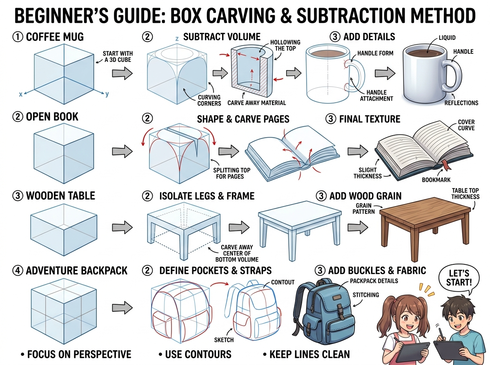

# บทเรียนที่ 1.1: เทคนิคแกะสลักกล่องสู่วัตถุรอบตัว (Box Carving & Subtraction Method)

ยินดีต้อนรับสู่บทเรียนที่จะเปลี่ยน "กล่องสี่เหลี่ยมธรรมดา" ให้กลายเป็น **แก้วกาแฟ หนังสือ โต๊ะ และกระเป๋าเป้ผจญภัย**! 📦✨

---

## 📌 สรุปหลักการสำคัญ (Core Concepts)

1. **ทุกสิ่งในโลกซ่อนอยู่ในกล่อง 3 มิติ**: ไม่ว่าวัตถุจะกลม โค้ง หรือมีดีเทลเยอะแค่ไหน ให้เริ่มต้นมองเป็น **"ก้อนหินสี่เหลี่ยม (Bounding Box)"** ก่อนเสมอ
2. **วิธีการแกะสลัก (Subtraction / Carving Method)**: เหมือนช่างแกะสลักไม้ เราขึ้นกล่องตันขึ้นมาก่อน แล้วค่อยๆ "เฉือนมุม หักระนาบ คว้านเนื้อในออก"
3. **วิธีการต่อเติม (Additive Method)**: เพิ่มชิ้นส่วนประกอบ เช่น หูจับแก้ว สายสะพายกระเป๋า หรือลิ้นชักโต๊ะ

---

## 🧩 เจาะลึก 4 ตัวอย่างการแกะสลักตามภาพประกอบ (Step-by-Step)

### 1. แก้วกาแฟ (Coffee Mug)
- **Step 1 (Start with 3D Cube)**: ตีกรอบกล่องสี่เหลี่ยมลูกบาศก์ในมุมมองที่ต้องการ
- **Step 2 (Subtract Volume)**: ลบมุมทั้ง 4 ด้านให้กลายเป็นทรงกระบอกกลม แล้วคว้านเนื้อตรงกลางลงไปเพื่อสร้างความลึกและขอบหนาของแก้ว
- **Step 3 (Add Details)**: เชื่อมต่อทรงกระบอกแบนเป็นหูจับแก้ว (Handle Attachment)
- **Step 4 (Final)**: เติมผิวน้ำกาแฟและแสงสะท้อนมันเงา (Specular Reflection)

### 2. หนังสือเปิดอ้า (Open Book)
- **Step 1 (3D Cube)**: ร่างกล่องแบนตามระนาบพื้น
- **Step 2 (Shape & Carve Pages)**: ผ่ากึ่งกลางกล่องเป็นรูปตัว V โค้ง แล้วดัดขอบกระดาษให้พองขึ้นเล็กน้อย
- **Step 3 (Final Texture)**: ซอยเส้นสันกระดาษบางๆ สันปกหลัง และริบบิ้นคั่นหน้า

### 3. โต๊ะไม้ (Wooden Table)
- **Step 1 (3D Box)**: ร่างกล่องทรงสี่เหลี่ยมผืนผ้าแนวนอน
- **Step 2 (Isolate Legs & Frame)**: เฉือนเนื้อที่ว่างใต้โต๊ะออก (Carve away bottom volume) ให้เหลือเฉพาะเสาขาทั้ง 4 ด้านและคานขอบ
- **Step 3 (Add Texture)**: ใส่ความหนาของแผ่นท็อปโต๊ะ และลากลายเสี้ยนไม้ตามทิศทางระนาบ

### 4. กระเป๋าเป้ผจญภัย (Adventure Backpack)
- **Step 1 (3D Box)**: วางกล่องทรงสูง
- **Step 2 (Define Pockets & Straps)**: มนมุมกล่องให้ดูนุ่มเหมือนผ้า แปะกล่องกระเป๋าใบเล็กด้านหน้าและด้านข้าง
- **Step 3 (Add Buckles & Fabric)**: ใส่รอยยับตะเข็บผ้า (Stitching) สายรัด และหัวเข็มขัด

---

## ✏️ การบ้านและแบบฝึกหัด (Practice Drills)

1. **Drill 1: The Mug Study (15 นาที)**: วาดแก้วกาแฟจากกล่อง 3 มิติ 3 ใบในมุมมองต่างกัน (มองจากด้านบน, ด้านข้าง, เอียง 3/4)
2. **Drill 2: Everyday Object Carving (30 นาที)**: เลือกสิ่งของ 1 ชิ้นบนโต๊ะทำงานจริงของน้อง (เช่น เมาส์, กล่องหูฟัง, หรือสมุด) แล้วร่าง Bounding Box ก่อนแกะสลักตามขั้นตอน
3. **Drill 3: Backpack Prop (30 นาที)**: ออกแบบกระเป๋าเป้ของตัวละครน้องจากกล่อง 3D พร้อมช่องเก็บของ

---

## 🔍 เช็กลิสต์ตรวจผลงาน (Self-Checklist)
- [ ] สันขอบของสิ่งของยังคงวิ่งเข้าสู่จุดรวมสายตา (Vanishing Points) เดียวกัน
- [ ] วัตถุมีความหนาของเนื้อวัสดุ (Thickness) ไม่บางเหมือนกระดาษ
