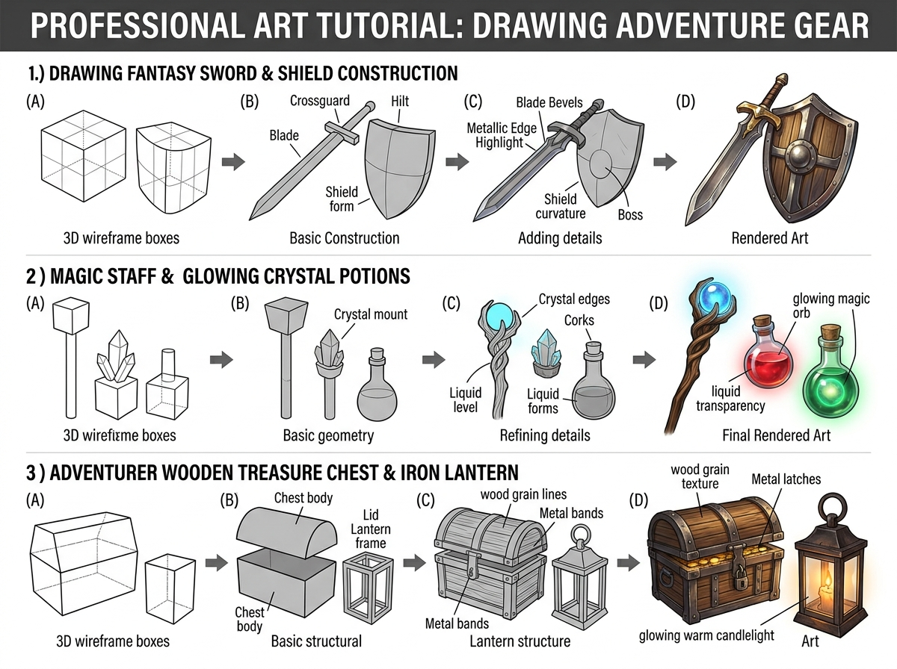

# บทเรียนที่ 1.2: อาวุธแฟนตาซี โพชั่นเวทมนตร์ และอุปกรณ์ผจญภัย (Weapons, Potions & Adventure Gear)

ยินดีต้อนรับสู่คลังแสงและไอเทมของเหล่านักผจญภัยค่ะ! ⚔️🛡️🧪✨ ไม่ว่าตัวละครของน้องจะเป็นนักดาบ นักเวท หรือ Kemono สายผจญภัย การวาดอุปกรณ์ประกอบ (Props & Equipment) ให้ดูมีน้ำหนักและน่าหยิบใช้ คือหัวใจสำคัญของการเล่าเรื่อง (Visual Storytelling)

---

## 📌 สรุปหลักการสำคัญ (Core Concepts)

1. **ดาบและโล่คือการบากระนาบ 3D (Bevels & Curvature)**: ดาบไม่ใช่แค่แผ่นกระดาษแบนๆ แต่มีสันกลางคมดาบ (Ridge Line) ที่สะท้อนแสงสองฝั่งไม่เท่ากัน และโล่มีความโค้งนูนเพื่อเบี่ยงเบนแรงปะทะ
2. **ขวดโพชั่นเวทมนตร์ (Glass & Liquid Physics)**: แก้วมีความโปร่งใส (Transparency) มีความหนาของก้นขวด และของเหลวด้านในจะปรับระดับระนาบขนานกับพื้นโลกเสมอ (Liquid Level)
3. **หีบสมบัติและตะเกียงเหล็ก (Wood & Metal Textures)**: การประกบแผ่นไม้ลายเสี้ยนเข้ากับแถบเหล็กรัดมุม (Metal Bands) พร้อมตะขอสลักและแสงเทียนอุ่นเรืองรอง

---

## 🧩 เจาะลึก 3 หมวดหมู่อุปกรณ์ (Detailed Breakdown)

### 1. โครงสร้างดาบและโล่แฟนตาซี (Fantasy Sword & Shield Construction)
ดูขั้นตอนในโซนที่ 1 ของภาพประกอบ:
- **(A) 3D Wireframe Boxes**: ขึ้นกล่องทรงยาวแคบสำหรับใบดาบ และกล่องแบนโค้งสำหรับโล่
- **(B) Basic Construction**: วางแกนโคนดาบ (Crossguard), ด้ามจับ (Hilt), และทรงโค้งของโล่ (Shield Form)
- **(C) Adding Details**: 
  - สันคมดาบ (Blade Bevels) หักมุมรับแสง
  - ขอบโลหะสะท้อนแสงคมกริบ (Metallic Edge Highlight)
  - หมุดเหล็กกลางโล่ (Shield Boss) สำหรับกันกระแทก
- **(D) Rendered Art**: เกลี่ยค่าน้ำหนักเงาด้านล่าง และใส่รอยบิ่นถลอกเล็กๆ เพื่อเพิ่มความสมจริง

### 2. ไม้เท้าเวทมนตร์และขวดโพชั่นเรืองแสง (Magic Staff & Glowing Potions)
ดูขั้นตอนในโซนที่ 2 ของภาพประกอบ:
- **(A-B) 3D Wireframe to Geometry**: แท่งไม้ทรงกระบอก + กล่องใส่หัวคริสตัล + ทรงกลมขวดน้ำยา
- **(C) Refining Details**: 
  - เนื้อไม้เถาวัลย์บิดเกลียวโอบอุ้มลูกแก้วมนตรา
  - ระดับน้ำยาโพชั่น (Liquid Level) โค้งตามรูปทรงภายในขวด
  - จุกไม้คอร์ก (Corks) ปิดปากขวด
- **(D) Final Rendered Art**: ใส่แสงสะท้อนมันวาวบนผิวนอกของแก้ว และลงสีเรืองแสง (Bloom Effect) สว่างวาบจากใจกลางน้ำยา

### 3. หีบไม้ล่าสมบัติและตะเกียงโบราณ (Wooden Chest & Iron Lantern)
ดูขั้นตอนในโซนที่ 3 ของภาพประกอบ:
- **(A-B) Box & Arch Lid**: ตัวหีบเป็นกล่องสี่เหลี่ยม ส่วนฝาหีบเป็นครึ่งทรงกระบอกแนวนอน (Cylinder Arch)
- **(C) Structural Framework**: ตีเส้นแถบเหล็กคาดมุม (Metal Bands) และโครงเสาตะเกียง
- **(D) Rendered Art**: ลงสีเสี้ยนเนื้อไม้โทนอบอุ่น แต้มสนิมเหล็กเบาๆ และจุดประกายไฟเปลวเทียนสีทองอร่ามทะลุผืนกระจก

---

## ✏️ การบ้านและแบบฝึกหัด (Practice Drills)

1. **Drill 1: Sword & Bevel Study (20 นาที)**: ขึ้นโครงกล่องแล้ววาดดาบ 1 เล่มที่มีสันกลางคมกริบและแสงสะท้อนโลหะ
2. **Drill 2: Glowing Potion Bottle (20 นาที)**: วาดขวดโพชั่นทรงกลมใสที่มีน้ำยาสีแดงหรือสีเขียวเรืองแสงด้านใน 1 ขวด
3. **Drill 3: Adventurer Treasure Chest (30 นาที)**: วาดหีบสมบัติไม้เปิดอ้าเล็กน้อยให้เห็นเหรียญทองหรือไอเทมส่องประกายข้างใน

---

## 🔍 เช็กลิสต์ตรวจผลงาน (Self-Checklist)
- [ ] สันคมดาบและระนาบสองฝั่งมีค่าน้ำหนักแสงเงาต่างกันอย่างชัดเจน
- [ ] ขวดแก้วโพชั่นมีความโปร่งแสงและมองเห็นระนาบของเหลวด้านใน
- [ ] แถบเหล็กและหมุดของหีบสมบัตินาบไปกับความโค้งของฝาหีบอย่างเป็นธรรมชาติ
