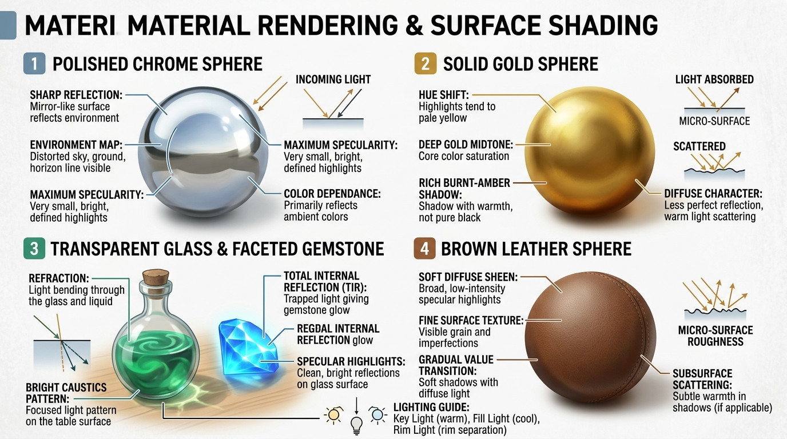

# บทเรียนที่ 1.3: คลังเรนเดอร์วัสดุและพื้นผิว (Mastering Materials & Surfaces)

ยินดีต้อนรับสู่บทเรียนที่จะเปลี่ยนวัตถุธรรมดาให้มีมูลค่า และดูสมจริงจนแทบอยากเอื้อมมือไปสัมผัส! ไม่ว่าจะเป็นดาบเหล็กกล้าเงาวับ มงกุฎทองคำ ขวดแก้วโพชั่นเวทมนตร์ หรือเสื้อแจ็กเกตหนังแท้ค่ะ 💎✨



---

## 📌 สรุปหลักการสำคัญ (Core Concepts)

1. **วัตถุไม่ได้มี "สีประจำตัวตายตัว" แต่แสดงผลตาม "ปฏิกิริยาต่อแสง (Material Physics)"**: วัตถุแต่ละชนิดจะกระจายแสง (Diffuse) หรือสะท้อนแสงตรงๆ (Specular) แตกต่างกันไปตามความเรียบเนียนของพื้นผิว (Roughness)
2. **โลหะคือ "กระจกสะท้อนโลก" (Metals are Mirrors)**: โลหะแท้ไม่มีสีมิดโทนทึบแสงของตัวเอง แต่มันสะท้อนท้องฟ้า พื้นดิน และวัตถุรอบข้าง
3. **ทองคำต้องการ "การเลื่อนเฉดสี (Hue Shift)"**: ห้ามใช้สีเหลืองผสมขาวเด็ดขาด เพราะจะดูเหมือนพลาสติกชีส ทองคำต้องการการไล่เฉดตั้งแต่ส้มไหม้ไปจนถึงเหลืองสว่างอมขาว
4. **แก้วและอัญมณีมีพลังแห่ง "การหักเหและรวมแสง (Refraction & Caustics)"**: แสงที่ทะลุผ่านแก้วจะโค้งงอ และรวมตัวเป็นลวดลายสว่างจ้าบนพื้นผิวด้านล่าง

---

## 🧩 เจาะลึก 4 วัสดุหลักระดับมาสเตอร์ (Step-by-Step Breakdown)

```
[ โลหะเงาวับ (Chrome) ]      [ ทองคำแท้ (Gold) ]       [ แก้วใส & Caustics ]       [ หนังแท้ (Leather) ]
      /------------\            /------------\            /------------\            /------------\
     | ฟ้า (ท้องฟ้า)|          | เหลืองสว่าง  |          | ไฮไลต์ขอบคม  |          | ผิวสากนุ่ม   |
     |-------------|          | ส้มทองมิดโทน |          | ด้านหลังบิดเบี้ยว|        | ไฮไลต์ฟุ้ง   |
     | ดิน (พื้นดิน)|          | น้ำตาลแดงไหม้ |          |  [ Caustics ] |          | รอยย่นตามแรงดึง|
      \____________/            \____________/            \____________/            \____________/
```

---

### 1. โลหะและโครเมียม (Polished Chrome & Brushed Metal)
* **พฤติกรรมแสง**: พื้นผิวเรียบสนิทจนโฟตอนของแสงเด้งกลับตรงๆ เหมือนกระจก
* **วิธีเรนเดอร์**:
  1. ลาก **"เส้นขอบฟ้าสะท้อน (Reflected Horizon Line)"** พาดผ่านกึ่งกลางวัตถุ
  2. ครึ่งบนของวัตถุ: สะท้อนสีท้องฟ้า (ฟ้าสว่าง $\rightarrow$ ฟ้าเข้ม)
  3. ครึ่งล่างของวัตถุ: สะท้อนสีพื้นดิน (น้ำตาลเข้ม หรือเขียวหญ้า)
  4. ตัดเส้นไฮไลต์สีขาวบริสุทธิ์ ($100\%$ White) ตรงสันคมของใบมีด
* **Brushed Metal (โลหะผิวด้าน)**: ใช้หลักการเดียวกัน แต่เกลี่ยขอบสะท้อนให้เบลอนุ่มลงเล็กน้อย

---

### 2. ทองคำและทองเหลือง (Gold & Brass)
* **พฤติกรรมแสง**: โลหะมีค่าที่ดูดกลืนแสงคลื่นสั้น (สีน้ำเงิน) และสะท้อนเฉพาะแสงคลื่นยาว (สีส้ม-เหลือง)
* **สูตรคู่สี Hue Shifting สำหรับทองคำ**:
  - **Specular Highlight**: สีเหลืองนวลเกือบขาว (`#FFF7C2`) เฉพาะจุดกระทบตรง
  - **Midtone (เนื้อทอง)**: สีเหลืองทองอิ่มตัวสูง (`#E5A91A`)
  - **Core Shadow**: สีส้มอมน้ำตาลไหม้ (`#8A4B08`) ไม่ใช่สีดำ!
  - **Reflected Light (แสงสะท้อนในเงา)**: สีส้มทองเรืองรอง ช่วยให้เนื้อโลหะดูสุกปลั่ง

---

### 3. แก้ว คริสตัล และอัญมณี (Glass, Gems & Caustics)
* **พฤติกรรมแสง**: แสงสามารถเดินทางทะลุผ่านเนื้อวัตถุได้ แต่ความเร็วแสงจะเปลี่ยนไป ทำให้เกิดการบิดเบี้ยว
* **กฎ 3 ข้อของแก้วใส**:
  1. **Inverted Darkness**: ตรงกลางของแก้วโปร่งใสจะสว่างตามฉากหลัง แต่ **"ขอบรอบนอก (Silhouette Edge)"** จะมีความหนาและสีเข้มกว่า
  2. **Refraction (ภาพหักเห)**: วัตถุที่อยู่หลังแก้วจะถูกบิดโค้งงอหรือกลับหัวตามรูปทรงของแก้ว
  3. **Caustics (ลายน้ำแสงตกกระทบ)**: แสงที่ส่องทะลุแก้วจะรวมศูนย์เป็นจุดสว่างจ้าบนพื้นโต๊ะใต้ก้นขวด คล้ายลวดลายแสงระลอกคลื่นใต้น้ำ

---

### 4. หนังแท้ ผ้า และพลาสติก (Leather, Fabric & Plastic)
* **หนังแท้ (Leather)**:
  - มีความมันวาวกึ่งกลาง (Semi-gloss) ไฮไลต์จะไม่คมกริบแบบโลหะ แต่จะมีความฟุ้งเล็กน้อย
  - มีรอยย่นตามแรงดึง (Micro-wrinkles) ตรงรอยเย็บและข้อพับ
* **พลาสติก (Plastic)**:
  - สีพื้น (Base color) เป็นสีทึบแสง แต่มีไฮไลต์สีขาวจิ๋วที่ **คมกริบมาก** ตรงจุดกระทบแสง
* **ผ้าเนื้อด้าน (Cotton / Wool)**:
  - แสงกระจายตัวสม่ำเสมอ (Full Diffuse) ไม่มีจุดสะท้อนประกายขาว (Specular = 0)

---

## ⚠️ ข้อผิดพลาดที่พบบ่อย (Common Pitfalls)

1. **ระบายทองคำด้วยสีเหลืองเลมอนผสมดำ**: จะทำให้ทองคำดูเหมือน "พลาสติกเปื้อนโคลน" ให้ใช้คู่สีส้มไหม้เสมอ
2. **ลืมใส่เส้นสะท้อนขอบฟ้าบนดาบ**: ดาบที่ลงน้ำหนักไล่เฉดเทาธรรมดาจะดูเหมือน "แท่งคอนกรีต" ต้องมีเส้นตัดคอนทราสต์สูงของท้องฟ้ากับพื้นดินเสมอ
3. **วาดขวดแก้วทึบแสงเหมือนหิน**: ก้อนแก้วต้องมองทะลุเห็นฉากหลังได้ 80% มีเพียงขอบแก้วและแสงไฮไลต์เท่านั้นที่เป็นตัวกำหนดรูปทรง

---

## ✏️ การบ้านและแบบฝึกหัด (Practice Drills)

1. **Drill 1: The 4 Material Spheres (30 นาที)**  
   วาดทรงกลม 4 ลูกในฉากเดียวกัน: (1) ทรงกลมโครเมียมเงาวับ (2) ทรงกลมทองคำ (3) ทรงกลมแก้วใส (4) ทรงกลมลูกบอลหนัง
2. **Drill 2: The Magic Gemstone (20 นาที)**  
   วาดอัญมณีทับทิมหรือมรกตทรงเหลี่ยมบาก (Faceted Gem) ให้มีระนาบแสงสะท้อนภายในและประกายวิ้ง
3. **Drill 3: Legendary Weapon Rendering (45 นาที)**  
   วาดดาบแฟนตาซี 1 เล่มที่มี: ด้ามจับพันหนังแท้, กระบังมือทองคำสลักลาย, ใบมีดโลหะขัดเงา, และประดับอัญมณีคริสตัลตรงกลาง

---

## 🔍 เช็กลิสต์ตรวจผลงาน (Self-Checklist)
- [ ] โลหะเงาแสดงภาพสะท้อนของสภาพแวดล้อม (ท้องฟ้า/พื้นดิน) อย่างชัดเจน
- [ ] ทองคำมีการเปลี่ยนเฉดสี (Hue Shift) จากขาวนวลสู่เหลืองทองและส้มไหม้
- [ ] แก้วใสแสดงการมองทะลุและปรากฏการณ์แสงรวมตัว (Caustics) บนพื้น
- [ ] ไฮไลต์ของแต่ละวัสดุมีความคม/ฟุ้ง (Edge Sharpness) แตกต่างกันตามความขรุขระของพื้นผิว
