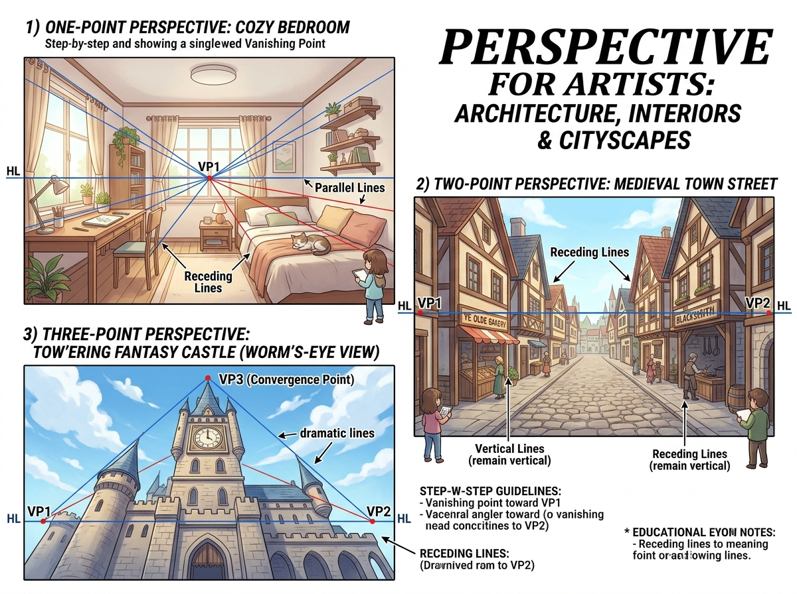

# บทเรียนที่ 2.1: ทัศนียภาพ 1-2-3 จุด: ห้องนอน ถนนเมืองเก่า และปราสาทสูงเสียดฟ้า (Architecture, Interiors & Cityscapes)

ยินดีต้อนรับสู่บทเรียนที่จะพาน้องก้าวข้ามจากการวาดวัตถุเดี่ยวๆ ไปสู่การสร้าง **"โลกและฉากหลัง (Environment & Background)"** ทั้งหมดค่ะ! 🏰🏠🛏️ เมื่อน้องเข้าใจเส้นสายเปอร์สเปกทีฟ น้องจะสามารถวางตัวละครลงในห้องนอนที่แสนอบอุ่น หรือเดินเล่นในตรอกเมืองแฟนตาซีได้อย่างมั่นใจ

---

## 📌 สรุปหลักการสำคัญ (Core Concepts)

1. **เส้นระดับสายตา (Horizon Line - HL)**: คือระดับความสูงของดวงตาผู้ชม (Camera Eye Level) วัตถุที่อยู่เหนือเส้น HL เราจะมองเห็น "ใต้ท้อง" ของมัน ส่วนวัตถุที่อยู่ใต้เส้น HL เราจะมองเห็น "หลังคา/ระนาบบน" ของมัน
2. **จุดรวมสายตา (Vanishing Points - VP)**: จุดบนเส้นขอบฟ้าที่เส้นคู่ขนานในโลกความจริงทอดลู่เข้าหากัน
   - **1-Point Perspective**: เหมาะสำหรับมองตรงเข้าไปในห้อง (Interior Room) หรือมองตรงไปตามรางรถไฟ
   - **2-Point Perspective**: เหมาะสำหรับมองเห็นมุมตึกภายนอก (Corner of Street/Buildings)
   - **3-Point Perspective**: เพิ่มจุด VP3 แนวดิ่ง เพื่อสร้างมุมมองเงยอลังการ (Worm's-Eye View) หรือมุมมองก้มจากตึกสูง (Bird's-Eye View)

---

## 🧩 เจาะลึก 3 รูปแบบเปอร์สเปกทีฟ (Detailed Breakdown)

### 1. เปอร์สเปกทีฟ 1 จุด: ห้องนอนอบอุ่น (1-Point Perspective: Cozy Bedroom)
ดูภาพที่ 1 ด้านซ้ายบน:
- **จุด VP1 อยู่กลางผนังห้อง**: บนเส้น Horizon Line (HL)
- **กฎเหล็กของ 1-Point**:
  - ผนังด้านหน้า กรอบหน้าต่าง ขอบเตียงแนวหน้า จะเป็น **เส้นขนานและเส้นดิ่ง 90 องศาแท้จริง**
  - มีเพียง **เส้นที่พุ่งลึกเข้าไปในห้อง (Receding Lines)** เท่านั้น ที่จะวิ่งมุ่งหน้าเข้าสู่จุด VP1 กลางหน้าต่าง
- **การจัดวางเฟอร์นิเจอร์**: โต๊ะทำงาน เตียงนอน ชั้นหนังสือ ทุกชิ้นจะยึดตามเส้นนำสายตาสีฟ้าที่วิ่งออกจากจุด VP1 เดียวกัน

### 2. เปอร์สเปกทีฟ 2 จุด: ตรอกถนนเมืองยุคกลาง (2-Point Perspective: Medieval Town Street)
ดูภาพที่ 2 ด้านขวา:
- **จุด VP1 (ซ้าย) และ VP2 (ขวา)**: วางอยู่คนละฝั่งบนเส้น Horizon Line ระดับสายตา
- **กฎเหล็กของ 2-Point**:
  - เสาบ้าน ขอบหน้าต่าง ขอบประตูแนวตั้ง **ยังคงเป็นเส้นดิ่ง 90 องศาเสมอ (Vertical Lines remain vertical)**
  - ผนังตึกฝั่งซ้ายจะวิ่งลู่เข้าหาจุด **VP1**
  - ผนังตึกฝั่งขวาจะวิ่งลู่เข้าหาจุด **VP2**
  - พื้นถนนหินก้อนกลม (Cobblestone) จะค่อยๆ มีขนาดเล็กลงและถี่ขึ้นตามระยะทางที่ไกลออกไป

### 3. เปอร์สเปกทีฟ 3 จุด: หอคอยปราสาทมุมมองหนอนเงยมองฟ้า (3-Point Perspective: Towering Castle)
ดูภาพที่ 3 ด้านซ้ายล่าง:
- **มุมมองเงยสุดดราม่า (Worm's-Eye View)**:
  - นอกจาก VP1 และ VP2 บนเส้นขอบฟ้าด้านล่างแล้ว จะมี **จุด VP3 (Convergence Point) อยู่บนท้องฟ้าสูงลิบ**
  - เส้นแนวตั้งของหอคอย **จะไม่ดิ่งตรง 90 องศาอีกต่อไป** แต่จะเอียงสอบเข้าหาจุด VP3 ด้านบน ยิ่งสูงยิ่งเรียวสอบเข้าหากัน
  - ให้ความรู้สึกถึงความสูงตระหง่าน ยิ่งใหญ่ น่าเกรงขาม

---

## ✏️ การบ้านและแบบฝึกหัด (Practice Drills)

1. **Drill 1: 1-Point Dream Room (30 นาที)**: วาดห้องนอนในฝันของน้องหรือห้องของตัวละคร 1 ห้อง โดยกำหนดจุด VP1 บนหน้าต่าง แล้ววางเตียง โต๊ะ และชั้นวางของ
2. **Drill 2: 2-Point Street Corner (30 นาที)**: วาดมุมตึกร้านกาแฟหรือร้านขายยาเวทมนตร์ 1 ตึก โดยให้เห็นป้ายร้านและถนนหน้าร้าน
3. **Drill 3: 3-Point Skyscraper / Tower (30 นาที)**: วาดหอคอยปราสาทหรือตึกสูงระฟ้ามุมเงย 1 หลัง

---

## 🔍 เช็กลิสต์ตรวจผลงาน (Self-Checklist)
- [ ] ใน 1-Point และ 2-Point เส้นแนวตั้งทุกเส้นดิ่งตรง 90 องศากับขอบกระดาษ ไม่เอียงเปะปะ
- [ ] เส้นเฉียงทั้งหมดวิ่งมุ่งหน้าเข้าหาจุดรวมสายตา (VP) ที่ถูกต้อง ไม่บานออก
- [ ] ขนาดของหน้าต่าง ประตู และอิฐหิน มีขนาดเล็กลงตามระยะลึก
