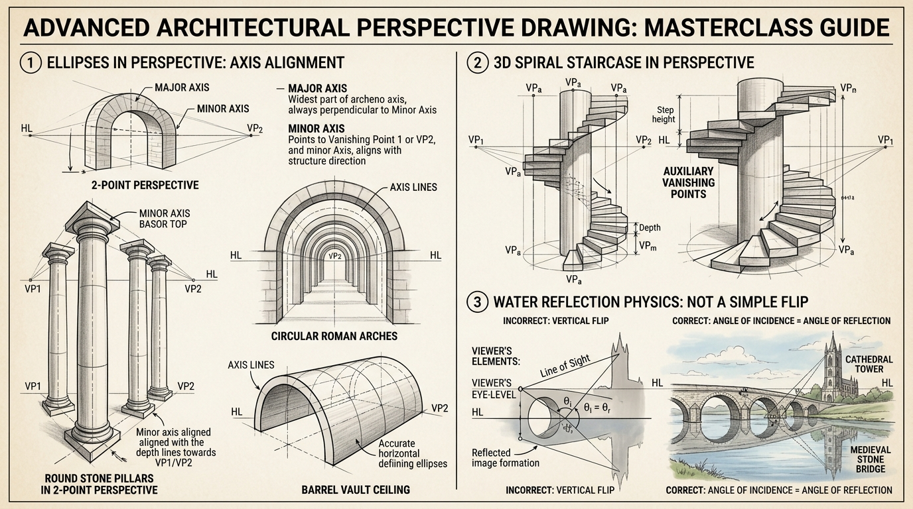

# บทเรียนที่ 2.2: วงรี ซุ้มโค้ง บันไดวน และการสะท้อนในผิวน้ำ (Advanced Architecture: Ellipses, Arches & Reflections)

ยินดีต้อนรับสู่บทเรียนที่จะยกระดับการวาดฉากของน้อง จากเมืองกล่องสี่เหลี่ยมธรรมดา สู่ **"สถาปัตยกรรมระดับมหาวิหารปราสาทแฟนตาซี"** ด้วยการพิชิตเส้นโค้งวงรี เสาหินกลมหรูหรา บันไดเวียนวน และเงาสะท้อนผิวน้ำที่สมจริงตามหลักฟิสิกส์ค่ะ! 🏛️🌊✨



---

## 📌 สรุปหลักการสำคัญ (Core Concepts)

1. **กฎเหล็กของวงรีในเปอร์สเปกทีฟ (Minor Axis Rule)**: 
   - **แกนสั้น (Minor Axis)** ของวงรีจะ **"ชี้ตรงไปยังจุดรวมสายตา (Vanishing Point) เสมอ"**
   - **แกนยาว (Major Axis)** จะวางตัว **"ตั้งฉาก $90^\circ$ กับแกนสั้นเสมอ"**
2. **ซุ้มโค้งโรมัน (Roman Arches)**: เกิดจากการตีกล่องสี่เหลี่ยมในเปอร์สเปกทีฟ แล้วลากเส้นตัดกากบาท (X-Method) เพื่อหากึ่งกลางแท้จริง ก่อนจะวาดครึ่งวงรีทาบลงไป
3. **บันไดวน (Spiral Staircase)**: คือการห่อหุ้มระนาบเอียงรอบทรงกระบอกแกนกลาง โดยแต่ละขั้นบันไดจะชี้ออกจากแกนกลางเหมือนชิ้นพิซซ่า
4. **เงาสะท้อนในน้ำ "ไม่ใช่การกลับหัวภาพ (Not a Vertical Flip)"**: มุมมองของสายตาต่อวัตถุจริงกับภาพสะท้อนเป็นคนละมุมกัน (มุมตกกระทบ = มุมสะท้อน) วัตถุที่ยื่นออกมาด้านหน้าจะบดบังส่วนอื่นในเงาสะท้อนแตกต่างจากของจริงบนบก

---

## 🧩 เจาะลึกเทคนิคสถาปัตยกรรม (Step-by-Step Breakdown)

---

### ภาคที่ 1: การขึ้นโครงวงรีและเสาหินกลม (Ellipses & Round Pillars)

```
[ แกนของวงรีใน Perspective ]
   VP1 <--------------------- (Minor Axis แกนสั้น ชี้หา VP) ---------------------> VP2
                                     |
                                     | (Major Axis แกนยาว กว้างสุด ตั้งฉาก 90 องศา)
                                     |
```

1. **อย่าเริ่มวาดวงรีลอยๆ**: ให้ขึ้นโครงกล่องสี่เหลี่ยมจัตุรัสใน Perspective ก่อนเสมอ
2. **วาดวงรีสัมผัส 4 ด้าน**: วงรีที่ถูกต้องจะต้องสัมผัสกับกึ่งกลางของขอบกล่องทั้ง 4 ด้านพอดี
3. **ความกลมของวงรี (Ellipse Degree)**:
   - วงรีที่อยู่ใกล้เส้นระดับสายตา (Eye-level / Horizon Line) จะแบนมาก (แคบเกือบเป็นเส้นตรง)
   - ยิ่งวงรีอยู่ห่างจากระดับสายตามากเท่าไหร่ (สูงขึ้นไปบนฟ้า หรือต่ำลงมาที่พื้น) วงรีจะยิ่ง **"อ้วนกลมขึ้นเรื่อยๆ"**

---

### ภาคที่ 2: ซุ้มโค้งโรมันและเพดานถ้ำหิน (Roman Arches & Barrel Vaults)

1. **ขึ้นโครงประตูสี่เหลี่ยมใน 2-Point Perspective**
2. **หาจุดศูนย์กลางของส่วนโค้ง**:
   - ลากเส้นกากบาททะแยงมุมบนระนาบด้านหน้า จุดตัดคือจุดกึ่งกลางความกว้าง
   - ลากเส้นดิ่งจากจุดกึ่งกลางขึ้นไปแตะขอบบน = จุดยอดสูงสุดของซุ้มโค้ง (Keystone apex)
3. **ดึงความลึกทะลุไปด้านหลัง**:
   - ลากเส้นเชื่อมจากขอบโค้งหน้า ไปยังจุดรวมสายตา (VP2) เพื่อสร้างความหนาของกำแพงหิน
4. **Barrel Vault (เพดานโค้งอุโมงค์)**:
   - ทำซ้ำซุ้มโค้งหลายๆ บานถอยร่นเข้าไปตามแนวเส้น Perspective เพื่อสร้างอุโมงค์ทางเดินในปราสาท

---

### ภาคที่ 3: บันไดวน 3 มิติรอบเสากลาง (3D Spiral Staircase)

1. **ปักเสากลาง (Center Column)**: วาดทรงกระบอกแกนกลางขึ้นมา 1 ต้น
2. **ตีวงแหวนรอบนอก (Outer Cylinder Template)**: ร่างทรงกระบอกขนาดใหญ่ครอบเสากลางไว้
3. **แบ่งขั้นบันไดเป็นชิ้นพิซซ่า**: 
   - แบ่งวงกลมที่พื้นเป็น 8 หรือ 12 ส่วนเท่าๆ กัน
   - ลากเส้นแกนของแต่ละขั้นบันไดจากเสากลางพุ่งออกไปแตะขอบทรงกระบอกนอก
4. **ไต่ระดับความสูง**: แต่ละขั้นจะยกตัวสูงขึ้นในระยะเท่าๆ กัน (Step Height) หมุนวนไต่ขึ้นสู่ชั้นบนอย่างสง่างาม

---

### ภาคที่ 4: ฟิสิกส์เงาสะท้อนผิวน้ำที่ถูกต้อง (Water Reflection Mechanics)

ดูแผนภาพเปรียบเทียบในภาพประกอบส่วนล่างขวา:
* **ข้อผิดพลาดอันดับ 1**: นักวาดมักก็อปปี้รูปสะพานแล้วกลับหัวภาพ (Flip Vertical) แปะลงในน้ำ ซึ่ง **ผิดหลักฟิสิกส์!**
* **ความจริงทางแสง (Angle of Incidence = Angle of Reflection)**:
  - สายตาของเรามองลงไปยังผิวน้ำ แล้วสะท้อน **"เงยขึ้นไปมองใต้ท้องสะพาน"**
  - ดังนั้น ในเงาสะท้อนบนน้ำ เราจะมองเห็น **"ใต้ท้องซุ้มโค้งสะพาน"** ชัดเจนกว่าที่เรายืนมองจากบนบก!
  - ยอดหอคอยที่อยู่ถอยร่นไปด้านหลัง จะมีความสูงในเงาสะท้อนที่ "สั้นลง" เมื่อเทียบกับวัตถุที่อยู่ชิดริมตลิ่ง

---

## ⚠️ ข้อผิดพลาดที่พบบ่อย (Common Pitfalls)

1. **แกนสั้นของวงรีเอียงมั่วซั่ว**: จำไว้เสมอว่า แกนสั้น (Minor Axis) ต้องชี้เข้าหา Vanishing Point เสมอ ถ้าแกนเอียงไปทางอื่น เสากลมจะดูเหมือนเอียงจะล้ม
2. **วาดวงรีด้านล่างแบนเท่ากับวงรีด้านบน**: ฐานเสาด้านล่างต้องอ้วนกลมกว่าหัวเสาด้านบนเสมอ เพราะอยู่ห่างจากระดับสายตา (Eye-level) มากกว่า
3. **เงาสะท้อนในน้ำคมชัดเท่าของจริงบนบก**: ผิวน้ำมีการดูดกลืนแสงและมีระลอกคลื่นเบาๆ เงาสะท้อนจะต้องมีค่า Value เข้มขึ้นเล็กน้อย และขอบของภาพสะท้อนต้องสั่นไหวตามแนวนอน

---

## ✏️ การบ้านและแบบฝึกหัด (Practice Drills)

1. **Drill 1: The Round Pillar Challenge (25 นาที)**  
   วาดเสาหินโรมันทรงกลม 3 ต้นเรียงแถวใน 2-Point Perspective โดยให้ระดับความอ้วนของวงรีค่อยๆ เปลี่ยนแปลงอย่างสมจริง
2. **Drill 2: Medieval Roman Arch (30 นาที)**  
   วาดประตูเมืองโบราณที่มีซุ้มโค้งโรมันอิฐหิน 2 ชั้น เจาะความลึกทะลุเห็นถนนด้านหลัง
3. **Drill 3: Stone Bridge & Water Reflection (40 นาที)**  
   วาดสะพานหินข้ามแม่น้ำยามเย็น มีซุ้มโค้งสะท้อนลงบนผิวน้ำที่นิ่งสงบ โดยแสดงใต้ท้องสะพานในเงาสะท้อนอย่างถูกต้อง

---

## 🔍 เช็กลิสต์ตรวจผลงาน (Self-Checklist)
- [ ] แกนสั้น (Minor Axis) ของวงรีทุกวงชี้ไปยังจุดรวมสายตา (VP) อย่างแม่นยำ
- [ ] วงรีที่อยู่ต่ำกว่าระดับสายตามีความอ้วนกว้างกว่าวงรีที่อยู่ระดับสายตา
- [ ] ขั้นบันไดวนมีขนาดและความสูงสม่ำเสมอรอบแกนเสากลาง
- [ ] เงาสะท้อนในผิวน้ำแสดงมุมมองใต้ท้องสะพาน ไม่ใช่แค่การกลับหัวภาพ
