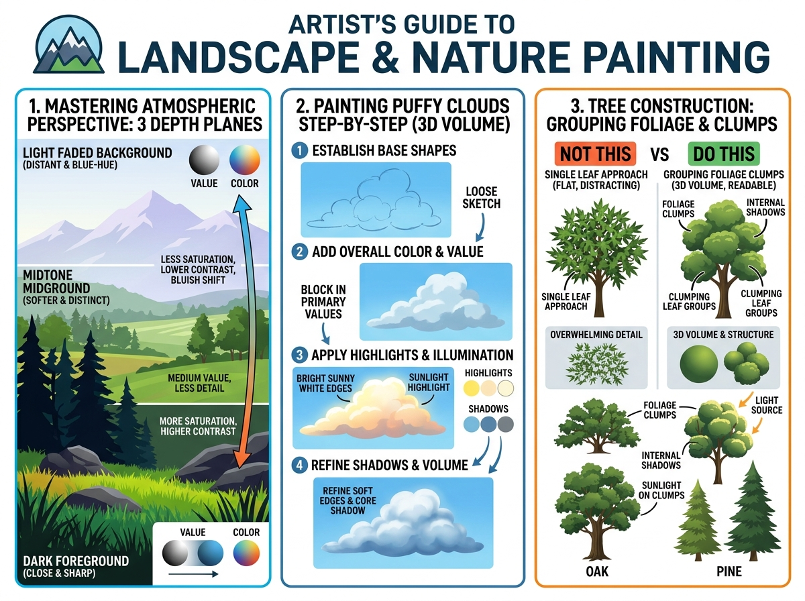

# บทเรียนที่ 3.1: ทัศนียภาพบรรยากาศ เมฆ 3 มิติ และต้นไม้ (Atmospheric Perspective & Nature)

ยินดีต้อนรับสู่บทเรียนที่จะพาน้องออกไปสูดอากาศบริสุทธิ์ในโลกธรรมชาติ! ธรรมชาติไม่ได้วาดเป็นกิ่งๆ หรือใบๆ เดี่ยวๆ แต่มีกฎเกณฑ์ที่เรียบง่ายและทรงพลังมากค่ะ 🌲☁️⛰️

---

## 📌 สรุปหลักการสำคัญ (Core Concepts)

1. **ทัศนียภาพบรรยากาศ (Atmospheric Perspective)**: ยิ่งวัตถุอยู่ไกลตา มวลอากาศและความชื้นจะทำให้วัตถุนั้น **"สีจางลง สว่างขึ้น คอนทราสต์ต่ำลง และกลืนเป็นสีฟ้าอมเทา"**
2. **เมฆไม่ใช่สำลีแบนๆ (3D Puffy Clouds)**: เมฆมีปริมาตรทรงกลมและมีทิศทางแสงเงาเหมือนลูกบอลยักษ์ลอยฟ้า
3. **ต้นไม้คือกลุ่มก้อนพุ่มไม้ (Foliage Clumping)**: ⚠️ **ห้ามวาดใบไม้ทีละใบเด็ดขาด!** ให้มองพุ่มไม้เป็น "ช่อทรงกลมหลายๆ ลูกเกาะบนลำต้น"

---

## 🧩 เจาะลึก 3 เทคนิคหลัก (Detailed Breakdown)

### 1. กฎ 3 ระยะความลึก (Mastering Atmospheric Perspective: 3 Depth Planes)
ดูแผนภาพด้านซ้ายของภาพประกอบ:
- **Foreground (ระยะหน้า - ใกล้สุด)**: 
  - สีเข้มจัด คมชัดสุด (Dark & Sharp)
  - ความอิ่มสีสูง (High Saturation) คอนทราสต์จัด รายละเอียดใบหญ้าและโขดหินชัดเจน
- **Midground (ระยะกลาง)**:
  - น้ำหนักสีปานกลาง (Medium Value) คอนทราสต์เริ่มนุ่มนวลลง
- **Background (ระยะไกล - ภูเขาและขอบฟ้า)**:
  - สีจางลง (Faded) กลืนเป็นสีเดียวกับท้องฟ้า (Bluish/Atmospheric Shift)
  - รายละเอียดหายไป เหลือเพียงโครงร่างเงาทึบ (Silhouette)

### 2. ขั้นตอนการวาดก้อนเมฆ 3 มิติ (Painting Puffy Clouds Step-by-Step)
ดูแผนภาพตรงกลางของภาพประกอบ:
- **Step 1 (Establish Base Shapes)**: สเก็ตช์โครงก้อนเมฆเป็นกลุ่มฟองสบู่มนๆ หลวมๆ
- **Step 2 (Add Overall Color & Value)**: ปาดสีพื้นฐานฟ้าอ่อนอมเทาเพื่อกำหนดรูปทรงรวม
- **Step 3 (Apply Highlights & Illumination)**: กำหนดทิศทางแดด แต้มแสงแดดสีขาวอมทองตามขอบบนของแต่ละลอนเมฆ
- **Step 4 (Refine Shadows & Volume)**: ใส่ Core Shadow ใต้ลอนเมฆ และเกลี่ยขอบนุ่มให้ดูฟู

### 3. โครงสร้างต้นไม้: การรวมช่อพุ่มใบ (Tree Construction)
ดูแผนภาพเปรียบเทียบด้านขวา:
- **NOT THIS (แบบผิด)**: วาดใบไม้ทีละใบยุ่บยั่บไปหมด ทำให้ภาพดูรก ลอย และแบน
- **DO THIS (แบบถูก)**:
  - รวมกลุ่มใบเป็น **"ก้อนเมฆใบไม้ (Foliage Clumps)"** 3-5 ก้อน
  - มองแต่ละก้อนเป็น **"ทรงกลม 3D"** ที่มีแสงแดดส่องด้านบน และมีเงาตกทอด (Internal Shadows) อยู่ด้านล่าง
  - ซอยเส้นใบไม้เฉพาะบริเวณขอบนอกของทรงพุ่มเท่านั้น!

---

## ✏️ การบ้านและแบบฝึกหัด (Practice Drills)

1. **Drill 1: 3-Layer Mountain Landscape (20 นาที)**: วาดทิวเขา 3 ชั้น (ภูเขาหน้าดำเข้ม -> ภูเขากลางเทา -> ภูเขาหลังฟ้าจาง) เพื่อฝึก Atmospheric Perspective
2. **Drill 2: Fluffy Cloud Study (20 นาที)**: วาดก้อนเมฆ 3 มิติ 2 ก้อนที่มีแสงแดดส่องจากด้านบนขวา
3. **Drill 3: The Clump Tree (30 นาที)**: ขึ้นโครงลำต้นและกิ่งไม้ แล้ววาดพุ่มใบ 4 ช่อทรงกลม พร้อมลงแสงเงา

---

## 🔍 เช็กลิสต์ตรวจผลงาน (Self-Checklist)
- [ ] ภูเขาระยะไกลมีค่าน้ำหนักที่จางและสว่างกว่าวัตถุระยะหน้า
- [ ] ก้อนเมฆมีระนาบเงาใต้ฐาน ไม่ใช่สีขาวแบนๆ ทึบผืนเดียว
- [ ] ต้นไม้ถูกจัดเป็นกลุ่มก้อนพุ่มไม้ที่มีเงาในตัวเอง
