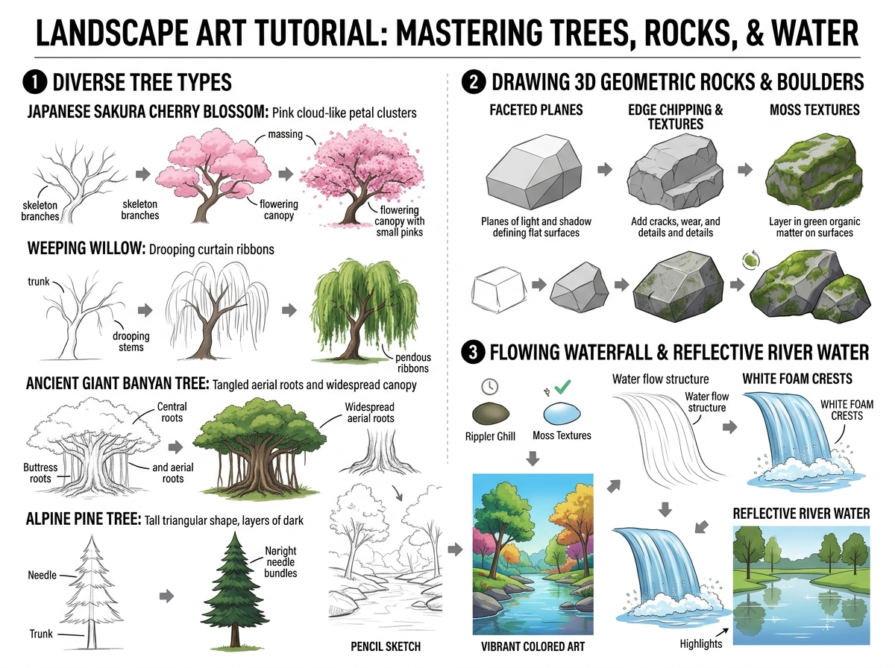

# บทเรียนที่ 3.2: ซากุระ วิลโลว์ หินผา 3 มิติ และน้ำตกประกายฟอง (Diverse Trees, Rocks & Water)

ยินดีต้อนรับสู่บทเรียนธรรมชาติชั้นสูงค่ะ! 🌸🌲🪨🌊 ในธรรมชาติไม่ได้มีแค่ต้นไม้สีเขียวทรงกลมทรงเดียว แต่มีความหลากหลายของสายพันธุ์ต้นไม้ โขดหินผาเหลี่ยมมุม และการเคลื่อนไหวของสายน้ำตก

---

## 📌 สรุปหลักการสำคัญ (Core Concepts)

1. **ทรงพุ่มต้นไม้ตามสายพันธุ์ (Foliage Shape Language)**:
   - **ซากุระ (Sakura)**: ช่อดอกไม้ฟูสีชมพูคล้ายก้อนเมฆนุ่ม (Massing Cloud-like Canopy)
   - **หลิว / วิลโลว์ (Weeping Willow)**: กิ่งและใบห้อยระย้าดั่งม่านริบบิ้นทิ้งตัวลงหาผืนน้ำ
   - **ไทรยักษ์โบราณ (Ancient Banyan Tree)**: รากอากาศระโยงระยางและค้ำยันโคนต้นอันทรงพลัง
   - **สนภูเขา (Alpine Pine)**: โครงสร้างรูปสามเหลี่ยมพีระมิดเรียงซ้อนกันเป็นชั้น
2. **โขดหินผาคือระนาบเหลี่ยม 3 มิติ (Faceted Planes of Rocks)**: หินไม่ใช่ก้อนกลมมนทึบๆ แต่ถูกลมและน้ำกัดเซาะจนเกิด **ระนาบหักมุม (Planes)** มีทั้งระนาบรับแสงแดด ระนาบเงา รอยแตก (Cracks) และตะไคร่น้ำ (Moss)
3. **ฟิสิกส์ของสายน้ำและน้ำตก (Water Dynamics & Foam Crests)**: น้ำไหลตามแรงโน้มถ่วง เมื่อตกลงมากระทบผิวด้านล่างจะแตกตัวเป็น **ฟองสีขาว (White Foam Crests)** และมีแสงสะท้อนเงาต้นไม้บนผืนน้ำเรียบ

---

## 🧩 เจาะลึก 3 องค์ประกอบหลัก (Detailed Breakdown)

### 1. วิธีวาดต้นไม้ 4 ชนิดยอดนิยม (Diverse Tree Types)
ดูขั้นตอนในโซนที่ 1 ของภาพประกอบ:
- **Japanese Sakura (ต้นซากุระ)**:
  - เริ่มจากกิ่งก้านกระดูกสันหลัง (Skeleton Branches) โค้งอ่อนช้อย
  - วางก้อนมวลทรงพุ่มดอก (Massing Canopy) 3-4 พุ่มใหญ่
  - แต้มขอบพุ่มด้วยกระจุกดอกซากุระสีชมพูอ่อนสลับเข้ม
- **Weeping Willow (ต้นหลิว)**:
  - ลำต้นหลักแตกกิ่งโค้งงอขึ้น แล้วทิ้งก้านกิ่งแนวดิ่งลงมาเหมือนสายฝน
  - ระบายริบบิ้นใบไม้สีเขียวอ่อนทิ้งตัวลงมาขนานกัน ให้ความรู้สึกอ่อนหวานและลึกลับ
- **Ancient Giant Banyan Tree (ต้นไทรยักษ์)**:
  - รากค้ำยัน (Buttress Roots) แผ่กว้างยึดพื้นอย่างมั่นคง
  - รากอากาศ (Aerial Roots) ห้อยจากกิ่งลงสู่พื้นดิน เหมาะสำหรับฉากป่าดงดิบหรือป่าแฟนตาซี

### 2. วิธีปั้นโขดหินผา 3 มิติ (Drawing 3D Geometric Rocks)
ดูขั้นตอนในโซนที่ 2 ของภาพประกอบ:
- **Step 1 (Faceted Planes)**: เริ่มจากกล่อง 3D แล้วใช้มีดสมมุติ "เฉือนมุมหิน" ให้เกิดระนาบเหลี่ยมเพชร แยกด้านสว่างและด้านเงาชัดเจน
- **Step 2 (Edge Chipping & Textures)**: เซาะรอยบิ่น รอยแตกตามขอบสันหิน เพื่อบอกความแข็งแกร่งและกาลเวลา
- **Step 3 (Moss Textures)**: ปาดเลเยอร์สีเขียวของมอสและตะไคร่น้ำบนระนาบด้านบนที่สะสมความชื้น

### 3. น้ำตกและผืนน้ำสะท้อนเงา (Flowing Waterfall & Reflective Water)
ดูขั้นตอนในโซนที่ 3 ของภาพประกอบ:
- **โครงสร้างการไหล (Water Flow Structure)**: ลากเส้นสายน้ำตกโค้งออกจากขอบผาแล้วทิ้งดิ่งลงมาเป็นเส้นขนาน
- **ฟองขาวที่ปลายน้ำ (White Foam Crests)**: วาดฟองคลื่นสีขาวกระจายตัวรอบจุดที่น้ำตกกระทบผืนน้ำ
- **ผืนน้ำสะท้อนเงา (Reflective River)**: ระบายเงาสะท้อนกลับหัวของต้นไม้และท้องฟ้าลงบนน้ำ โดยมีรอยระลอกคลื่น (Ripples) แนวนอนรบกวนภาพสะท้อนเบาๆ

---

## ✏️ การบ้านและแบบฝึกหัด (Practice Drills)

1. **Drill 1: Sakura or Willow Study (25 นาที)**: เลือกวาดต้นซากุระแสนหวาน หรือต้นหลิวพลิ้วไหวริมน้ำ 1 ต้น
2. **Drill 2: 3D Boulder with Moss (20 นาที)**: วาดโขดหินผาเหลี่ยมมุม 2 ก้อนที่มีรอยแตกและมอสสีเขียวเกาะด้านบน
3. **Drill 3: Forest Waterfall Scene (35 นาที)**: ร่างฉากธรรมชาติประกอบด้วย โขดหิน + น้ำตกไหลลงลำธาร + ต้นไม้ป่า 1 ฉาก

---

## 🔍 เช็กลิสต์ตรวจผลงาน (Self-Checklist)
- [ ] โขดหินมีระนาบเหลี่ยมมุมตัดกันชัดเจน ไม่ใช่ก้อนแป้งกลมเรียบ
- [ ] น้ำตกมีประกายฟองสีขาวบริเวณจุดกระทบก้นบึ้ง
- [ ] ช่อดอกซากุระหรือพุ่มใบหลิวมีทิศทางการทิ้งตัวตามแรงโน้มถ่วง
