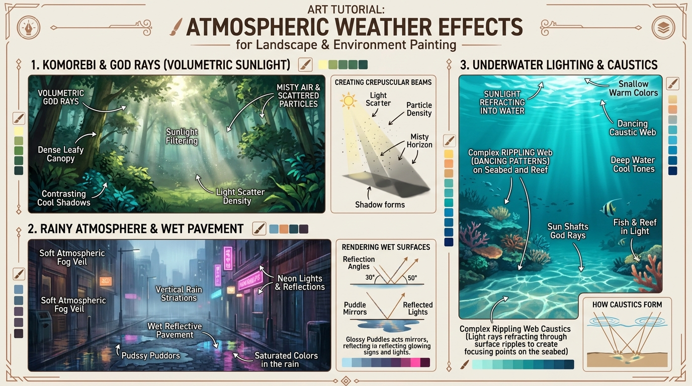

# บทเรียนที่ 3.3: สภาพอากาศ ละอองฝน ป่าหมอก และแสงแดดลอดแมกไม้ (Atmospheric Weather, Rain & Komorebi)

ยินดีต้อนรับสู่บทเรียนที่จะเปลี่ยนภาพทิวทัศน์นิ่งๆ ให้กลายเป็น **"ภาพที่มีลมหายใจ มีอารมณ์ และมีบรรยากาศโอบล้อม (Atmospheric Storytelling)"** เรียนรู้เวทมนตร์ของลำแสงแดดส่องผ่านป่าหมอก ละอองฝนโปรยปรายบนถนนเปียกน้ำ และโลกใต้ผืนน้ำสีครามค่ะ! 🌧️🌲✨🌊



---

## 📌 สรุปหลักการสำคัญ (Core Concepts)

1. **ลำแสงมีตัวตนได้เพราะ "ละอองหมอกในอากาศ (Tyndall Effect & Volumetric Light)"**: แสงแดดจะมองเห็นเป็นลำแสงสีทอง (God Rays) พุ่งผ่านอากาศได้ ก็ต่อเมื่อมีละอองน้ำ ฝุ่น หรือหมอกคอยกระเจิงแสง และต้องมี "ฉากหลังที่มืดกว่า" มารองรับ
2. **Komorebi (木漏れ日 - แสงแดดลอดแมกไม้)**: ลำแสงสีทองอบอุ่นที่ลอดผ่านช่องว่างของใบไม้ในป่าดิบชื้น ตกกระทบเป็นหย่อมแสงสว่างจ้าบนโขดหินและผืนหญ้า ตัดกับเงาป่าทึบสีน้ำเงินเข้ม
3. **ถนนเปียกน้ำกลายสภาพเป็น "กระจกเงา (Diffuse to Specular)"**: พื้นถนนที่แห้งจะกระจายแสงสม่ำเสมอ แต่เมื่อฝนตก น้ำจะเคลือบผิวกลายเป็นแผ่นฟิล์มกระจก ทำให้เกิดเงาสะท้อนไฟนีออนทอดยาวเป็นแนวดิ่ง
4. **โลกใต้น้ำและการดูดกลืนสี (Light Absorption & Caustics)**: ยิ่งน้ำลึก แสงสีแดงจะถูกดูดกลืนหายไปจนหมด เหลือเพียงสีฟ้า-เขียว และระลอกคลื่นบนผิวน้ำจะหักเหแสงลงไปเป็น **"ตาข่ายแสงเต้นระบำ (Caustic Web)"** บนพื้นทราย

---

## 🧩 เจาะลึก 3 บรรยากาศเอกอุ (Step-by-Step Breakdown)

---

### ภาคที่ 1: แสงแดดส่องลอดแมกไม้ (Komorebi & God Rays)

```
[ แสงแดดลอดผ่านเรือนยอดไม้ ]
         \   \   \  (ลำแสงสีทองพุ่งเฉียง)
       [ พุ่มไม้ทึบ ]  \
         /   /   /  (ละอองหมอกกระเจิงแสง)
      (  หย่อมแสงสว่างบนพื้นหญ้า  ) <--- [ คอนทราสต์ตัดกับเงามืดรอบข้าง ]
```

1. **สร้างพื้นหลังป่าทึบและเงามืด (Deep Shadow Background)**:
   - ลงสีต้นไม้และพุ่มไม้ด้วยโทนสีเขียวอมน้ำเงินเข้ม (Cool Shadows) เพื่อเป็นฉากหลังรับแสง
2. **เจาะช่องว่างเรือนยอดไม้ (Negative Space Holes)**:
   - จุดที่แสงจะลอดผ่าน ต้องเป็นช่องว่างเล็กๆ ระหว่างกิ่งก้านและใบไม้
3. **ลากลำแสงเฉียง (Volumetric Beams)**:
   - ใช้บรัชนุ่ม (Soft Airbrush) ปาดสีเหลืองนวลหรือส้มทองจางๆ ในเลเยอร์โหมด `Screen` หรือ `Add (Glow)` ลากเฉียงลงมาจากยอดไม้
   - ความกว้างของลำแสงจะค่อยๆ ขยายกว้างขึ้นเมื่อใกล้พื้นดิน
4. **แต้มฝุ่นละอองแสง (Mote Particles)**:
   - แต้มจุดประกายแสงเล็กๆ สุ่มลอยอยู่ในลำแสง เพื่อจำลองฝุ่นละอองและสปอร์เห็ดในป่า

---

### ภาคที่ 2: บรรยากาศฝนตกและถนนเปียกน้ำ (Rainy City & Wet Pavement)

1. **ม่านหมอกบรรยากาศสีเงิน (Atmospheric Fog Veil)**:
   - ในวันที่ฝนตก คอนทราสต์ของฉากหลังจะลดลง ตึกระฟ้าในระยะไกลจะถูกกลืนด้วยหมอกสีเทาอมฟ้า (Desaturated High-Key)
2. **สายฝนแนวดิ่ง (Rain Striations)**:
   - อย่าวาดเม็ดฝนทีละเม็ด! ให้ใช้ Motion Blur ลากเส้นพู่กันสีขาวบางเฉียบเอียงเฉียงตามทิศทางลม
   - บริเวณที่ฝนตกกระทบร่ม พื้นถนน หรือหลังคา ให้แต้มละอองน้ำกระเซ็นขาวฟุ้งจิ๋วๆ (Splash Mist)
3. **พื้นถนนเปียกและแอ่งน้ำขัง (Puddle Mirrors)**:
   - พื้นถนนยางมะตอยจะมืดลงกว่าปกติ แต่จุดที่มีน้ำขังจะสะท้อนภาพตึก เสาไฟ และป้ายไฟนีออนลงมาในแนวดิ่ง
   - ลากเส้นสะท้อนไฟนีออนสว่างวาบลงมาตามแนวดิ่ง แล้วเกลี่ยขอบให้สั่นไหวเล็กน้อยตามระลอกคลื่นน้ำ

---

### ภาคที่ 3: โลกใต้น้ำและลวดลาย Caustics (Underwater Atmosphere)

```
[ แสงแดดทะลุผิวน้ำ ] ~ ~ ~ ~ ~ ~ ~ ~ ~ ~ ~ ~ (ผิวน้ำกระเพื่อม)
                         \       /
                          \     /  (ลำแสงส่องเฉียงลงสู่ก้นทะเล)
                           \   /
   ( โขดหิน & แนวปะการัง )   \ /
   ~~~~~~~~~~~~~~~~~~~~~~~~~~~~~~~~~~~~~~
   [ ลายตาข่ายแสง Caustic Web เต้นระบำบนพื้นทราย ]
```

1. **การไล่เฉดสีความลึก (Depth Gradient)**:
   - ผิวน้ำด้านบน = สีฟ้าครามอมเขียวมรกตสดใส (Turquoise / Cyan)
   - ก้นทะเลด้านล่าง = สีน้ำเงินครามลึกเข้ม (Deep Ocean Blue)
2. **ลำแสงใต้น้ำ (Sun Shafts)**:
   - ลำแสงแดดส่องทะลุผิวน้ำลงมาเป็นริ้วๆ สีฟ้าอ่อน ปลายลำแสงจะค่อยๆ จางหายไปในความมืดมิด
3. **ลวดลายตาข่ายแสง (Dancing Caustic Web)**:
   - คลื่นบนผิวน้ำทำหน้าที่เป็นเลนส์รวมแสง แสงที่ส่องถึงพื้นทรายหรือเกล็ดปลาจะรวมตัวเป็น **"โครงตาข่ายร่างแหสีขาวอมฟ้าอ่อนที่มีความโค้งมนไม่เป็นระเบียบ"**
   - รอยต่อของตาข่ายจะสว่างจ้าที่สุด ส่วนตรงกลางช่องตาข่ายจะโปร่งใส

---

## ⚠️ ข้อผิดพลาดที่พบบ่อย (Common Pitfalls)

1. **วาดลำแสง God Rays บนพื้นหลังสีขาวสว่าง**: ลำแสงจะมองไม่เห็นเลยถ้าฉากหลังสว่างเท่ากัน ลำแสงจะเปล่งประกายได้เมื่อ **ฉากหลังเป็นเงาดำมืด** เท่านั้น!
2. **ถนนเปียกน้ำแต่ไม่มีแสงสะท้อน**: ฝนตกแต่พื้นด้านเหมือนกระดาษทราย จะทำให้ภาพดูแห้งแล้งทันที ต้องมีเงาสะท้อนไฟเป็นทางยาวบนพื้นเสมอ
3. **วาดลาย Caustics ใต้น้ำเป็นตารางหมากรุกตรงๆ**: ลาย Caustics เกิดจากคลื่นน้ำธรรมชาติ ต้องมีรูปทรงอิสระ (Organic Voronoi Web) หนาบ้าง บางบ้าง และบิดโค้งตามโขดหิน

---

## ✏️ การบ้านและแบบฝึกหัด (Practice Drills)

1. **Drill 1: The Komorebi Forest Clearing (30 นาที)**  
   วาดพุ่มไม้ในป่าทึบ 1 จุด แล้วยิงลำแสงแดดสีทองลอดผ่านแมกไม้ลงมาตกกระทบพื้นหญ้า พร้อมใส่ละอองแสงลอยฟุ้ง
2. **Drill 2: Neon Reflection on Wet Asphalt (35 นาที)**  
   วาดถนนคนเดินยามค่ำคืนที่มีฝนตก ป้ายไฟร้านค้านีออนสีชมพูและฟ้าสะท้อนทอดยาวบนแอ่งน้ำขังสีดำมะเมื่อม
3. **Drill 3: Coral Reef Caustics (40 นาที)**  
   วาดฉากใต้ทะเลที่มีโขดหิน ปะการัง และพื้นทราย โดยเพ้นท์ลวดลายตาข่ายแสง Caustics เต้นระบำพาดผ่านพื้นผิวและตัวปลา

---

## 🔍 เช็กลิสต์ตรวจผลงาน (Self-Checklist)
- [ ] ลำแสง Komorebi ส่องสว่างตัดกับฉากหลังที่มืดกว่าอย่างชัดเจน
- [ ] พื้นถนนเปียกน้ำสะท้อนแสงไฟเป็นแนวดิ่งและมีคอนทราสต์อิ่มตัวสูง
- [ ] ความลึกของน้ำมีการไล่เฉดจากฟ้าสว่างสู่ครามเข้ม
- [ ] ลวดลาย Caustics แนบโค้งไปตามรูปทรง 3 มิติของพื้นทรายและโขดหิน
