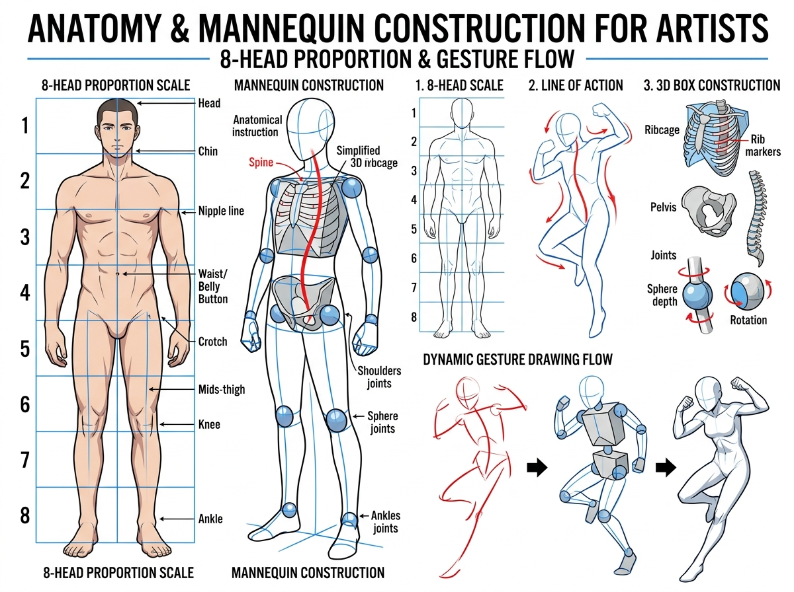

# บทเรียนที่ 4.1: สัดส่วนร่างกาย 8 ส่วน และหุ่นก้านกล้วย 3 มิติ (Human Proportion & Mannequin)

ยินดีต้อนรับสู่บทเรียนที่จะปลดล็อก "ความกลัวการวาดคน" ให้กลายเป็นเรื่องง่าย! เคล็ดลับของอนาโตมีไม่ใช่การจำชื่อกล้ามเนื้อภาษาละตินทุกมัด แต่คือการเข้าใจ **"สัดส่วนทองคำ 8 ช่วงหัว"** และ **"หุ่นกล่องเชื่อมกระดูกสันหลัง"** ค่ะ 🧍‍♂️✨

---

## 📌 สรุปหลักการสำคัญ (Core Concepts)

1. **สัดส่วน 8 ช่วงหัว (8-Head Proportion Scale)**: ใช้ "ความยาวศีรษะ (Head Length)" เป็นหน่วยวัดมาตรฐานของร่างกายมนุษย์
2. **กรงอกและเชิงกรานคือ 2 กล่องใหญ่ (Ribcage & Pelvis Boxes)**: ลำตัวคนไม่ใช่ท่อตรง แต่ประกอบด้วยกล่องกรงอก (Ribcage) และกล่องกระดูกเชิงกราน (Pelvis) ที่สามารถ "บิดและเอียง (Twist & Tilt)" ได้อย่างอิสระ
3. **เส้นสายพลัง (Line of Action)**: เริ่มต้นวาดท่าทางจากเส้นเดี่ยวเส้นเดียวที่ลากผ่านกระดูกสันหลังเสมอ เพื่อให้ท่าทางมีพลัง ไม่แข็งทื่อ

---

## 🧩 เจาะลึก 3 ขั้นตอนการขึ้นโครงร่าง (Detailed Breakdown)

### 1. แผนผังสัดส่วน 8 ช่วงหัว (8-Head Proportion Scale)
ดูแผนผังด้านซ้ายของภาพประกอบ:
- **หัวที่ 1**: ยอดกระหม่อม ถึง ปลายคาง (Head)
- **หัวที่ 2**: ปลายคาง ถึง **ระดับราวนม (Nipple line)**
- **หัวที่ 3**: ราวนม ถึง **สะดือ / เอวคอด (Waist / Belly Button)**
- **หัวที่ 4**: เอว ถึง **ง่ามขา / จุดกึ่งกลางร่างกาย (Crotch / Pubic Bone)**
- **หัวที่ 5**: ง่ามขา ถึง **กึ่งกลางต้นขา (Mid-thigh)** (ปลายนิ้วมือจะห้อยลงมาถึงระดับนี้)
- **หัวที่ 6**: ต้นขา ถึง **ใต้หัวเข่า (Knee)**
- **หัวที่ 7**: หัวเข่า ถึง **กึ่งกลางหน้าแข้ง**
- **หัวที่ 8**: หน้าแข้ง ถึง **ข้อเท้าและฝ่าเท้า (Ankle & Soles)**

*(หมายเหตุ: สำหรับตัวละคร Kemono หรือตัวละครอนิเมะ สามารถปรับเป็น 5-6 หัว หรือ Chibi 2-3 หัวได้ โดยย่อส่วนขาและลำตัวลง แต่ลำดับจุดยังคงสัมพันธ์กัน)*

### 2. โครงสร้างหุ่นจำลอง (Mannequin Construction)
ดูภาพตรงกลาง:
- **กรงอก (Ribcage)**: ทรงกล่องรีคล้ายไข่ คว่ำลง
- **เชิงกราน (Pelvis)**: ทรงกล่องสี่เหลี่ยมคางหมูคล้ายกางเกงใน คว่ำขึ้น
- **กระดูกสันหลัง (Spine)**: เส้นเชื่อมโยงระหว่างสองกล่อง สามารถโค้งงอได้ตามท่าทาง
- **ข้อต่อทรงกลม (Sphere Joints)**: หัวไหล่, ข้อศอก, สะโพก, หัวเข่า, ข้อเท้า หมุนได้รอบทิศทาง

### 3. กระบวนการวาด 3 ขั้นตอนจากเส้นสู่รูปทรง (Dynamic Gesture Flow)
ดูแผนผังขวาล่าง:
- **ขั้นตอนที่ 1 (Gesture Line - สีแดง)**: ลากเส้น Line of Action โค้งแสดงอารมณ์และทิศทางการเคลื่อนไหว จับทิศทางหัว ไหล่ และกระดูกสันหลังใน 30 วินาที
- **ขั้นตอนที่ 2 (3D Box Mannequin - สีน้ำเงิน)**: ใส่กล่องกรงอก กล่องเชิงกราน และท่อนแขนขาทรงกระบอกในพื้นที่ 3 มิติ
- **ขั้นตอนที่ 3 (Final Silhouette / Muscles)**: ร่างเส้นขอบกล้ามเนื้อและเสื้อผ้าทับลงไปบนหุ่นกล่อง

---

## ✏️ การบ้านและแบบฝึกหัด (Practice Drills)

1. **Drill 1: 8-Head Ruler (15 นาที)**: ตีตาราง 8 ช่องเท่าๆ กัน แล้วร่างตำแหน่งสำคัญของร่างกาย (คาง ราวนม สะดือ ง่ามขา เข่า ข้อเท้า)
2. **Drill 2: Ribbon Spine & Boxes (20 นาที)**: วาดกล่องกรงอกและกล่องเชิงกราน 5 คู่ โดยให้กล่องทั้งสองบิดเอียงคนละทิศทาง (บิดเอว, ก้มตัว, เอี้ยวหลัง)
3. **Drill 3: 1-Minute Gesture Mannequin (30 นาที)**: หาภาพคนเต้นหรือเล่นกีฬา แล้วร่างท่าทางแบบ 3 ขั้นตอน (เส้นแดง -> หุ่นกล่อง) 5 ท่า ท่าละ 2-3 นาที

---

## 🔍 เช็กลิสต์ตรวจผลงาน (Self-Checklist)
- [ ] ความยาวลำตัว (หัวถึงง่ามขา) เท่ากับความยาวขา (ง่ามขาถึงฝ่าเท้า)
- [ ] ข้อศอกอยู่ในระดับเดียวกับเอว/สะดือ และข้อมืออยู่ในระดับเดียวกับง่ามขา
- [ ] ท่าทางมีความลื่นไหลจาก Line of Action ไม่แข็งทื่อเหมือนท่อนไม้
