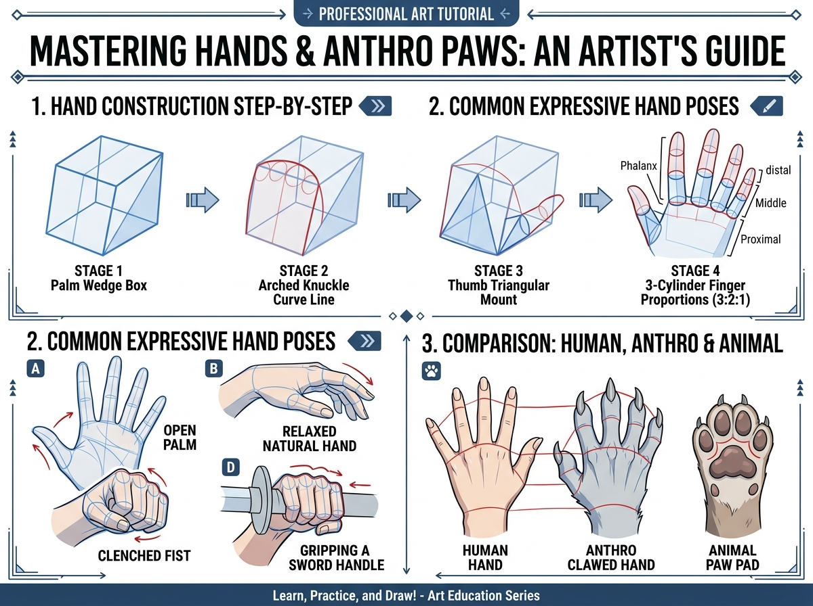

# บทเรียนที่ 4.2: พิชิตการวาดมือ นิ้ว และกรงเล็บ Anthro (Mastering Hands & Anthro Paws)

ยินดีต้อนรับสู่บทเรียนปราบเซียนอันดับ 1 ของวงการวาดรูปค่ะ! 🖐️🐾✨ หลายคนวาดหน้าสวยมากแต่มักจะ "ซ่อนมือไว้ข้างหลัง" หรือ "ล้วงกระเป๋า" เพราะกลัววาดนิ้วเบี้ยว... แต่วันนี้พี่สาวจะพาน้องผ่าโครงสร้างมือด้วย **"กล่องฝ่ามือ 4 ขั้นตอน"** ให้วาดได้อย่างมั่นใจตลอดไปค่ะ!

---

## 📌 สรุปหลักการสำคัญ (Core Concepts)

1. **ห้ามเริ่มวาดจากนิ้วทีละนิ้วเด็ดขาด**: ให้เริ่มต้นจาก **"กล่องฝ่ามือทรงลิ่ม (Palm Wedge Box)"** ที่มีความหนาและโค้งเว้า
2. **เส้นระนาบข้อนิ้วโค้งเป็นสะพาน (Arched Knuckle Curve Line)**: โคนนิ้วทั้ง 4 นิ้วไม่ได้เรียงตัวเป็นเส้นตรงทื่อ แต่วิ่งโค้งตามแนวทรงโดม (นิ้วกลางยาวสุดเสมอ)
3. **สัดส่วนนิ้ว 3 ท่อน (3-Cylinder Finger Proportions 3:2:1)**:
   - แต่ละนิ้วประกอบด้วยกระดูก 3 ท่อน (Proximal -> Middle -> Distal) ที่ค่อยๆ สั้นลงตามอัตราส่วนทองคำ

---

## 🧩 เจาะลึก 3 หมวดหมู่หลัก (Detailed Breakdown)

### 1. วิธีขึ้นโครงมือ 4 ขั้นตอน (Hand Construction Step-by-Step)
ดูแผนผังแถวบนของภาพประกอบ:
- **Stage 1 (Palm Wedge Box)**: วาดกล่องสี่เหลี่ยมคางหมูหนาๆ เป็นตัวแทนของอุ้งฝ่ามือ
- **Stage 2 (Arched Knuckle Curve Line)**: ลากเส้นโค้งด้านบนกล่องเพื่อกำหนดโคนนิ้วทั้ง 4 ช่อง
- **Stage 3 (Thumb Triangular Mount)**: แปะกล่องสามเหลี่ยมด้านข้างฝ่ามือเป็นฐานโคนนิ้วโป้ง (Thenar Eminence) นิ้วโป้งมีมุมกางอิสระทำมุม 90 องศากับฝ่ามือ
- **Stage 4 (3-Cylinder Fingers)**: ลากทรงกระบอก 3 ปล้องต่อนิ้ว นิ้วกลางยาวที่สุด นิ้วชี้และนางสั้นลงมา นิ้วก้อยสั้นที่สุด

### 2. ท่าทางมือที่พบบ่อย (Common Expressive Hand Poses)
ดูแผนผังด้านซ้ายล่าง:
- **(A) Open Palm (มือแบ)**: นิ้วทั้ง 5 กางแผ่ รอยต่อผ่ามือรูปดาว
- **(B) Relaxed Natural Hand (มือผ่อนคลาย)**: นิ้วจะงอโค้งเข้าหาฝ่ามือเล็กน้อยอย่างเป็นธรรมชาติ (ไม่ใช่เหยียดตรงเกร็ง)
- **(C) Clenched Fist (กำปั้น)**: นิ้วทั้ง 4 ม้วนพับเก็บเข้าสู่ฝ่ามือ และนิ้วโป้งพาดทับล็อคด้านนอกข้อนิ้วชี้และกลาง
- **(D) Gripping a Sword Handle (มือจับด้ามดาบ/ไอเทม)**: ท่อนนิ้วจะโอบรอบทรงกระบอกด้ามดาบ โดยมีแนวระนาบข้อนิ้วเฉียงตามมุมถือ

### 3. เปรียบเทียบ: มือคน vs มือสัตว์ Anthro vs อุ้งเท้านิคุคิว (Comparison)
ดูแผนผังด้านขวาล่าง:
- **Human Hand (มือมนุษย์)**: นิ้วเรียว ปลายนิ้วมน มีเล็บแบนราบ
- **Anthro Clawed Hand (มือลูกผสมกึ่งคนกึ่งสัตว์)**: โครงสร้างกระดูกมือคล้ายมนุษย์ แต่ **ปลายนิ้วงอกกรงเล็บแหลมคม (Claws)** มีขนปกคลุมหลังมือ และมีปุ่มเนื้อเล็กๆ ช่วยเพิ่มเสน่ห์
- **Animal Paw Pad (อุ้งเท้าสัตว์แท้)**: ฝ่ามือสั้นลง นิ้วเท้าหนากลม พร้อมปุ่มเนื้อ Nikukyu นุ่มฟูสำหรับรับน้ำหนัก

---

## ✏️ การบ้านและแบบฝึกหัด (Practice Drills)

1. **Drill 1: The Palm Wedge (15 นาที)**: วาดกล่องฝ่ามือเปล่าๆ ที่มีเส้นโค้งข้อนิ้ว 5 กล่องในมุมต่างๆ (หงาย คว่ำ เอียง 3/4)
2. **Drill 2: Tracing Finger Cylinders (20 นาที)**: วาดมือผ่อนคลาย (Relaxed Hand) และมือกำหมัด (Fist) อย่างละ 1 ข้าง
3. **Drill 3: Anthro Hand with Claws (25 นาที)**: วาดมือของตัวละคร Anthro กำลังจับด้ามดาบหรือถือขวดโพชั่น 1 ภาพ

---

## 🔍 เช็กลิสต์ตรวจผลงาน (Self-Checklist)
- [ ] ความยาวของฝ่ามือ เท่ากับความยาวของนิ้วกลางโดยประมาณ
- [ ] นิ้วโป้งพับล็อคอยู่ด้านนอกกำปั้นเสมอ ไม่ได้ถูกพับซ่อนไว้ด้านใน
- [ ] แนวข้อนิ้วมีความโค้งรับกันเป็นทรงโดม นิ้วไม่เท่ากันทื่อๆ
