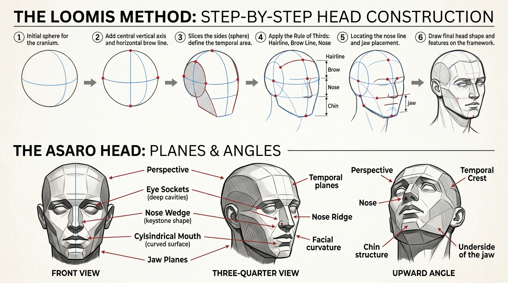

# บทเรียนที่ 4.3: โครงสร้างกะโหลกศีรษะ ใบหน้า และเครื่องหน้า (Human Head & Facial Features)

ยินดีต้อนรับสู่บทเรียนที่จะปลดล็อกความลับของ "การวาดใบหน้าคนให้เป๊ะทุกมุมมอง" โดยไม่ต้องเดาสุ่ม! ด้วยระบบสากลระดับโลก **Loomis Method** และการแบ่งระนาบแสงเงาแบบ **Asaro Head** ค่ะ 👤✨



---

## 📌 สรุปหลักการสำคัญ (Core Concepts)

1. **กะโหลกศีรษะไม่ใช่ทรงกลม แต่เป็น "ทรงกลมที่ถูกปาดข้างออกให้แบน (Flattened Sphere)"**: ด้านข้างศีรษะ (ขมับ) มีลักษณะแบนราบเป็นรูปวงรี
2. **กฎทอง 3 ส่วนเท่ากันของใบหน้า (The Rule of Thirds)**: จากไรผม $\rightarrow$ สันคิ้ว $\rightarrow$ ฐานจมูก $\rightarrow$ ปลายคาง แต่ละช่วงจะมีระยะห่างเท่าๆ กันเสมอ
3. **เครื่องหน้ามีระนาบ 3 มิติ ไม่ใช่แผ่นแปะแบนๆ**: เบ้าตาเว้าลึกเหมือนชาม, จมูกเป็นลิ่มสามมิติ, ปากโค้งตามทรงกระบอกฟัน และหูวางอยู่ระหว่างแนวคิ้วถึงฐานจมูก

---

## 🧩 เจาะลึกขั้นตอนการขึ้นโครง (Step-by-Step Breakdown)

```
[ 1. ทรงกลมปาดข้าง ]        [ 2. กากบาทกำหนดมุม ]        [ 3. แปะกล่องกราม ]         [ 4. วางเครื่องหน้า ]
       ______                       ______                       ______                       ______
     /   ||   \                   /   ||   \                   /   ||   \                   /   ||   \
    |   ( O )  |                 |---( O )--| (แนวคิ้ว)          |---( O )--| (แนวคิ้ว)          |--(=O=)-| (ดวงตา)
     \   ||   /                   \   ||   /                   \   ||   /                   \   /\   / (จมูก)
       ------                       ------                       \  ||  /                     \(__)/   (ปาก)
     (ปาดวงรีข้าง)                (แกนกลางหน้า)                    \____/ (คาง)                 \____/
```

---

### ภาคที่ 1: การขึ้นโครงศีรษะด้วย Loomis Method

1. **วาดทรงกลมสมบูรณ์ (Ball of the Cranium)**: แทนส่วนของกะโหลกสมองส่วนบน
2. **ปาดระนาบข้างสองฝั่ง (Chop the Sides)**: 
   - ลากวงรีแบนๆ ด้านข้างของทรงกลม เพื่อแทนส่วนกระดูกขมับ (Temporal Bone)
   - ความกว้างของวงรีนี้จะคิดเป็นประมาณ 2 ใน 3 ของความสูงทรงกลม
3. **ลากเส้นแกนหน้า (Brow Line & Centerline)**:
   - เส้นแนวนอนพาดผ่านกึ่งกลางวงรีข้าง = **แนวสันคิ้ว (Brow Line)**
   - เส้นแนวดิ่งลากผ่ากึ่งกลางหน้า = **เส้นกึ่งกลางใบหน้า (Centerline)** เพื่อบอกว่าหน้าหันไปทางไหน
4. **แบ่งสัดส่วน 3 ส่วนเท่ากัน (Rule of Thirds)**:
   - **ส่วนที่ 1**: ขอบบนของวงรีข้าง = **แนวไรผม (Hairline)**
   - **ส่วนที่ 2**: เส้นผ่าศูนย์กลางวงรีข้าง = **แนวคิ้ว (Brow line)**
   - **ส่วนที่ 3**: ขอบล่างของวงรีข้าง = **ฐานจมูก (Bottom of Nose)**
   - **ส่วนคาง**: วัดระยะทางเท่ากับช่วงคิ้ว-จมูก ดิ่งลงมาด้านล่าง = **ปลายคาง (Chin)**
5. **ต่อโครงสร้างกราม (Jawline)**:
   - ลากเส้นจากกึ่งกลางวงรีข้าง (ตำแหน่งติ่งหู) หักมุมลงมาที่มุมกราม แล้วเฉียงมาบรรจบที่ปลายคาง

---

### ภาคที่ 2: เจาะลึกอวัยวะเครื่องหน้า (Facial Features Construction)

```
[ ดวงตาในเบ้าตา ]              [ จมูกทรงลิ่ม 3D ]            [ ริมฝีปากบนทรงกระบอก ]        [ หูระหว่างคิ้วถึงจมูก ]
     ______                          /\                           _--_                        |----\
    /  (O) \  (เบ้าตาเว้า)            /  \ (สันจมูก)                /      \ (ปากบนเอียงคว่ำ)     |     \ (แนวคิ้ว)
   \________/                       /____\ (ฐานปีกจมูก)             \______/ (ปากล่างรองรับ)       |____/ (ฐานจมูก)
```

1. **ดวงตาและเบ้าตา (Eyes & Sockets)**:
   - ห้ามวาดตาก่อน! ให้เจาะ **"เบ้าตาทรงแว่นกันแดด (Eye Sockets)"** ที่จมลึกลงไปในกะโหลกก่อน
   - ลูกตาคือ **"ทรงกลมลูกบอล"** เปลือกตาบนและล่างคือแผ่นเนื้อที่ห่อหุ้มลูกบอลตามแนวโค้ง
   - ระยะห่างระหว่างตาสองข้าง = **ความกว้างของตา 1 ข้างพอดี**
2. **จมูก (Nose Construction)**:
   - มองจมูกเป็น **"รูปลิ่ม 3 มิติ (Wedge)"** ที่มี 4 ระนาบ: สันจมูกบน, ระนาบข้างซ้าย, ระนาบข้างขวา, และฐานล่างที่มีรูจมูก
   - ความกว้างของฐานปีกจมูกจะกว้างเท่ากับหัวตาทั้งสองข้างพอดี
3. **ริมฝีปาก (Lips Construction)**:
   - ปากไม่ได้อยู่บนระนาบแบน แต่วางอยู่บน **"ทรงกระบอกฟัน (Muzzle Cylinder)"**
   - ริมฝีปากบนจะเอียงคว่ำลง (มักอยู่ในเงา) ส่วนริมฝีปากล่างจะเอียงหงายขึ้นรับแสงเต็มๆ
   - มุมปากทั้งสองข้างจะตรงกับกึ่งกลางรูม่านตาพอดีเวลาหน้าตรง
4. **ใบหู (Ears)**:
   - ติดอยู่ด้านข้างกะโหลกตรงขอบหลังของวงรีขมับ
   - **ตำแหน่งความสูง**: ด้านบนของใบหูจะตรงกับ **แนวคิ้ว** และติ่งหูด้านล่างจะตรงกับ **ฐานจมูก** เสมอ

---

### ภาคที่ 3: การหมุนหัวในมุมมองก้มและเงย (Perspective Angles)

* **มุมเงย (Worm's-eye View / Looking Up)**:
  - เส้นแนวคิ้ว ตา และปาก จะโค้ง **คว่ำขึ้น (U-Curve คว่ำ)**
  - จะมองเห็น **ใต้คางและคอ** ชัดเจน ฐานปีกจมูกจะยกสูงบดบังหัวตาบางส่วน
  - หูจะเลื่อนต่ำลงมาเมื่อเทียบกับใบหน้า
* **มุมก้ม (Bird's-eye View / Looking Down)**:
  - เส้นแนวคิ้ว ตา และปาก จะโค้ง **หงายลง (Smile Curve หงาย)**
  - จะมองเห็นกระหม่อมศีรษะและเส้นผมเป็นพื้นที่ส่วนใหญ่ สันคิ้วจะกดต่ำลงมาบดบังดวงตา
  - หูจะเลื่อนสูงขึ้นไปอยู่ระดับเดียวกับหน้าผากหรือกระหม่อม

---

## ⚠️ ข้อผิดพลาดที่พบบ่อย (Common Pitfalls)

1. **วาดกะโหลกศีรษะด้านหลังแบนเกินไป**: สมองของมนุษย์มีขนาดใหญ่ กะโหลกด้านหลังต้องยื่นออกไปทางด้านหลังให้มีปริมาตรเพียงพอ
2. **วาดตาสองข้างชิดหรือห่างกันเกินไป**: จำกฎ "1 Eye Distance" ไว้เสมอ ระหว่างตาสองข้างต้องสามารถวางลูกตาอีกลูกหนึ่งได้พอดี
3. **แปะหูผิดตำแหน่ง**: อย่าแปะหูไว้ที่แก้ม! หูต้องอยู่ครึ่งหลังของกะโหลก (หลังแนวกราม) เสมอ

---

## ✏️ การบ้านและแบบฝึกหัด (Practice Drills)

1. **Drill 1: Loomis Head Turnaround (25 นาที)**  
   ขึ้นโครงกะโหลก Loomis 3 มุมมอง: (1) หน้าตรง (Front) (2) หัน 3/4 (Three-Quarter) (3) ด้านข้างตรง (Side Profile) โดยเน้นแบ่งสัดส่วน 3 ส่วนให้เท่ากัน
2. **Drill 2: Facial Features Study (30 นาที)**  
   วาดชิ้นส่วนแยก: ตา 3 คู่, จมูกทรงลิ่ม 3 มุม, และปาก 3 มุมมอง เพื่อทำความเข้าใจระนาบ 3D
3. **Drill 3: Up & Down Angles Challenge (35 นาที)**  
   วาดใบหน้าสมบูรณ์ 1 ใบหน้าในมุมก้ม (Bird's-eye) หรือมุมเงย (Worm's-eye) พร้อมลงแสงเงาระนาบ Asaro Head เบาๆ

---

## 🔍 เช็กลิสต์ตรวจผลงาน (Self-Checklist)
- [ ] แบ่งสัดส่วน 3 ส่วน (ไรผม-คิ้ว-จมูก-คาง) เท่ากันอย่างแม่นยำ
- [ ] มีช่องว่างขนาด 1 ดวงตา คั่นระหว่างตาสองข้าง
- [ ] หูอยู่ในระดับระหว่างแนวคิ้วถึงฐานจมูก
- [ ] เส้นระนาบของเครื่องหน้าโค้งไปตามมุมก้ม/เงยของมุมมอง Perspective
