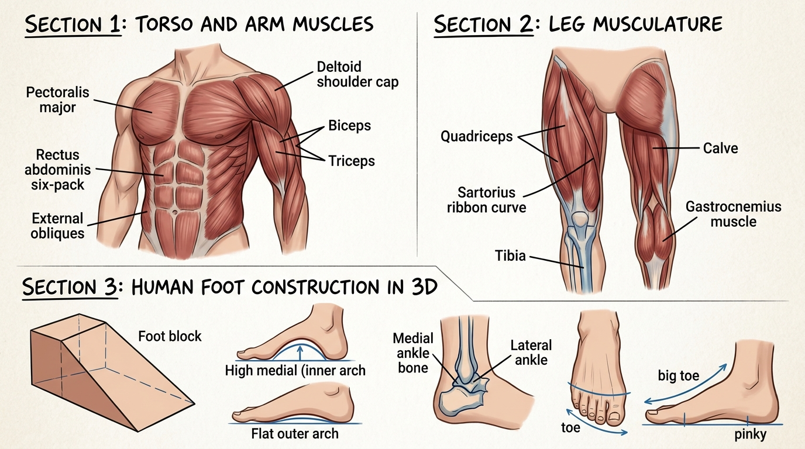

# บทเรียนที่ 4.4: กายวิภาคกล้ามเนื้อลำตัว แขน ขา และโครงสร้างเท้ามนุษย์ (Torso, Limbs & Human Feet Anatomy)

ยินดีต้อนรับสู่บทเรียนที่จะเปลี่ยนหุ่นกล่องธรรมดาให้กลายเป็น **"ร่างกายที่มีมัดกล้ามเนื้อและพลังชีวิตที่แท้จริง"** พร้อมเจาะลึกอวัยวะที่ปราบเซียนที่สุดอย่าง **"เท้ามนุษย์ (Human Feet)"** ให้วาดได้อย่างมั่นใจและมั่นคงค่ะ! 💪🧍‍♂️🦶✨



---

## 📌 สรุปหลักการสำคัญ (Core Concepts)

1. **กล้ามเนื้อคือ "สายเคเบิลดึงข้อต่อ (Pulleys & Cables)"**: กล้ามเนื้อไม่ได้แปะลอยๆ แต่จะเริ่มต้นจากกระดูกชิ้นหนึ่ง ข้ามข้อต่อ แล้วไปยึดเกาะกับกระดูกอีกชิ้นหนึ่งเสมอ
2. **การประสานสบกัน (Interlocking Muscles)**: กล้ามเนื้อจะไม่ชนกันตรงๆ แต่จะ **"เกยทับกันเหมือนเกล็ดเกราะ"** เช่น หัวไหล่ (Deltoid) จะครอบทับทั้งกล้ามอก (Pecs) และกล้ามต้นแขน (Biceps/Triceps)
3. **โครงสร้างเท้าคือ "รูปลิ่ม 3 มิติ (The Foot Wedge)"**: เท้ามนุษย์ไม่ได้แบนราบ แต่เป็นรูปลิ่มลาดเอียงจากข้อเท้าลงมาที่ปลายนิ้ว
4. **กฎเหล็กของตาตุ่ม (Ankle Bone Height Rule)**: **ตาตุ่มด้านใน (Medial Ankle) จะอยู่สูงกว่า ตาตุ่มด้านนอก (Lateral Ankle) เสมอ!**

---

## 🧩 เจาะลึกกายวิภาคกล้ามเนื้อ (Step-by-Step Breakdown)

---

### ภาคที่ 1: กล้ามเนื้อลำตัวและแขน (Torso & Arms)

```
[ กล้ามเนื้อด้านหน้าลำตัว ]                     [ การสบกันของหัวไหล่และแขน ]
     /=====[ ไหปลาร้า ]=====\                           ( Deltoid หัวไหล่ครอบคลุม )
    (  กล้ามอก Pectoralis   )                                  /        \
    |---|---| กล้ามท้อง |---|---|                             /   Biceps \  Triceps (หลัง)
    |   |   |   Abs     |   |   |                            (  หน้าแขน  )
     \  \___|___________|___/  /                              \        /
      \  External Obliques (เอว) /                              ( ข้อศอก )
```

1. **กล้ามเนื้ออก (Pectoralis Major)**:
   - มีรูปทรงคล้าย **"พัดสองอันประกบกัน"** หรือครึ่งวงรี
   - ยึดเกาะจากกระดูกอกตรงกลาง แล้วบิดรวมกันไปเกาะที่กระดูกต้นแขนใต้หัวไหล่ (เมื่อยกแขน กล้ามอกจะถูกดึงยืดตามแขนขึ้นไป)
2. **กล้ามท้อง (Rectus Abdominis / Six-Pack)**:
   - ไม่ใช่ตารางสี่เหลี่ยมเป๊ะๆ แต่มี 3 ชั้นหลักเหนือสะดือ และ 1 แผ่นทรงสามเหลี่ยมใต้สะดือ
   - แถวบนสุดจะอยู่ใต้ชายโครง แถวกลางอยู่ระดับสะดือ
3. **กล้ามเนื้อเอวด้านข้าง (External Obliques / Love Handles)**:
   - สวมกอดด้านข้างลำตัวและเกาะบนขอบกระดูกเชิงกราน ทำให้ช่วงเอวมีรอยหยักโค้ง V-Line
4. **หัวไหล่และแขน (Deltoid & Arm Flow)**:
   - **Deltoid (หัวไหล่)**: คล้ายถ้วยครอบรูปตัว V คว่ำ ครอบทับโคนแขน
   - **Biceps (ต้นแขนหน้า)**: ก้อนกล้ามเนื้อทรงไข่ด้านหน้า ดึงแขนพับขึ้น
   - **Triceps (ต้นแขนหลัง)**: ก้อนกล้ามเนื้อรูปเกือกม้า (Horseshoe) ด้านหลังแขน มีขนาดใหญ่กว่า Biceps ถึง 60%

---

### ภาคที่ 2: กล้ามเนื้อช่วงล่างและขา (Leg Musculature)

1. **กล้ามเนื้อต้นขาหน้า (Quadriceps Group)**:
   - มี 4 มัดหลัก โดยมีก้อนกลางใหญ่ (Rectus femoris) ดิ่งตรงลงมาหาหัวเข่า ประกบด้วยก้อนด้านข้างและด้านใน (Teardrop muscle เหนือเข่า)
2. **ริบบิ้นซาร์โทเรียส (Sartorius Muscle)**:
   - กล้ามเนื้อที่ยาวที่สุดในร่างกาย ทอดตัวเฉียงเหมือน **"ริบบิ้นคาด"** จากสะโพกบนด้านนอก เฉียงพาดผ่านหน้าขาลงไปเกาะที่ข้อเข่าด้านใน ทำให้ขาดูมีความลื่นไหลเป็น S-Curve
3. **หน้าแข้ง (Tibia Crest)**:
   - สันหน้าแข้งด้านหน้าคือ **กระดูกล้วนๆ ไม่มีกล้ามเนื้อบัง** (เวลาโดนเตะหน้าแข้งจึงเจ็บมาก!) ต้องวาดเป็นเส้นสันคม
4. **กล้ามเนื้อน่อง (Gastrocnemius / Calves)**:
   - ก้อนน่องหลังประกอบด้วยสองหัวคล้ายเพชร โดย **ก้อนน่องด้านนอกจะอยู่สูงกว่า ก้อนน่องด้านใน**
   - รวบสอบลงมาเป็นเส้นเอ็นร้อยหวาย (Achilles Tendon) หนาเหนียวยึดเกาะที่ส้นเท้า

---

### ภาคที่ 3: โครงสร้างเท้ามนุษย์ 3 มิติ (Human Foot Construction)

```
[ โครงสร้างรูปลิ่ม Foot Wedge ]          [ อุ้งเท้าด้านใน vs ด้านนอก ]            [ ความสูงของตาตุ่ม ]
           /\                                                                     |  (หน้าแข้ง)
          /  \ (ข้อเท้า)                /\ (อุ้งในยกสูง High Arch)                  |
         /    \                        /  \                                  (ใน) O   |
        /      \                      /____\_____ (อุ้งนอกแบน Flat)                   |   O (นอก อยู่ต่ำกว่า)
       /________\ (ปลายนิ้ว)                                                           \_____/ (ส้นเท้า)
```

1. **The 3D Wedge (ก้อนลิ่มสามเหลี่ยม)**:
   - ขึ้นโครงเท้าด้วยกล่องรูปลิ่ม: ฐานแคบและหนาที่ส้นเท้า $\rightarrow$ ลาดเอียงลง $\rightarrow$ บานกว้างและแบนที่โคนนิ้วเท้า
2. **อุ้งเท้า 2 ฝั่งไม่เท่ากัน (The Two Arches)**:
   - **ฝั่งด้านใน (Medial Side - ฝั่งนิ้วโป้ง)**: มี **"อุ้งเท้าโค้งยกสูง (High Arch)"** ไม่แตะพื้นเวลาเดิน
   - **ฝั่งด้านนอก (Lateral Side - ฝั่งนิ้วก้อย)**: มีลักษณะ **"แบนราบติดพื้น (Flat Arch)"** สำหรับกระจายน้ำหนัก
3. **ตาตุ่มเอียงสลับระดับ (The Angled Ankle Rule)**:
   - ลากเส้นเชื่อมตาตุ่มสองข้าง: ตาตุ่มด้านใน (หัวแม่โป้ง) จะ **อยู่สูงกว่า** ตาตุ่มด้านนอก (นิ้วก้อย) เสมอ!
4. **การจัดเรียงนิ้วเท้า (Toe Staircase)**:
   - นิ้วโป้งใหญ่ หนา และชี้ตรงไปข้างหน้า มี 2 ปล้อง
   - นิ้วชี้-กลาง-นาง-ก้อย มี 3 ปล้อง เรียงตัวลดหลั่นเป็นแนวโค้งมน และปลายนิ้วจะงุ้มลงแตะพื้นเล็กน้อยเพื่อยึดเกาะ

---

## ⚠️ ข้อผิดพลาดที่พบบ่อย (Common Pitfalls)

1. **วาดซิกแพ็กเป็นตารางหมากรุกตรงๆ**: ซิกแพ็กคนจริงจะมีความไม่สมมาตรเล็กน้อย และโค้งรับไปตามกรงอกทรงกระบอก
2. **วาดตาตุ่มสองข้างอยู่ในระนาบเดียวกัน**: จำสูตรเด็ดไว้เสมอ: **"ในสูง นอกต่ำ" (High Inside, Low Outside)** ถ้าตาตุ่มเท่ากันเท้าจะดูแข็งทื่อทันที
3. **วาดเท้าเป็นแผ่นกระดาษแบนๆ**: เท้ามีความหนา มีความลาดชัน และมีส่วนส้นเท้าที่ยื่นออกไปด้านหลังข้อเท้าเสมอ

---

## ✏️ การบ้านและแบบฝึกหัด (Practice Drills)

1. **Drill 1: Torso Muscle Interlocking (25 นาที)**  
   วาดหุ่นกล่องช่วงบน แล้วแปะกล้ามอก (Pecs), หัวไหล่ (Deltoids) และซิกแพ็ก 3 ระดับ พร้อมลงเงานุ่มนวล
2. **Drill 2: The Ankle & Foot Wedge (30 นาที)**  
   ขึ้นโครงลิ่ม 3D วาดเท้ามนุษย์ 3 มุมมอง: (1) ด้านข้างใน (เห็นอุ้งเท้าสูง) (2) ด้านข้างนอก (เห็นขอบแบนติดพื้น) (3) มุมมองหน้าตรง (เห็นตาตุ่มในสูงกว่านอก)
3. **Drill 3: Full Leg Flow Sketch (35 นาที)**  
   วาดขามนุษย์เต็มขาตั้งแต่สะโพกลงมาถึงปลายนิ้วเท้า เน้นเส้นริบบิ้น Sartorius เชื่อมต่อกับกล้ามเนื้อน่อง

---

## 🔍 เช็กลิสต์ตรวจผลงาน (Self-Checklist)
- [ ] หัวไหล่ (Deltoid) ครอบทับกล้ามอกและแขนอย่างถูกต้อง
- [ ] กล้ามเนื้อน่องด้านนอกอยู่สูงกว่ากล้ามเนื้อน่องด้านใน
- [ ] เท้ามีโครงสร้างรูปลิ่ม 3 มิติและมีส้นเท้ายื่นออกไปด้านหลัง
- [ ] ตาตุ่มด้านในอยู่สูงกว่าตาตุ่มด้านนอกอย่างชัดเจน
