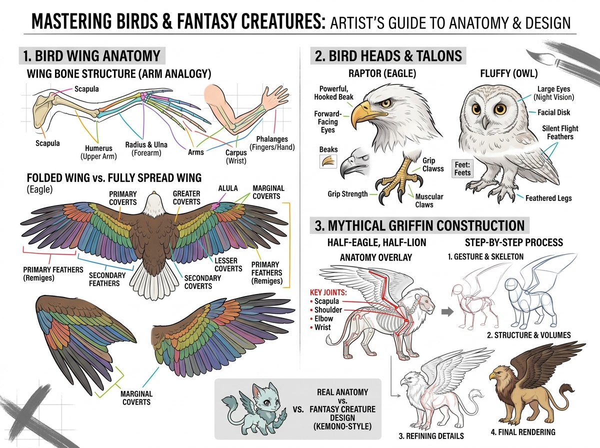

# บทเรียนที่ 5.1: สัตว์ปีก โครงสร้างปีก และสัตว์ในตำนานกริฟฟอน (Birds, Wings & Mythical Griffin)

ยินดีต้อนรับสู่บทเรียนติดปีกทะยานสู่เวหาค่ะ! 🦅🦉🪶 การวาดปีกและสัตว์ปีกมักทำให้นักวาดสับสน แต่เมื่อน้องเข้าใจว่า **"ปีกนกแท้จริงแล้วคือแขนมนุษย์ที่ดัดแปลงมา"** ทุกอย่างจะกลายเป็นเรื่องง่ายและมีตรรกะทันทีค่ะ!

---

## 📌 สรุปหลักการสำคัญ (Core Concepts)

1. **โครงกระดูกปีก = แขนมนุษย์ (Wing Bone Structure - Arm Analogy)**:
   - **Scapula**: กระดูกสะบักหลัง
   - **Humerus**: ท่อนต้นแขน
   - **Radius & Ulna**: ท่อนปลายแขนคู่
   - **Carpus & Phalanges**: ข้อมือและข้อนิ้วที่รวมตัวกันเป็นปลายปีก
2. **ขนนกซ้อนทับกันเป็นชั้น (Feather Layering)**: ขนนกไม่ได้งอกสะเปะสะปะ แต่เรียงตัวเป็น 3 ชั้นหลัก:
   - **Primary Feathers (ขนปีกหลักชั้นนอก)**: ปลายปีกยาวที่สุด ควบคุมทิศทางและแรงยก
   - **Secondary Feathers (ขนปีกชั้นใน)**: ยึดติดกับท่อนแขน ช่วยสร้างแรงพยุงตัว
   - **Coverts (ขนคลุมฐานปีก)**: ขนช่อเล็กๆ ที่ซ้อนทับโคนปีกให้เรียบเนียน Aerodynamic
3. **ปีกกาง vs ปีกหุบ (Spread vs Folded Wings)**: เมื่อนกหุบปีก ท่อนแขนจะพับเป็นรูปตัว Z ทำให้ขนนกทั้งหมดเลื่อนมาซ้อนทับกันเป็นแพอยู่ข้างลำตัว

---

## 🧩 เจาะลึก 3 หมวดหมู่สำคัญ (Detailed Breakdown)

### 1. โครงสร้างหัวและกรงเล็บนกล่าเหยื่อ vs นกฮูก (Raptor vs Owl)
ดูแผนผังโซนที่ 2 ของภาพประกอบ:
- **Raptor (นกอินทรี / เหยี่ยว - นักล่ากลางวัน)**:
  - **จะงอยปาก (Hooked Beak)**: สันปากหนา โค้งงอคมกริบสำหรับฉีกเหยื่อ
  - **ดวงตา**: อยู่ด้านข้างเยื้องหน้าเล็กน้อย สันคิ้วหนาให้สายตามุ่งมั่นดุดัน
  - **กรงเล็บ (Talons)**: นิ้วเท้าหนากล้ามเนื้อแน่น เล็บโค้งแหลมคม แรงบีบมหาศาล
- **Fluffy Owl (นกฮูก / นกเค้าแมว - นักล่ากลางคืน)**:
  - **จานใบหน้า (Facial Disk)**: ขนเรียงตัวเป็นวงกลมรอบดวงตาทำหน้าที่คล้ายจานดาวเทียมรวมคลื่นเสียง
  - **ดวงตากลมโตหันตรงไปข้างหน้า (Forward-facing Eyes)**: มองเห็นในที่มืดได้ชัดเจน
  - **ขนนุ่มเงียบ (Silent Flight Feathers)**: ปลายขนหยักละเอียดช่วยลดเสียงลมเวลาบินโฉบ

### 2. การสร้างสัตว์ในตำนาน: กริฟฟอน (Mythical Griffin Construction)
ดูแผนผังโซนที่ 3 ของภาพประกอบ: กริฟฟอนคือการผสานระหว่าง **"ราชาแห่งเวหา (อินทรี)"** และ **"ราชาแห่งพงไพร (สิงโต)"**
- **จุดเชื่อมต่อกายวิภาค (Anatomy Overlay)**:
  - ท่อนหน้า: หัว ปีก และกรงเล็บหน้าของนกอินทรี
  - ท่อนหลัง: ลำตัว สะโพก ขาหลัง และหางพู่ของสิงโต
  - **จุดยึดปีก (Key Joints)**: ฐานปีกจะเชื่อมต่อกับกระดูกสะบักเสริม (Secondary Scapula) บริเวณหลังส่วนหน้า เหนือกระดูกหัวไหล่สิงโต
- **กระบวนการวาด 4 ขั้นตอน (Step-by-Step)**:
  - **Step 1 (Gesture & Skeleton)**: ลากเส้นกระดูกสันหลังและแกนปีก 2 ข้าง
  - **Step 2 (Structure & Volumes)**: ขึ้นกล่องกรงอกอินทรี + กล่องสะโพกสิงโต + โครงกระดูกแขนปีก
  - **Step 3 (Refining Details)**: ซอยแพรขนปีก เติมจะงอยปาก และมัดกล้ามเนื้อสะโพก
  - **Step 4 (Final Rendering)**: ใส่แสงเงา ค่าน้ำหนัก และแผงคอขนนก

---

## ✏️ การบ้านและแบบฝึกหัด (Practice Drills)

1. **Drill 1: Wing Arm Analogy (15 นาที)**: วาดโครงกระดูกปีกเทียบกับแขนคน 1 คู่ (ท่อนแขนบน -> ท่อนปลายแขน -> นิ้วปีก)
2. **Drill 2: Folded vs Spread Wing (20 นาที)**: วาดปีกนกอินทรีแบบกางเต็มที่ 1 ปีก และแบบหุบพับข้างตัว 1 ปีก โดยแบ่งชั้น Primaries, Secondaries, และ Coverts ชัดเจน
3. **Drill 3: Mythical Griffin or Winged Kemono (30 นาที)**: วาดสัตว์ผสมกริฟฟอน หรือตัวละคร Kemono ติดปีก 1 ตัว

---

## 🔍 เช็กลิสต์ตรวจผลงาน (Self-Checklist)
- [ ] ข้อต่อปีกมีจังหวะพับคล้ายหัวไหล่ ข้อศอก และข้อมือ
- [ ] ขนนกซ้อนทับกันเป็นระเบียบจากบนลงล่าง (ขนชั้นบนทับขนชั้นล่าง)
- [ ] จุดเชื่อมต่อระหว่างท่อนหน้า (นก) และท่อนหลัง (สิงโต/เสือ) กลมกลืนเป็นเนื้อเดียวกัน
