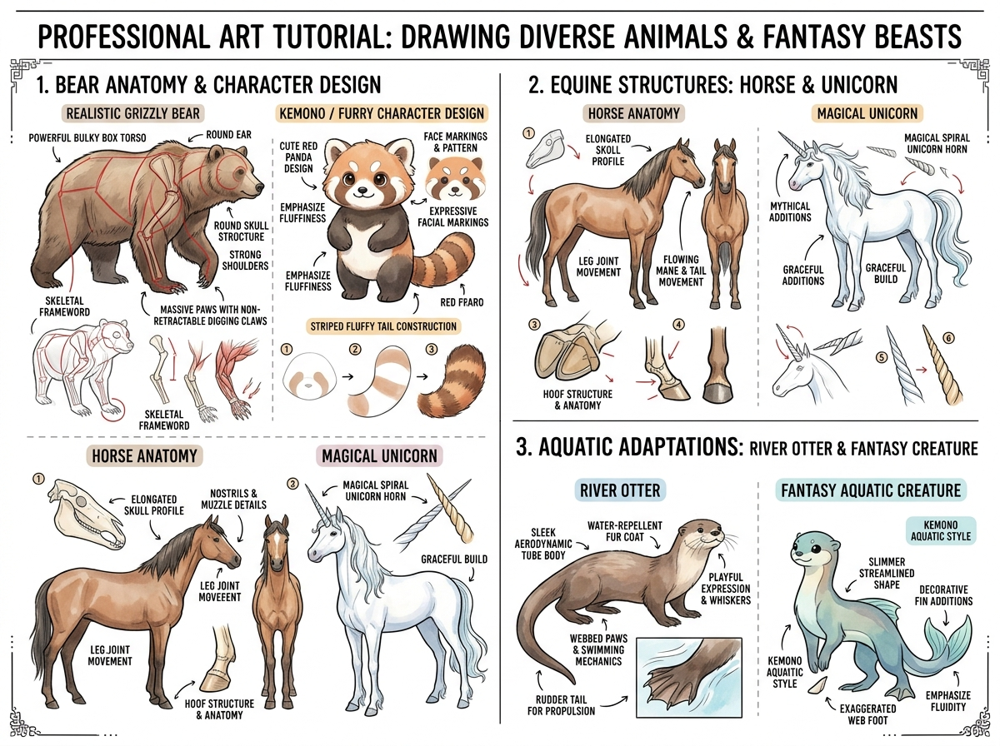

# บทเรียนที่ 5.2: หมี แพนด้าแดง ม้า ยูนิคอร์น และสัตว์น้ำแฟนตาซี (Bears, Equines & Aquatic Beasts)

ยินดีต้อนรับสู่บทเรียนสารานุกรมสัตว์บก สัตว์กีบ และสัตว์น้ำแฟนตาซีค่ะ! 🐻🐴🦄🦦🌊 บทเรียนนี้จะช่วยขยายคลังภาพ (Visual Library) ของน้องให้วาดได้ตั้งแต่สัตว์ร่างยักษ์ทรงพลัง ไปจนถึงสัตว์น้ำตัวยาวปราดเปรียวและสัตว์ในเทพนิยาย

---

## 📌 สรุปหลักการสำคัญ (Core Concepts)

1. **หมี (Ursids) = ราชาแห่งกล่องมวลหนาแน่น (Heavy Box Volume)**: โครงสร้างลำตัวของหมีคือกรงอกทรงถังเบียร์ขนาดใหญ่ และกระดูกสะบักที่มีหนอกกล้ามเนื้อ (Shoulder Hump) เด่นชัด อุ้งเท้า Plantigrade เดินเต็มฝ่าเท้าพร้อมเล็บขุดทรงพลัง
2. **ม้า (Equines) = เส้นสายแห่งความสง่างามและกล้ามเนื้อแน่น (Graceful Curves & Hooves)**: กะโหลกยาวทรงลิ่ม สันจมูกทอดระนาบตรง กล้ามเนื้อขาเพรียวบางแต่เหนียวแน่น ปลายนิ้วเท้าวิวัฒนาการกลายเป็น **"กีบเท้าเดี่ยว (Single Hoof - Unguligrade)"**
3. **สัตว์น้ำ (Aquatic Beasts) = รูปทรงท่อลู่ลมและครีบ (Streamlined Tubes & Fins)**: ลำตัวทรงกระบอกเรียวยาว ไร้มุมหัก ขนเรียบมันกันน้ำ พร้อมพังผืดระหว่างนิ้ว (Webbed Paws) และหางทรงหางเสือ

---

## 🧩 เจาะลึก 3 หมวดหมู่สายพันธุ์ (Detailed Breakdown)

### 1. โครงสร้างหมีกริซลี vs แพนด้าแดง (Bear Anatomy & Red Panda)
ดูแผนผังโซนที่ 1 ของภาพประกอบ:
- **Grizzly Bear (หมีสีน้ำตาล / หมีขั้วโลก)**:
  - **ลำตัว**: กล่องกรงอกขนาดมหึมา ไหล่มีหนอกกล้ามเนื้อสูงกว่าสะโพก
  - **ศีรษะ**: กะโหลกกลมหนา หูทรงกลมเล็กปลายมน สันจมูกกว้าง
  - **อุ้งเท้า**: ฝ่าเท้าแบนราบ (Plantigrade) กรงเล็บหนายาวไม่สามารถหดเก็บได้ ใช้สำหรับขุดดินและจับปลา
- **Red Panda (แพนด้าแดง - ขวัญใจสาย Kemono)**:
  - หัวกลมแป้น แก้มป่อง มี **ลายมาร์กิ้งสีขาวเหนือดวงตาและข้างแก้ม** อันเป็นเอกลักษณ์
  - ขนหนานุ่มฟูเป็นสองเท่า
  - **หางลายปล้อง (Striped Fluffy Tail)**: ขึ้นโครงจากทรงกระบอกดัดโค้งเป็นตัว S แล้วปาดลายปล้องสีส้มสลับน้ำตาลเข้ม

### 2. ม้าและยูนิคอร์นเวทมนตร์ (Horse Anatomy & Magical Unicorn)
ดูแผนผังโซนที่ 2 ของภาพประกอบ:
- **ม้าจริง (Realistic Horse)**:
  - **กะโหลกศีรษะ**: ยาวเรียว มีรอยต่อระหว่างหน้าผากกับสันจมูก รูจมูกขนาดใหญ่ขยายตัวรับออกซิเจน
  - **แผงคอและหาง (Mane & Tail)**: ลู่พริ้วไหวตามแรงลม มีทิศทาง Follow-through Action
  - **กีบเท้า (Hoof Structure)**: โครงสร้างเคราตินรูปสามเหลี่ยมคว่ำ แข็งแกร่ง รองรับแรงกระแทกจากการวิ่งควบ
- **ยูนิคอร์น (Magical Unicorn)**:
  - สัดส่วนเพรียวระหงกว่าม้าศึก ลำคอยาวโค้งรับกับคาง
  - **เขาเกลียวเวทมนตร์ (Magical Spiral Horn)**: งอกขึ้นจากกึ่งกลางหน้าผาก โคนเขาหนา ปลายแหลมคม บิดเป็นเกลียว 3 มิติ (Helix Curves)

### 3. สัตว์น้ำและสัตว์ครึ่งบกครึ่งน้ำ (River Otter & Aquatic Fantasy Creature)
ดูแผนผังโซนที่ 3 ของภาพประกอบ:
- **River Otter (นากแม่น้ำ)**:
  - ลำตัวท่อทรงกระบอกเรียวยาว ยืดหยุ่นได้สูงเหมือนยางลบ
  - ใบหูและจมูกเล็กจิ๋ว สามารถปิดแนบสนิทเวลาดำน้ำ
  - ฝ่าเท้ามีพังผืด (Webbed Paws) เชื่อมระหว่างนิ้วช่วยพุ้ยน้ำ
  - หางหนาแบน (Rudder Tail) สำหรับบังคับทิศทาง
- **Fantasy Aquatic Creature (สัตว์น้ำแฟนตาซี Kemono)**:
  - นำความนุ่มนิ่มของนาก/แมวน้ำมาผสมกับ **ครีบปลาโปร่งแสง (Decorative Fins)** และหางปลาวาฬ/ปลาโลมา
  - เน้นความลื่นไหลของเส้นสาย (Fluidity) และสีสันเหลือบมุก

---

## ✏️ การบ้านและแบบฝึกหัด (Practice Drills)

1. **Drill 1: Bear Bulky Box (20 นาที)**: วาดหุ่นกล่องทรงหนาของหมีกริซลี 1 ตัว เน้นหนอกกล้ามเนื้อไหล่และอุ้งเท้าหนา
2. **Drill 2: Red Panda Expression & Tail (20 นาที)**: วาดหน้าแพนด้าแดงพร้อมหางลายปล้องฟู 1 ภาพ
3. **Drill 3: Unicorn or Aquatic Beast (30 นาที)**: เลือกระหว่างยูนิคอร์นสง่างาม หรือตัวละคร Kemono สายพันธุ์สัตว์น้ำมีครีบ 1 ตัว

---

## 🔍 เช็กลิสต์ตรวจผลงาน (Self-Checklist)
- [ ] หมีมีมวลลำตัวที่หนาแน่น ไม่เพรียวบางเหมือนสุนัข
- [ ] เขายูนิคอร์นมีรอยเกลียวบิดเป็น 3 มิติ โคนเขาเชื่อมกับหน้าผากอย่างสมดุล
- [ ] สัตว์น้ำมีรูปทรงลำตัวเพรียวลู่ลม (Streamlined) เส้นสายลื่นไหลต่อเนื่อง
