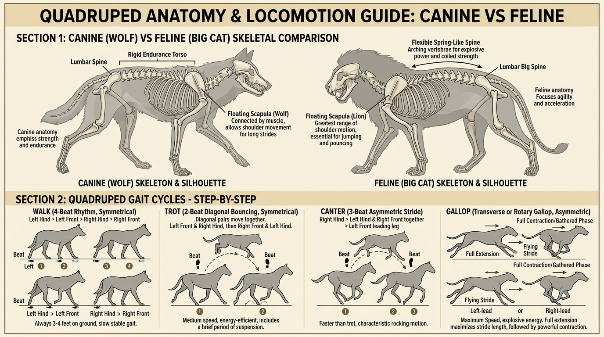

# บทเรียนที่ 5.3: สัตว์สี่ขานักล่า กายวิภาคโครงกระดูก และจังหวะก้าวเดิน/วิ่ง (Canine & Feline Quadrupeds & Gait)

ยินดีต้อนรับสู่บทเรียนที่จะเปลี่ยน "สัตว์ 4 ขาที่วาดแล้วดูเหมือนโต๊ะมีขา" ให้กลายเป็นสัตว์นักล่าที่มีชีวิตชีวา ปราดเปรียว และทรงพลัง! เรียนรู้โครงกระดูกสุนัข/หมาป่า vs แมว/เสือ พร้อมเจาะลึกแอนิเมชันจังหวะการเดินและวิ่ง 4 ระดับค่ะ! 🐺🦁🐾



---

## 📌 สรุปหลักการสำคัญ (Core Concepts)

1. **สัตว์ 4 ขาไม่มีกระดูกไหปลาร้าที่ตรึงแน่น (Floating Scapula)**: หัวไหล่และกระดูกสะบักของสุนัขและแมวยึดติดกับลำตัวด้วย "มัดกล้ามเนื้อเท่านั้น" ทำให้สะบักสามารถเลื่อนขึ้น-ลง-หน้า-หลังได้อย่างอิสระ ส่งผลให้ก้าวขายาวได้มากกว่ามนุษย์มหาศาล
2. **สุนัข = มาราธอนแห่งความแกร่ง (Rigid Endurance Torso)**: กรงอกลึก กระดูกสันหลังกระชับมั่นคง ออกแบบมาเพื่อการวิ่งไล่ล่าระยะไกลอย่างไม่เหน็ดเหนื่อย
3. **แมว/เสือ = สปริงระเบิดพลัง (Flexible Spring Spine)**: กระดูกสันหลังโค้งงอและแอ่นตัวได้สุดขั้ว ปล่อยพลังสปริงก้าวกระโดดตะครุบเหยื่อได้รวดเร็วที่สุดในพงไพร
4. **จังหวะก้าว 4 ระดับ (Gait Cycles)**: Walk (4 จังหวะช้า) $\rightarrow$ Trot (2 จังหวะทะแยง) $\rightarrow$ Canter (3 จังหวะโยก) $\rightarrow$ Gallop (ควบเต็มเหยียดลอยกลางอากาศ)

---

## 🧩 เจาะลึกโครงสร้าง & กลไก (Step-by-Step Breakdown)

---

### ภาคที่ 1: โครงกระดูกเปรียบเทียบ สุนัข (Canine) vs แมว/เสือ (Feline)

| ส่วนประกอบ | ตระกูลสุนัข / หมาป่า (Canine) | ตระกูลแมว / เสือ / สิงโต (Feline) |
| :--- | :--- | :--- |
| **กะโหลกศีรษะ (Skull)** | มูเซิลยาว ลาดเอียง ฟันกรามแข็งแรงสำหรับขบกระดูก | กะโหลกกลมสั้น มูเซิลทู่ แรงกัดเขี้ยวสูงมาก |
| **แนวกระดูกสันหลัง (Spine)** | ค่อนข้างตรงและแข็งแรง มีความยืดหยุ่นปานกลาง | **ยืดหยุ่นสูงเหมือนคันศร (Spring-like)** โค้งและแอ่นได้ $90^\circ$ |
| **กรงอก (Ribcage)** | กรงอกลึกรูปทรงลิ่ม รองรับปอดและหัวใจขนาดใหญ่ | กรงอกกลมมนและกว้างกว่าเล็กน้อย |
| **ข้อต่อแขนหน้า (Forelimbs)** | แขนขนานกัน วิ่งตรงไปข้างหน้า ไม่หมุนบิดข้อมือ | **ข้อมือหมุนบิด (Supination) ได้คล่องตัว** สำหรับตบและกอดรัดเหยื่อ |
| **กรงเล็บ (Claws)** | เล็บยื่นตลอดเวลา สึกทื่อจากการวิ่ง (Non-retractable) | **เล็บหดซ่อนในซอกนิ้วได้ (Retractable)** คมกริบตลอดเวลา |

---

### ภาคที่ 2: ความลับของกระดูกสะบักลอยตัว (Floating Scapula Mechanics)

```
[ สัตว์ 4 ขาก้าวขาหน้า ]
    (สะบักเลื่อนไปข้างหน้า)
         \ 
          \  (Scapula)
           \_____ (Humerus ต้นแขน)
                 \
                  \ (Radius/Ulna ปลายแขน)
                   \__ (อุ้งเท้าแตะพื้น)
```
- เวลาคนเราเดิน หัวไหล่จะอยู่นิ่งๆ เพราะมีกระดูกไหปลาร้า (Clavicle) ล็อกไว้
- แต่ในสัตว์ 4 ขา **กระดูกสะบัก (Scapula) จะทำหน้าที่เหมือน "กระดูกขาท่อนบนพิเศษ"**
- เมื่อสัตว์ก้าวขาหน้าไปข้างหน้า สะบักจะหมุนสไลด์ไปข้างหน้า ช่วยเพิ่มระยะก้าวอีก 20-30%
- เมื่อสัตว์รับน้ำหนักตัว สะบักจะถูกดันยกสูงขึ้นไปโผล่เป็นสันนูนบนแผ่นหลัง

---

### ภาคที่ 3: จังหวะการเคลื่อนไหว 4 ระดับ (The 4 Gait Cycles)

1. **WALK (การเดิน - 4-Beat Symmetrical Gait)**:
   - ก้าวขาทีละข้างสลับกัน: ขาหลังซ้าย $\rightarrow$ ขาหน้าซ้าย $\rightarrow$ ขาหลังขวา $\rightarrow$ ขาหน้าขวา
   - มีเท้าแตะพื้น 3-4 ข้างตลอดเวลา เป็นท่าที่มั่นคงและใช้พลังงานน้อยที่สุด
2. **TROT (การวิ่งเหยาะ - 2-Beat Diagonal Gait)**:
   - ขาคู่ทะแยงมุมจะขยับพร้อมกัน: (ขาหน้าซ้าย + ขาหลังขวา) พร้อมกัน $\rightarrow$ สลับกับ (ขาหน้าขวา + ขาหลังซ้าย)
   - มีจังหวะลอยตัวสั้นๆ กลางอากาศ (Brief Suspension) ทำให้ลำตัวโยกขึ้น-ลงเป็นจังหวะสนุกสนาน
3. **CANTER (การวิ่งควบปานกลาง - 3-Beat Asymmetric Gait)**:
   - เสียงย่ำเท้าดัง "ตึก-ตั๊ก-ตั๊ก": ขาหลังข้างหนึ่งก้าวเดี่ยว $\rightarrow$ ตามด้วยคู่ทะแยง $\rightarrow$ จบด้วยขาหน้าข้างนำ (Leading Leg)
   - เป็นท่าควบที่มีจังหวะโยกหน้า-หลังคล้ายเรือโต้คลื่น
4. **GALLOP (การวิ่งควบเต็มฝีเท้า - Maximum Flying Stride)**:
   - ความเร็วสูงสุด มี 2 เฟสหลักที่ตัดกันสุดขั้ว:
     - **เฟสยืดเหยียดสุดตัว (Full Extension)**: กระดูกสันหลังแอ่นยาว ขาหน้าเหยียดไปข้างหน้าสุด ขาหลังถีบไปข้างหลังสุด ลอยอยู่กลางอากาศ
     - **เฟสขดตัวสะสมพลัง (Gathered / Full Contraction)**: กระดูกสันหลังโก่งงอเป็นคันศร ขาหลังก้าวแซงขาหน้าเข้ามาอยู่ใต้ท้อง ลอยตัวกลางอากาศอีกครั้ง!

---

## ⚠️ ข้อผิดพลาดที่พบบ่อย (Common Pitfalls)

1. **วาดขาหลังของสัตว์เหมือนเข่าคนกลับด้าน**: ข้อต่อที่งอไปข้างหลังนั้นคือ **"ส้นเท้า (Hock)"** ส่วนหัวเข่าจริงของสัตว์อยู่สูงขึ้นไปติดกับหน้าท้องและงอไปข้างหน้าเหมือนคน!
2. **วาดแมวยืนหลังตรงทื่อเหมือนโต๊ะ**: แมวและเสือจะมีเส้นสันหลังที่มีรอยหยักโค้งเป็นคลื่นธรรมชาติเสมอ (หลังคอโค้ง $\rightarrow$ สะบักนูน $\rightarrow$ แอ่นตรงกลาง $\rightarrow$ สะโพกยกสูง)
3. **วาดท่าวิ่ง Gallop ขาลอยแตะพื้นพร้อมกัน 4 ข้าง**: สัตว์เวลาวิ่งควบจะไม่เอาเท้าแตะพื้นพร้อมกัน แต่จะสลับจังหวะดีดตัวลอยกลางอากาศอย่างสง่างาม

---

## ✏️ การบ้านและแบบฝึกหัด (Practice Drills)

1. **Drill 1: Wolf vs Cat Skeleton Breakdown (25 นาที)**  
   ร่างโครงกระดูกแบบง่าย (กะโหลกทรงกลม, กล่องกรงอก, กล่องเชิงกราน, เส้นสันหลัง) ของหมาป่าเปรียบเทียบกับเสือดาว
2. **Drill 2: The Floating Scapula in Action (20 นาที)**  
   วาดขาหน้าของสุนัข 2 ท่า: (1) ท่ายืนรับน้ำหนัก (สะบักดันขึ้นสูง) (2) ท่ายื่นก้าวขาแตะพื้น (สะบักเลื่อนไปข้างหน้า)
3. **Drill 3: Gallop Flying Stride (35 นาที)**  
   วาดเสือชีตาห์หรือหมาป่ากำลังวิ่ง Gallop ในจังหวะลอยตัวกลางอากาศ (Full Extension) 1 รูป และจังหวะขดตัวใต้ท้อง (Full Contraction) 1 รูป

---

## 🔍 เช็กลิสต์ตรวจผลงาน (Self-Checklist)
- [ ] ตำแหน่งข้อเท้า (Hock) และหัวเข่า (Knee) ถูกต้องตามหลักชีววิทยา
- [ ] กระดูกสะบัก (Scapula) เลื่อนขยับตามทิศทางการก้าวขาหน้า
- [ ] สันหลังของแมวมีความโค้งงอยืดหยุ่น ขณะที่หมามีความกระชับมั่นคง
- [ ] ท่าทางวิ่ง Gallop แสดงความยาวของลำตัวและการดีดตัวได้อย่างทรงพลัง
