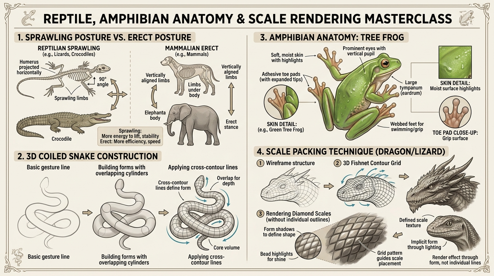

# บทเรียนที่ 5.4: สัตว์เลื้อยคลาน สัตว์ครึ่งบกครึ่งน้ำ และการจัดเรียงเกล็ด (Reptiles, Amphibians & Scale Rendering)

ยินดีต้อนรับสู่บทเรียนที่จะพาน้องๆ ดำดิ่งสู่โลกของสิ่งมีชีวิตยุคดึกดำบรรพ์ มังกรผู้ยิ่งใหญ่ กิ้งก่า จระเข้ และสัตว์ครึ่งบกครึ่งน้ำผิวฉ่ำวาว พร้อมมอบ **"สูตรลับการวาดเกล็ด 3 มิติ (Scale Packing)"** ที่จะทำให้เกล็ดมังกรของน้องดูสมจริงและมีมิติ โดยไม่ต้องเสียเวลานั่งวาดทีละเกล็ดจนมือหงิกค่ะ! 🦎🐊🐍🐸✨



---

## 📌 สรุปหลักการสำคัญ (Core Concepts)

1. **ท่ายืนกางข้อศอก $90^\circ$ (Sprawling Posture)**: กระดูกต้นแขนและต้นขาของกิ้งก่าและจระเข้จะ **"พุ่งขนานออกด้านข้างลำตัว"** ก่อนจะหักมุมข้อศอกลงสู่พื้น แตกต่างจากสัตว์เลี้ยงลูกด้วยนมที่ขาลู่ดิ่งอยู่ใต้ลำตัว (Erect Posture)
2. **งูคือ "ท่อทรงกระบอก 3 มิติที่มีการทับซ้อน (Overlapping Cylinders)"**: งูไม่ใช่เส้นริบบิ้นแบนๆ การเลื้อยและขดตัวต้องการเส้น Cross-contour เพื่อบอกทิศทาง และมีเงาตกทอด (Cast Shadow) ของลำตัวท่อนบนที่ทับท่อนล่าง
3. **ผิวสัตว์ครึ่งบกครึ่งน้ำ = ผิวฉ่ำน้ำไร้เกล็ด (Moist & Translucent Skin)**: กบและซาลาแมนเดอร์มีผิวเรียบเนียน ชุ่มชื้น มีประกายไฮไลต์สะท้อนแสงระยิบระยับ และมีปุ่มดูด (Adhesive Toe Pads) ที่ปลายนิ้ว
4. **กฎเหล็กการวาดเกล็ด (Scale Packing Technique)**: **"ห้ามวาดเกล็ดทีละอันเด็ดขาด!"** ให้วาดโครงตาข่ายแห 3D (Fishnet Grid) ตามระนาบผิว แล้วเรนเดอร์เกล็ดให้ชัดเจนเฉพาะบริเวณ **"แนวแบ่งแสงเงา (Terminator Line)"** เท่านั้น!

---

## 🧩 เจาะลึกกายวิภาค & เทคนิคเกล็ด (Step-by-Step Breakdown)

---

### ภาคที่ 1: สรีระกิ้งก่าและจระเข้ (Sprawling Posture Mechanics)

```
[ ท่ายืนกางขา Sprawling Posture ]                  [ ท่ายืนสัตว์เลี้ยงลูกด้วยนม Erect Posture ]
        (ลำตัวแบนติดพื้น)                                      (ลำตัวยกสูงจากพื้น)
     <====[ กรงอก ]====> (กระดูกแขนพุ่งออกข้าง 90 องศา)            |   [กรงอก]   |
     |                 |                                          |             | (ขายืดดิ่งใต้ลำตัว)
     |                 | (หักข้อศอกลงแตะพื้น)                      |             |
    (_)               (_)                                        (_)           (_)
```

1. **จุดศูนย์ถ่วงต่ำ (Low Center of Gravity)**: ลำตัวของสัตว์เลื้อยคลานจะขนานและแทบจะแนบติดกับพื้น ท้องป่องออกข้างเล็กน้อย
2. **การเดินแบบบิดตัวตัว S (Lateral Undulation)**: เวลากิ้งก่าหรือจระเข้ก้าวเดิน กระดูกสันหลังจะเลื้อยส่ายไป-มาเป็นรูปตัว S สลับซ้าย-ขวา ส่งแรงผลักไปที่ขาก้าว
3. **โครงสร้างกะโหลกจระเข้ (Crocodile Skull)**: กะโหลกแบนยาว ช่องเปิดเบ้าตาและรูจมูกอยู่ **"ด้านบนสุดของกะโหลก"** เพื่อให้โผล่พ้นผิวน้ำได้ขณะที่ทั้งตัวยังจมอยู่ใต้น้ำ

---

### ภาคที่ 2: การเลื้อยและขดตัว 3D ของงู (3D Coiled Snake)

1. **ลากเส้นท่าทางหลัก (Gesture Line)**: ลากเส้นโค้งคลื่นบอกจังหวะการเลื้อยหรือขดตัว
2. **สร้างทรงกระบอกทับซ้อน (Overlapping Cylinders)**:
   - อย่าวาดลำตัวงูเท่ากันหมด ส่วนคอจะคอดเล็ก $\rightarrow$ ลำตัวตรงกลางจะหนาใหญ่ $\rightarrow$ ค่อยๆ เรียวแหลมที่ปลายหาง
   - ท่อนลำตัวที่อยู่ด้านหน้า **ต้องบดบัง (Overlap)** ท่อนลำตัวที่อยู่ด้านหลังอย่างชัดเจน
3. **Cross-Contour Rings (ห่วงบอกระนาบ)**: ลากเส้นโค้งรอบทรงกระบอกเพื่อกำหนดว่าส่วนท้องหงายขึ้นหรือคว่ำลง

---

### ภาคที่ 3: สรีระกบและสัตว์ครึ่งบกครึ่งน้ำ (Tree Frog Anatomy)

1. **โครงสร้างสามเหลี่ยมกะโหลกสั้น**: กบไม่มีคอ หัวเชื่อมต่อกับลำตัวโดยตรง ตาโปนโตเป็นทรงกลมอยู่ด้านบน
2. **ขาหลังทรงพลัง (Z-Fold Legs)**: ขาหลังพับซ้อนกัน 3 ท่อนเป็นรูปตัว Z มีกล้ามเนื้อต้นขาหนาสำหรับดีดตัวกระโดด
3. **ผิวหนังฉ่ำน้ำ (Moist Skin Highlights)**:
   - ผิวของกบทำหน้าที่แลกเปลี่ยนออกซิเจน จึงเคลือบด้วยเมือกชุ่มชื้นตลอดเวลา
   - เทคนิคลงสี: ระบายสีพื้นด้วยโทนเขียว/เหลืองไล่เฉด $\rightarrow$ เติมเงาหลืบ AO นุ่มนวล $\rightarrow$ **แต้มไฮไลต์สีขาวจิ๋วๆ กระจายตามแนวระนาบรับแสง** เพื่อให้ดูเปียกชื้นสมจริง

---

### ภาคที่ 4: คัมภีร์โกงวาดเกล็ดมังกร (Scale Packing Masterclass)

```
[ Step 1: Wireframe ]    ==>    [ Step 2: 3D Fishnet Grid ]    ==>    [ Step 3: Shading & Highlights ]
        ______                         __/\__/\__                          __/\__/\__
      /  O     \                      /  /\  /\  \                        /  /*\/*\  \ (ไฮไลต์บนเกล็ด)
     |          |                    |  /\  /\  /\|                      |  /  \  \  | (เงาฟอร์มรวม)
      \________/                      \__\/__\/__/                        \__\/__\/__/
```

1. **Step 1: วาดรูปทรงหลักและแสงเงารวม (Macro Form)**:
   - วาดหัวมังกรหรือกิ้งก่าให้เสร็จก่อน ลงแสงและเงารวม (Form Shadow) ให้ก้อนหัวมีมิติ 3D เต็มที่ **ก่อนจะคิดเรื่องเกล็ด!**
2. **Step 2: ลากโครงตาข่ายแห 3D (3D Fishnet Contour Grid)**:
   - ลากเส้นทแยงมุมสองทิศทางตัดกันเป็นรูปสี่เหลี่ยมข้าวหลามตัด (Diamond grid)
   - เส้นตาข่ายต้องโค้งรัดไปตามความนูนของกล้ามเนื้อ ไม่ใช่เส้นตรงแบนราบ
3. **Step 3: เรนเดอร์เกล็ดเฉพาะจุดสำคัญ (Focus on the Terminator)**:
   - **ในโซนสว่างจ้า (Highlight Area)**: ปล่อยให้แสงกลืนเกล็ดไป ไม่ต้องวาดรอยต่อชัด
   - **ในโซนเงามืด (Shadow Area)**: กลืนเกล็ดเข้าสู่เงามืด ไม่ต้องวาดดีเทล
   - **ในโซนรอยต่อแสงเงา (Terminator Line)**: **นี่คือจุดทองคำ!** แต้มเงาใต้เกล็ดแต่ละอัน และแต้มไฮไลต์รูปเม็ดบีดส์ (Bead Highlight) ตรงยอดเกล็ด จะทำให้สมองของผู้ชมคิดไปเองว่า "ตัวละครนี้มีเกล็ดสมบูรณ์แบบทั้งตัว!"

---

## ⚠️ ข้อผิดพลาดที่พบบ่อย (Common Pitfalls)

1. **วาดขากิ้งก่าห้อยลงมาใต้ตัวเหมือนวัว**: สัตว์เลื้อยคลานขาต้องกางออกด้านข้าง $90^\circ$ เสมอ ถ้าขาชี้ลงพื้นตรงๆ จะกลายเป็นไดโนเสาร์หรือสัตว์เลี้ยงลูกด้วยนมทันที
2. **วาดเกล็ดเรียงเป็นตารางหมากรุก 2D แบนๆ**: เกล็ดต้องซ้อนทับกันเหมือนกระเบื้องมุงหลังคา (Shingled Overlap) โดยเกล็ดด้านหน้าจะซ้อนทับขอบของเกล็ดด้านหลัง
3. **ตัดเส้นเกล็ดดำปื๊ดเท่ากันทุกเกล็ด**: จะทำให้ภาพดูลายตาและแบนทันที เกล็ดต้องพึ่งพาน้ำหนักแสงเงา ไม่ใช่เส้นขอบดำ

---

## ✏️ การบ้านและแบบฝึกหัด (Practice Drills)

1. **Drill 1: Sprawling Lizard Pose (25 นาที)**  
   ร่างโครงสร้างกิ้งก่ามุมมองก้ม (Top-down) 1 ตัว เน้นท่ายืนกางข้อศอกออกข้าง $90^\circ$ และการบิดสันหลังรูปตัว S
2. **Drill 2: Coiled Snake Cylinder (30 นาที)**  
   วาดงูขดตัวเป็นเลข 8 ทับซ้อนกัน 3 ชั้น โดยใส่เส้น Cross-contour และเงาตกทอด (Cast Shadow) ให้ดูลอยมีมิติ
3. **Drill 3: Dragon Head Scale Packing (40 นาที)**  
   วาดหัวมังกรครึ่งซีก ใช้เทคนิคตาข่ายแห 3D แล้วเรนเดอร์เกล็ดเฉพาะบริเวณแนวแบ่งแสงเงา (Terminator) ให้ดูนูนวับระดับภาพยนตร์

---

## 🔍 เช็กลิสต์ตรวจผลงาน (Self-Checklist)
- [ ] ขาของสัตว์เลื้อยคลานกางออกด้านข้างตามหลัก Sprawling Posture
- [ ] ลำตัวของงูมีมิติความลึกและการซ้อนทับที่ชัดเจน ไม่ดูแบนเป็นริบบิ้น
- [ ] ผิวกบมีความชุ่มฉ่ำน้ำด้วยจุดไฮไลต์ระยิบระยับ
- [ ] เกล็ดมังกรโค้งรับกับระนาบ 3 มิติ และเน้นเรนเดอร์เฉพาะบริเวณแนวแบ่งแสงเงา
