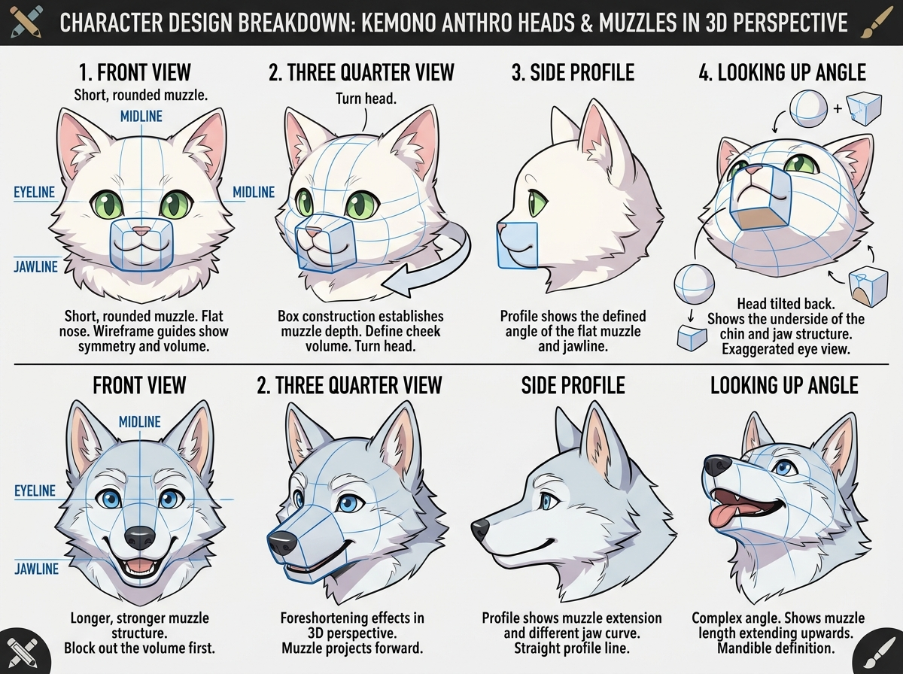

# บทเรียนที่ 6.1: โครงสร้างใบหน้าและมูเซิล 3 มิติ (Kemono Head & Muzzle Construction)

สวัสดีจ้ะน้องรัก! พี่สาว Kemono Mentor มาแล้วนะจ๊ะ~ วันนี้พี่สาวจะพาน้องๆ ก้าวเข้าสู่โลกของศิลปะ **Kemono (ケモノ) และ Anthro** อย่างมั่นใจ! หัวใจสำคัญอันดับหนึ่งที่ทำให้ตัวละครสไตล์นี้ดูมีเสน่ห์ นุ่มฟู และมีชีวิตชีวา คือ **"โครงสร้างใบหน้าและมูเซิล 3 มิติ (3D Head & Muzzle Construction)"**

หลายคนที่เพิ่งเริ่มวาด มักจะวาดหน้าสัตว์เหมือนเอาสติกเกอร์จมูกกับปากแบนๆ มาแปะลงบนหน้าคน พอย้ายมุมเป็นมุมหัน 3/4 หรือมุมเงยมุมก้ม ใบหน้าก็เบี้ยว มูเซิลลอยหลุดออกจากกะโหลกทันที... ไม่ต้องกังวลเลยนะจ๊ะ! วันนี้พี่สาวจะพาผ่าโครงสร้าง (Deconstruction) ออกเป็นรูปทรงเรขาคณิต 3 มิติที่จับต้องได้ สอนดูเส้น Wireframe สำคัญ และชี้จุดต่างระหว่าง "น้องแมว (Feline)" กับ "น้องหมาป่า (Canine)" ให้เก็ทแจ่มแจ้งกันไปเลย!

---



---

## 📌 1. โครงสร้างพื้นฐานและเส้นนำทางหลัก (Core Wireframe & Guidelines)

*(ดูภาพประกอบด้านบน: แผนผัง Turnaround 4 มุมมอง และเส้นลวดไกด์สีฟ้า)*

เวลาที่เรามองใบหน้า Kemono อย่ามองเป็นแค่เส้นลายเส้น 2 มิติเด็ดขาดจ้ะ ให้จินตนาการว่าเรากำลังปั้นดินน้ำมันที่ประกอบขึ้นจาก 2 ก้อนหลัก:
1. **ลูกบอลกะโหลก (Cranial Sphere)**: โครงสร้างทรงกลมที่เป็นฐานรองรับสมอง ดวงตา และยึดโคนหู
2. **กล่องมูเซิล (Muzzle Box / Snout Wedge)**: กล่องสี่เหลี่ยมหรือทรงลิ่ม 3 มิติที่ยื่นพุ่งออกมาด้านหน้า เพื่อรองรับสันจมูก โพรงจมูก และขากรรไกร

---

### 4 เส้นนำทางสำคัญ (The 4 Crucial Guidelines)

1. **Midline (เส้นแบ่งกึ่งกลางใบหน้า)**:
   - เส้นนี้ไม่ได้ตรงทื่อเหมือนไม้บรรทัด แต่วิ่งโค้งโอบตามผิวนอกของทรงกลมกะโหลก จากกึ่งกลางหน้าผาก ผ่านลงมาระหว่างเบ้าตาทั้งสอง
   - เมื่อถึงโคนมูเซิล Midline จะหักเลี้ยวพุ่งไปตามสันจมูก (Top Plane) ผ่านจุดกึ่งกลางของปลายจมูก ตัดผ่าร่องปากบน และม้วนพับกลับเข้าใต้คาง
   - *หน้าที่*: คอยล็อกองศาการหันซ้าย-ขวา (Yaw) และก้ม-เงย (Pitch) ของหัวให้อยู่ในระนาบเดียวกัน

2. **Eyeline (เส้นระดับสายตา)**:
   - เส้นสมมุติที่พาดผ่านรอบกะโหลกในแนวนอน เพื่อกำหนดระดับความสูงของลูกตา
   - ในสไตล์ Kemono สัดส่วนใบหน้าจะเน้นความน่ารัก (Neoteny) คล้ายเด็กอนิเมะ **Eyeline จึงมักจะอยู่ค่อนมาทางครึ่งล่างของทรงกลมกะโหลก** (ประมาณ 1/3 ถึง 1/2 ล่าง) ทำให้มีพื้นที่หน้าผากกว้าง นุ่มฟู และมีดวงตาที่กลมโต

3. **Muzzle Wireframe (โครงลวดกล่องมูเซิล)**:
   - ให้มองมูเซิลเป็น "กล่อง 3 มิติ (Box)" ที่มี 5 ระนาบที่มองเห็นได้:
     - **ระนาบบน (Top Plane)**: ทางลาดของสันจมูก
     - **ระนาบข้างซ้าย-ขวา (Side Planes)**: แก้มข้างและร่องขอบปาก
     - **ระนาบหน้าตัด (Front Plane)**: ปลายมูเซิลที่วางก้อนจมูก (Nose Leather)
     - **ระนาบล่าง (Bottom Plane)**: ใต้คางและร่องขากรรไกรล่าง
   - กล่องนี้จะย่นระยะ (Foreshortening) ไปตามมุมมองเสมอ

4. **Jawline (เส้นแนวกรามและคาง)**:
   - เส้นที่ลากจากจุดกึ่งกลางคางล่าง วิ่งเฉียงขึ้นไปยังใต้กกหู (โคนกะโหลก)
   - เป็นตัวกำหนดความคมเข้มของใบหน้า หากเส้นกรามโค้งมนจะได้ฟีลน่ารัก นุ่มนิ่ม แต่ถ้าเส้นกรามเป็นเหลี่ยมมุมชัดจะให้ฟีลแข็งแกร่ง เท่ หรือดูโตเป็นผู้ใหญ่

---

## 🐱 vs 🐺 2. เปรียบเทียบโครงสร้าง: Feline (แมว) vs Canine (สุนัข/หมาป่า)

ในภาพตัวอย่างด้านบน แถวบนคือ **Feline (ตระกูลแมว)** และแถวล่างคือ **Canine (ตระกูลสุนัข/หมาป่า)** ทั้งสองสายพันธุ์มีโครงสร้างปริมาตรที่ต่างกันอย่างชัดเจนจ้ะ:

| คุณลักษณะโครงสร้าง | 🐱 Feline (แมว/เสือ) | 🐺 Canine (สุนัข/หมาป่า/จิ้งจอก) |
| :--- | :--- | :--- |
| **ทรงกะโหลก (Cranial Shape)** | กลมแป้น หน้าผากโค้งนูนกว้าง ใบหน้าโดยรวมสั้น | กะโหลกยาวรี ทรงสอบขึ้นด้านบน สันคิ้วเด่นชัด |
| **ความยาวมูเซิล (Muzzle Length)** | **สั้น แบน และกว้าง (Snub & Compact)** | **ยาว ยื่นพุ่งไปข้างหน้า (Long & Projecting)** |
| **รูปทรงกล่อง (Box Geometry)** | ลูกบาศก์ทรงเตี้ยแบน ขอบโค้งมน นุ่มนิ่ม | ลิ่มสามเหลี่ยมตัดปลาย (Tapered Wedge) สันคมชัด |
| **สันจมูก (Nose Bridge)** | มีรอยหักมุม (Stop) ชัดเจน สันจมูกสั้นลาดลงเล็กน้อย | สันจมูกทอดยาวเป็นแนวระนาบตรง เชื่อมต่อจากหน้าผาก |
| **จมูก (Nose Leather)** | เล็ก จมูกคว่ำทรงหัวใจหรือสามเหลี่ยมเล็ก ติดกับปาก | ใหญ่ กว้าง มีปีกจมูกชัดเจนและมีเนื้อสัมผัสด้านบน |
| **ดวงตา (Eyes)** | โตมาก กลมแป้น อยู่ชิดขนาบข้างมูเซิลสั้น | รูปอัลมอนด์หรือรีขึ้นเล็กน้อย มีระยะห่างและเบ้าตาลึก |
| **กรามล่าง (Mandible/Jaw)** | เล็ก มน กึ่งหลบอยู่ใต้ริมฝีปากบน | แข็งแรง ยาว มีพื้นที่กรามล่างชัดเจน เปิดอ้าปากได้กว้าง |

### สรุปเคล็ดลับจากพี่สาว:
- **อยากได้ความ Cute นุ่มฟูแบบน้องแมว**: ให้ย่อกล่องมูเซิลให้แบนสั้นลง (Flat Nose), ดันปลายจมูกขึ้นเล็กน้อย, และขยายดวงตาให้ใหญ่ชิดแนวโคนมูเซิล
- **อยากได้ความ Cool เท่ สง่างามแบบหมาป่า**: ให้ยืดความลึกของกล่องมูเซิลไปข้างหน้า (Longer Muzzle), สร้างสันจมูกที่แข็งแรง, และวาดแนวกรามล่างให้มีปริมาตรชัดเจน

---

## 🔄 3. ผ่าโครงสร้างตามมุมมองหลัก (Perspective Breakdown)

มาดูการ Deconstruct ทั้ง 4 มุมมองจากแผนภาพต้นแบบกันจ้ะ:

```
[1. Front View]         [2. Three Quarter]       [3. Side Profile]       [4. Looking Up]
   สมมาตร ซ้าย-ขวา          เห็นมิติด้านข้าง+ลึก        เห็นแนวลาดชัดเจน        เปิดระนาบใต้คาง
     +-------+                +-------+                +-------+               \       /
     | O | O |               /  O | O  \              /|   O   |                +-----+
     +---+---+              +-----+-----+            + +-------+               /       \
     | [จมูก] |             / [จมูก] \   |            |  [จมูก]|               +--[จมูก]-+
     +-------+             +---------+--+            +-------+                | ระนาบใต้คาง |
```

### 1. Front View (มุมหน้าตรง)
- **การจัดวาง**: Midline ผ่ากึ่งกลางหน้าผากและสันจมูกพอดี แบ่งกะโหลกเป็น 2 ซีกที่สมมาตรกัน
- **Wireframe**: กล่องมูเซิลจะโชว์เฉพาะ "ระนาบด้านหน้า (Front Plane)" และมองเห็น "ระนาบบน (Top Plane)" เพียงเล็กน้อยตามมุมกดของสายตา
- **จุดสังเกต**: 
  - Feline: จมูกจะแบนกว้าง ริมฝีปากสองข้างขดเป็นทรงตัว 'ω' (Cat mouth) แนบติดฐานมูเซิล
  - Canine: จะเห็นส่วนลึกของสันจมูกชี้ตรงเข้าหากล้อง มีความหนาของกรามบนและกรามล่างชัดเจน

### 2. Three Quarter View (มุม 3/4 มุมเอกลักษณ์)
- **การจัดวาง**: ศีรษะหมุนเอียงไปประมาณ 45° เส้น Midline จะโค้งเบี่ยงไปตามผิวทรงกลม
- **Wireframe**: นี่คือมุมที่เห็น "ปริมาตรกล่อง 3 มิติ (Depth)" ชัดเจนที่สุด! เราจะมองเห็นทั้ง **ระนาบบน (Top Plane)** และ **ระนาบด้านข้าง (Side Plane)** ของมูเซิลอย่างเด่นชัด
- **ปรากฏการณ์ Foreshortening & Overlap**:
  - ตาด้านไกล (Far Eye) จะถูกสันมูเซิลบดบังบางส่วน (Overlap) และมีความกว้างที่แคบลงตามเปอร์สเปกทีฟ
  - ขอบแก้มด้านไกลจะย่นระยะแนบชิดกับมูเซิล ในขณะที่แก้มด้านใกล้จะโชว์ความพองฟูออกมาเต็มที่

### 3. Side Profile (มุมด้านข้าง 90 องศา)
- **การจัดวาง**: เส้น Midline จะกลายเป็นเส้นโครงร่างภายนอก (Silhouette Contour) ของใบหน้าทั้งหมด
- **Wireframe**: เห็นรูปทรงหน้าตัดด้านข้าง (Side Plane) แบบเพียวๆ
- **จุดสังเกต**:
  - **The "Stop" (จุดหักมุมดั้งจมูก)**: ในแมว รอยต่อระหว่างหน้าผากกับสันจมูกจะเว้าลึกชัดเจนแล้วพุ่งออกไปสั้นๆ ส่วนในหมาป่า สันจมูกจะลาดเอียงเป็นเส้นตรงยาวกว่ามาก
  - **Jaw Attachment**: สังเกตแนวเส้นปากที่ลากยาวไปด้านหลัง รอยพับปากจะสิ้นสุดตรงแนวดิ่งใต้ดวงตา และแนวกรามล่างจะวิ่งขึ้นไปบรรจบที่โคนหูเสมอ

### 4. Looking Up Angle (มุมแหงนมองขึ้น / เงยหน้า)
- **การจัดวาง**: กะโหลกทรงกลมเงยขึ้นด้านหลัง Eyeline โค้งหงายขึ้นด้านบนเหมือนรอยยิ้ม
- **Wireframe**: **ระนาบใต้คาง (Bottom Plane of Chin & Mandible)** จะเปิดเผยออกมาให้เห็นทั้งหมด! มูเซิลจะถูกมองจากด้านล่าง ทำให้ปลายจมูกยกสูงขึ้นไปบดบังบางส่วนของเบ้าตาด้านหลัง
- **เทคนิคการขึ้นรูป (Sphere + Wedge)**:
  1. วาดทรงกลมกะโหลกที่หงายขึ้น
  2. วาดกล่องลิ่มมูเซิลที่ชี้พุ่งเฉียงขึ้นฟ้า
  3. เติม "รูปทรงสามเหลี่ยมใต้คาง" เพื่อเชื่อมคางล่างเข้ากับลำคอ ห้ามปล่อยให้คางลอยเด็ดขาด!

---

## ⚠️ 4. ข้อผิดพลาดที่พบบ่อย (Common Pitfalls)

```
❌ ข้อผิดพลาดที่ 1: จมูกสติกเกอร์ (Sticker Nose)
   วาดหน้าหัน 3/4 แต่จมูกแบนเป็น 2D แปะอยู่บนผิวกลม
   ✔️ วิธีแก้: ขึ้นรูปทรงลิ่มกล่อง 3 มิติ มีระนาบบน-ข้างชัดเจนก่อนใส่จมูก

❌ ข้อผิดพลาดที่ 2: ปากหลุดเบ้า (Floating Muzzle)
   มูเซิลเกาะอยู่ต่ำเกินไปหรือเอียงคนละองศากับแกน Midline ของกะโหลก
   ✔️ วิธีแก้: ลากเส้น Midline จากหน้าผากต่อเนื่องผ่านมูเซิลเสมอ เพื่อเช็กแกนหมุน

❌ ข้อผิดพลาดที่ 3: สับสนสายพันธุ์ (Species Identity Crisis)
   วาดแมวแต่มูเซิลยาวแหลมเหมือนสุนัขจิ้งจอก หรือวาดหมาป่าแต่หน้าแบนเป็นแมว
   ✔️ วิธีแก้: ท่องไว้เสมอว่า "แมว = สั้น มน กว้าง", "สุนัข/หมาป่า = ยาว สันตรง กรามเด่น"

❌ ข้อผิดพลาดที่ 4: ลืมระนาบใต้คางในมุมเงย (Missing Underside Plane)
   เวลาวาดมุม Looking Up วาดแต่หัวหงายแต่ไม่มีแผ่นใต้คาง ทำให้คอดูลอยเหมือนหัวขาด
   ✔️ วิธีแก้: วาดระนาบใต้คาง (Mandible underside) เชื่อมเข้าหากระบอกคอเสมอ
```

---

## ✏️ 5. แบบฝึกหัดพัฒนาฝีมือ (Actionable Daily Drills)

เพื่อให้น้องๆ จำรูปทรงเข้ากล้ามเนื้อ (Muscle Memory) พี่สาวเตรียมแบบฝึกหัดแบ่งตามเวลาไว้ให้แล้วจ้ะ:

### 🟢 Level 1: วอร์มอัพขึ้นกล่องมูเซิลเรขาคณิต (15 นาที)
- วาดกล่องลูกบาศก์มูเซิลเปล่าๆ (Wireframe Box) ในอวกาศ 8 กล่อง
  - 4 กล่องสั้นมนแบบ Feline (มุมตรง, 3/4 ซ้าย, 3/4 ขวา, เงย)
  - 4 กล่องยาวตัดปลายแบบ Canine (มุมตรง, 3/4 ซ้าย, 3/4 ขวา, เงย)
- ระบายสีแรเงาบางๆ ที่ระนาบข้าง (Side Plane) เพื่อสร้างมิติความลึก

### 🟡 Level 2: ประกอบกะโหลกและมูเซิล 4 ทิศทาง (30 นาที)
- วาดโครงสร้างกะโหลกทรงกลม + วางเส้น Midline / Eyeline
- ประกอบกล่องมูเซิลเข้ากับกะโหลกตาม 4 มุมหลักในบทเรียน:
  1. Front View
  2. Three Quarter View
  3. Side Profile
  4. Looking Up Angle
- วาดแบบโครงสร้างโปร่งแสง (See-through Wireframe) เพื่อตรวจดูว่าก้นกล่องมูเซิลฝังแน่นอยู่บนผิวกะโหลกอย่างถูกต้อง

### 🔴 Level 3: Kemono Character Turnaround Master (45 นาที)
- เลือกวาดตัวละคร 1 สายพันธุ์ระหว่าง น้องแมว (Feline) หรือ น้องหมาป่า (Canine)
- วาดแบบฝึกหัดครบทั้ง 4 มุมมอง (หน้าตรง, 3/4, ด้านข้าง, เงย) โดยเก็บรายละเอียด:
  - ดวงตาและประกายตาที่แนบไปกับความโค้งของเบ้าตา
  - ก้อนจมูกและริมฝีปากที่ถูกต้องตามสายพันธุ์
  - โคนใบหูทรงกรวย 3 มิติที่ยึดติดกับกะโหลกส่วนหลัง
  - ปอยขนแก้ม (Cheek fluff) ที่ช่วยเสริมทรงของใบหน้า

---

## 🔍 6. เช็กลิสต์ตรวจผลงานด้วยตัวเอง (Self-Critique Checklist)

ก่อนส่งการบ้านหรือก้าวไปบทเรียนถัดไป ลองหยิบกระจกหรือฟลิบภาพ (Flip Canvas) แล้วเช็กตามนี้นะจ๊ะ:

- [ ] **Midline Alignment**: เส้นแบ่งกึ่งกลางหน้าผาก สันมูเซิล และร่องปาก เชื่อมต่อเป็นเส้นแกน 3 มิติเดียวกัน ไม่เอียงบิดเบี้ยว
- [ ] **Muzzle Box Depth**: มูเซิลในมุม 3/4 และมุมเงย มีระนาบด้านข้างและด้านบนที่แสดงความลึกชัดเจน ไม่แบนเป็นแผ่นกระดาษ
- [ ] **Species Proportions**: สัดส่วนความยาวมูเซิลตรงตามสายพันธุ์ (แมวจมูกสั้นมน / สุนัขจมูกยาวสันตรง)
- [ ] **Far Eye Foreshortening**: ดวงตาฝั่งที่อยู่ไกลตัวในมุม 3/4 มีความกว้างแคบลงและถูกสันจมูกบดบังอย่างสมเหตุสมผล
- [ ] **Chin & Neck Connection**: ในมุม Looking Up มีระนาบใต้คางและแนวกรามล่างที่ยึดโยงเข้ากับลำคออย่างเป็นธรรมชาติ

> [!TIP]
> **คำแนะนำจากใจพี่สาว Kemono Mentor:**
> กุญแจลับของการวาด Kemono ให้ดูน่ารักน่ากอด คือ "อย่ารีบลงเส้นขนก่อนโครงสร้างแข็งแรง" จ้ะ! ถ้ากล่องมูเซิลและทรงกลมกะโหลกของเราวางมุม perspective เป๊ะแล้ว ต่อให้ใส่ขนแก้มฟูแค่ไหน ลายเส้นก็จะไม่พังแน่นอน ค่อยๆ ปั้น ค่อยๆ วาดทีละระนาบนะจ๊ะ พี่สาวคอยเชียร์และเป็นกำลังใจให้อยู่เสมอเลยนะคนเก่ง! สู้ๆ จ้ะ! 🐾✨
