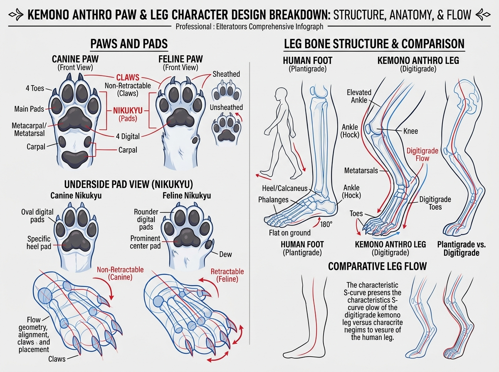

# บทเรียนที่ 6.2: โครงสร้างอุ้งเท้า เล็บ และขาสัตว์ Digitigrade (Kemono Paws & Digitigrade Legs)

ยินดีต้อนรับสู่บทเรียนที่จะเปลี่ยน "ขาและมือสัตว์ที่วาดยากๆ" ให้กลายเป็นจุดเด่นที่น่าหลงใหลที่สุดของตัวละคร Kemono ค่ะ! 🐾

---

## 📌 สรุปหลักการสำคัญ (Core Concepts)

1. **ขา Digitigrade ไม่ได้มี "เข่าสองข้อ"**: สัตว์ตระกูลสุนัข แมว เสือ แท้จริงแล้วยืนด้วย **"ปลายนิ้วเท้า (Digitigrade)"** ข้อต่อที่ดูเหมือนเข่ากลับทิศทางนั้น ความจริงคือ **"ข้อเท้าและส้นเท้า (Elevated Ankle / Hock)"** ที่ยกสูงขึ้นมาจากพื้น!
2. **รูปทรงกระดูก S-Curve Flow**: ขาแบบ Digitigrade มีจังหวะเส้นสายโค้งเป็นรูปตัว S ช่วยส่งเสริมความรู้สึกปราดเปรียว ว่องไว และมีสปริง
3. **อุ้งเท้า (Paw Pads / Nikukyu - 肉球)**: คือแผ่นรองรับน้ำหนักที่มีความหนานุ่มแบบเรขาคณิตมน ยึดติดกับกระดูกฝ่ามือ/ฝ่าเท้า

---

## 🧩 เจาะลึกโครงสร้าง (Step-by-Step Breakdown)

### 1. ความแตกต่างระหว่างขาคน (Plantigrade) vs ขา Kemono (Digitigrade)
ดูแผนภาพเปรียบเทียบในภาพประกอบด้านขวา:
- **มนุษย์ (Plantigrade)**: ส้นเท้าวางแบนราบกับพื้น $180^\circ$ (ฝ่าเท้ายาวแตะพื้นเต็มผืน)
- **Kemono / สัตว์ 4 ขา (Digitigrade)**: 
  - **ต้นขา (Femur)**: ชี้เฉียงไปข้างหน้า
  - **หัวเข่า (Knee)**: ชี้ไปข้างหน้าเหมือนคนปกติ
  - **หน้าแข้ง (Tibia/Fibula)**: เอียงย้อนกลับไปด้านหลัง
  - **ข้อเท้า/ส้นเท้า (Hock / Elevated Ankle)**: ลอยอยู่กลางอากาศ หักมุมลงมาข้างหน้า
  - **กระดูกฝ่าเท้า (Metatarsals)**: ทำหน้าที่คล้ายหน้าแข้งท่อนล่าง
  - **นิ้วเท้า (Toes)**: รับน้ำหนักบนพื้นเพียงส่วนเดียว

### 2. โครงสร้างอุ้งมือและอุ้งเท้า (Paws & Pads)
ดูแผนภาพเปรียบเทียบระหว่างสุนัข (Canine) และแมว (Feline) ด้านซ้าย:
- **Canine Paw (สุนัข / สุนัขจิ้งจอก / หมาป่า)**:
  - นิ้วเท้าจะเรียงตัวรูปวงรี (Oval digital pads) มีความกระชับ มั่นคง
  - **เล็บ (Claws)**: ยื่นออกมาตลอดเวลา ไม่สามารถหดเก็บได้ (Non-retractable)
  - ปลายเล็บจะทื่อจากการวิ่งกระทบพื้น
- **Feline Paw (แมว / เสือ / เสือดาว)**:
  - ปุ่มเนื้อนิ้วจะกลมมนกว่า (Rounder digital pads) แผ่นฝ่ามือกลางเด่นชัด
  - **เล็บ (Claws)**: มีกลไกหดเก็บได้ในซอกขน (Retractable) เวลาปกติจะเห็นเป็นเพียงปลายขนนุ่ม แต่เวลายืดกรงเล็บจะโค้งเกี่ยวคมกริบ
  - ข้อมือหมุนบิด (Supination) ได้คล่องตัวกว่าสุนัข

### 3. การขึ้นโครง 3 มิติ (Flow Geometry)
- **อย่าเริ่มวาดจากนิ้วทีละนิ้ว**: ให้ขึ้นโครงฝ่ามือก่อนด้วย **"กล่องสี่เหลี่ยมคางหมูมนๆ (Mitten Shape)"**
- ลากเส้นแกนความยาวของนิ้วแต่ละนิ้วตามระนาบโค้ง (Arch of Knuckles)
- วางทรงกระบอกนิ้ว และแปะก้อนเยลลี่ Nikukyu ด้านล่างในจังหวะสุดท้าย

---

## ⚠️ ข้อผิดพลาดที่พบบ่อย (Common Pitfalls)

1. **ส้นเท้าสูงหรือต่ำเกินไปจนผิดสรีระ**: ถ้าส้นเท้า (Hock) อยู่ต่ำเกินไป ขาจะดูเหมือนคนสวมรองเท้าส้นสูง แต่ถ้าสูงชิดเข่าเกินไป ขาจะดูแข็งทื่อไร้พลังสปริง
2. **ปุ่มเนื้อ Nikukyu แบนเป็นสติกเกอร์**: นิคุคิวเป็นก้อนไขมันรองรับน้ำหนัก ต้องมีความหนานูน (Volume) และมีรอยบุ๋มรอบขอบ
3. **วาดขาเป็นท่อตรงทื่อ**: ขาสัตว์มีกล้ามเนื้อน่องและเอ็นร้อยหวายที่เด่นชัด ต้องรักษาเส้นสาย S-Curve ไว้เสมอ

---

## ✏️ การบ้านและแบบฝึกหัด (Practice Drills)

1. **Drill 1: S-Curve Leg Bones (15 นาที)**  
   ลากเส้นกระดูกขา Digitigrade 3 ท่อน (ต้นขา -> หน้าแข้ง -> ฝ่าเท้ายกสูง -> นิ้วเท้า) ในมุมยืนปกติและย่อตัว 5 รูป
2. **Drill 2: Paw Pads Breakdown (20 นาที)**  
   ขึ้นโครงกล่องฝ่ามือ 3D แล้วแปะปุ่มเนื้อ Nikukyu 4 มุม (หงายฝ่ามือ, คว่ำฝ่ามือ, เอียง 3/4)
3. **Drill 3: Full Anthro Leg Sketch (30 นาที)**  
   วาดขาสัตว์เต็มตัวตั้งแต่สะโพกลงมาถึงอุ้งเท้า 1 คู่ พร้อมใส่รายละเอียดเงาและทิศทางขน

---

## 🔍 เช็กลิสต์ตรวจผลงาน (Self-Checklist)
- [ ] มีตำแหน่งข้อเท้า (Hock) ลอยสูงจากพื้นอย่างชัดเจน
- [ ] เส้นโครงร่างด้านข้างของขามีความโค้งรูปตัว S ไม่ใช่เส้นตรง
- [ ] ปุ่มเนื้อ Nikukyu มีความหนาแบบ 3 มิติ และเล็บชี้ออกจากปลายนิ้วอย่างถูกต้อง
