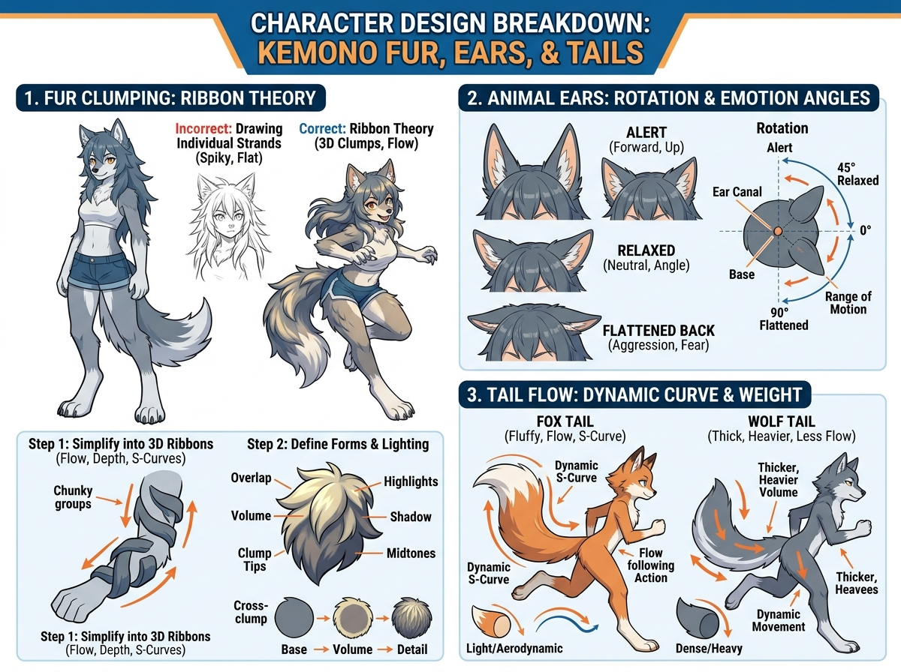

# บทเรียนที่ 6.3: ไดนามิกของช่อขน หูสื่ออารมณ์ และหางที่พลิ้วไหว (Kemono Fur, Ears & Tails)

ยินดีต้อนรับสู่บทเรียนที่จะปลดล็อก "ความนุ่มฟูและมีชีวิตชีวา" ให้กับตัวละคร Kemono ของน้องค่ะ! ขน หู และหาง คือ 3 องค์ประกอบหลักที่บอกเล่าอารมณ์และบุคลิกของตัวละครได้ชัดเจนที่สุด 🦊🐺✨

---

## 📌 สรุปหลักการสำคัญ (Core Concepts)

1. **ทฤษฎีริบบิ้นช่อขน (Ribbon Theory)**: ⚠️ **ห้ามวาดขนเป็นเส้นเดี่ยวๆ ฝอยๆ เด็ดขาด!** เพราะจะทำให้ภาพดูแบน แข็ง และรกสายตา ให้รวมเส้นขนเป็น "ช่อริบบิ้น 3 มิติ (3D Clumps)" ที่มีทั้งระนาบรับแสงและระนาบเงา
2. **หูคือหน้าต่างของอารมณ์ (Ear Language)**: หูสัตว์หมุนได้รอบทิศตามแกนกรวย (Ear Canal Pivot) องศาของหูจะเปลี่ยนไปตามอารมณ์ เช่น ตื่นตัว ผ่อนคลาย หรือกลัว/โกรธ
3. **หางคือเส้นแห่งพลัง (Tail Flow & Line of Action)**: หางคือส่วนต่อขยายของกระดูกสันหลัง ห้ามมองเป็นไส้กรอกที่ห้อยอยู่เฉยๆ แต่ต้องมีเส้นนำสายตา (S-Curve) และมี "น้ำหนัก (Weight)" ตามสายพันธุ์

---

## 🧩 เจาะลึกโครงสร้าง 3 ส่วน (Detailed Breakdown)

### 1. ทฤษฎีช่อขน 3 มิติ (Fur Clumping & Ribbon Theory)
ดูแผนผังด้านซ้ายบนของภาพประกอบ:
- **Incorrect (แบบผิด)**: วาดขนเป็นหยักๆ แหลมๆ รอบตัวเหมือนเม่น หรือขีดเป็นเส้นผมฝอยๆ ทำให้ตัวละครขาดปริมาตร 3D
- **Correct (แบบถูก)**:
  - **Step 1: Simplify into 3D Ribbons**: มองกลุ่มขนเป็นช่อริบบิ้นหนาๆ ที่พันโอบรอบโครงสร้างแขน/ขา/ลำตัว
  - **Step 2: Define Forms & Lighting**: ใส่แสงเงาลงบนแต่ละช่อ (มี Highlight สันช่อขน, Midtone ด้านข้าง, Shadow ใต้ช่อขน และรอยทับซ้อน Overlap)
  - **Cross-clump Principle**: ฐานก้อนทรงกลม $\rightarrow$ กำหนดความหนา Volume $\rightarrow$ ซอยรายละเอียดเฉพาะที่ปลายช่อขนเท่านั้น

### 2. โครงสร้างและการหมุนของหูสัตว์ (Ear Mechanics & Expressions)
ดูแผนผังด้านขวาบนของภาพประกอบ:
- **จุดหมุนหู (Ear Canal Pivot)**: ฐานหูไม่ได้อยู่บนยอดกระหม่อม แต่อยู่เยื้องไปด้านหลังตรงกับแนวกรามล่าง สามารถหมุนได้ตั้งแต่ $0^\circ$ ถึง $90^\circ$
- **3 อารมณ์หลักของหู**:
  - **Alert (ตื่นตัว/สนใจ)**: หูชี้ตรงขึ้นด้านบน ปลายหูเบนมาข้างหน้าเพื่อจับเสียง
  - **Relaxed (ผ่อนคลาย/สบายใจ)**: หูกางออกทำมุมประมาณ $45^\circ$ เป็นมุมธรรมชาติที่สุด
  - **Flattened Back (หวาดกลัว/ก้าวร้าว/ขู่)**: หูลู่แนบแบนไปด้านหลังศีรษะ $90^\circ$ เพื่อป้องกันอันตรายเวลาต่อสู้

### 3. เส้นสายและน้ำหนักของหาง (Tail Flow & Weight Dynamics)
ดูแผนผังด้านขวาล่างของภาพประกอบ:
- **Fox Tail (หางจิ้งจอก - เบา ฟู พลิ้วไหว)**:
  - จุดเด่นคือความโค้ง **Dynamic S-Curve** ที่นุ่มนวล
  - ขนยาวเบา ทิศทางของขนจะลู่ตามการเคลื่อนไหว (Follow-through Action) มีความ Aerodynamic สูง
- **Wolf Tail (หางหมาป่า - แน่น หนา หนักแน่น)**:
  - กระดูกหางหนากว่า ขนแน่นและสั้นกว่า
  - มีน้ำหนักถ่วง (Dense/Heavy Volume) เวลาวิ่งจะแกว่งอย่างมีพลังและมีแรงเหวี่ยง

---

## ⚠️ ข้อผิดพลาดที่พบบ่อย (Common Pitfalls)

1. **Spiky Hair Syndrome**: วาดขนแหลมเปี๊ยวทุกช่อเท่ากันหมด ทำให้ดูเหมือนตัวละครการ์ตูนหุ่นยนต์ ให้จัดสลับ "ช่อใหญ่ (Major), ช่อกลาง (Medium), ช่อเล็ก (Minor)"
2. **หูขยับไม่ได้ (Stiff Ears)**: วาดหูตั้งตรงตลอดเวลาแม้นอนหลับหรือตกใจ ทำให้ตัวละครไร้อารมณ์
3. **หางลอยไม่ต่อกับกระดูกก้นกบ**: จุดเริ่มของหางต้องเริ่มจากปลายกระดูกกระเบนเหน็บ (Sacrum) ใต้สะโพก ไม่ใช่แปะติดที่กลางหลัง

---

## ✏️ การบ้านและแบบฝึกหัด (Practice Drills)

1. **Drill 1: Ribbon Fur Studies (15 นาที)**  
   วาดทรงกระบอกแขน แล้ววาดช่อขนริบบิ้นโอบรอบ 3 ช่อ พร้อมลงน้ำหนักแสงเงา (ตามภาพ Step 1 & 2)
2. **Drill 2: Ear Expression Sheet (20 นาที)**  
   วาดหัว Kemono เปล่าๆ แล้วฝึกใส่หู 3 อารมณ์: ตื่นเต้น (Alert), สบายๆ (Relaxed), และงอน/ระแวง (Flattened)
3. **Drill 3: Running Dynamic Tail (30 นาที)**  
   วาดหุ่นก้านกล้วยวิ่ง 1 ตัว แล้วลากเส้น Line of Action ของหางจิ้งจอก หรือหมาป่า ให้มีความพลิ้วไหวและน้ำหนัก

---

## 🔍 เช็กลิสต์ตรวจผลงาน (Self-Checklist)
- [ ] ขนจัดกลุ่มเป็นช่อหนา (Clumps) มีแสงเงา ไม่เป็นเส้นฝอยรก
- [ ] ฐานหูทั้งสองข้างเชื่อมโยงกับแนวกรามและกะโหลกอย่างสมดุล
- [ ] หางมีเส้น S-Curve ลื่นไหลตามทิศทางการเคลื่อนไหวของลำตัว
