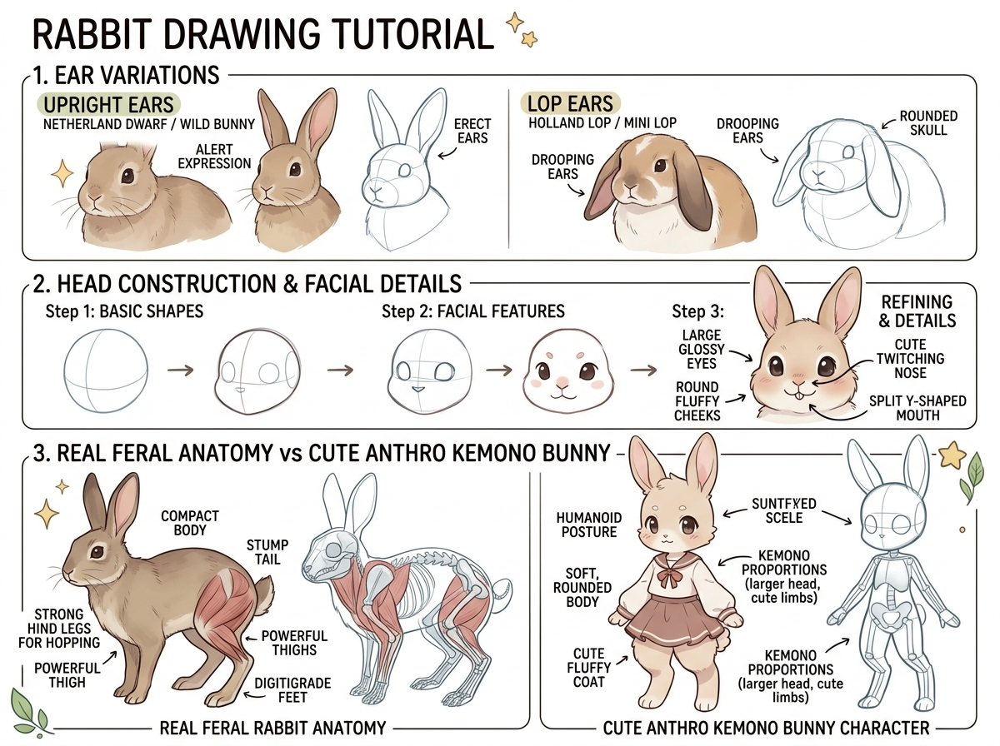

# บทเรียนที่ 6.4: วาดกระต่ายหลากสายพันธุ์ หูตั้ง หูตก สู่ตัวละคร Kemono (Rabbit Species & Kemono Design)

ยินดีต้อนรับสู่บทเรียนกระต่ายแสนน่ารักค่ะ! 🐰🥕 น้องกระต่ายเป็นหนึ่งในสัตว์ที่มีเสน่ห์เฉพาะตัวสูงมาก ไม่ว่าจะเป็นหูทรงต่างๆ ปากแฉกรูปตัว Y และแก้มกลมๆ นุ่มฟู

---

## 📌 สรุปหลักการสำคัญ (Core Concepts)

1. **หู 2 รูปแบบหลัก (Ear Variations)**:
   - **Upright Ears (หูตั้ง - Netherland Dwarf / Wild Bunny)**: ปลายหูชี้ตรงหรือเอนไปด้านหลังเล็กน้อย โคนหูรูปกรวยเปิดรับเสียง แสดงอารมณ์ตื่นตัว (Alert)
   - **Lop Ears (หูตก - Holland Lop / Mini Lop)**: โคนหูจะโค้งหักมุมลงมาคล้ายริบบิ้นหนา ทิ้งน้ำหนักลงข้างแก้ม ทำให้กะโหลกดูทรงกลมแป้นและน่ารักเป็นพิเศษ
2. **ใบหน้าปากแฉกรูปตัว Y (Split Y-Shaped Mouth)**: ริมฝีปากบนของกระต่ายแยกออกจากกันเป็นร่อง เพื่อให้เคี้ยวหญ้าได้คล่องตัว จุดนี้คือจุดเด่นที่ทำให้รู้ทันทีว่าเป็นกระต่าย
3. **อนาโตมีกระต่ายจริง vs Kemono Bunny**:
   - **สัตว์จริง (Real Feral)**: หลังโก่งมน ขาหลังใหญ่ทรงพลังสำหรับกระโดด หางสั้นกลมดุจปอมปอม (Stump Tail)
   - **Kemono Bunny**: สัดส่วนหัวโต ตัวนุ่มกลม ขาเรียวมนสวมชุดน่ารัก ยืนสองขาแบบทรงตัวมนุษย์

---

## 🧩 เจาะลึกโครงสร้าง 3 ขั้นตอน (Detailed Breakdown)

### 1. โครงสร้างใบหน้ากระต่าย (Head Construction & Details)
ดูขั้นตอนในแถวที่ 2 ของภาพประกอบ:
- **Step 1: Basic Shapes**: ร่างลูกบอลกะโหลกทรงกลม แล้วเติมแก้มป่องด้านล่าง (Pear/Teardrop Shape) ให้หน้ากว้างกว่าด้านบน
- **Step 2: Facial Features**: ขีดเส้นแกนระดับสายตา (Eyeline) ค่อนไปทางด้านล่าง วางจมูกสามเหลี่ยมเล็กจิ๋ว และกรอบเบ้าตากลมโตสองข้าง
- **Step 3: Refining & Details**: 
  - ตาโตใสมีแววตาสะท้อน (Large Glossy Eyes)
  - แต้มจมูกกระตุกดุ๊กดิ๊ก (Cute Twitching Nose)
  - ลากเส้นปากแฉกรูปตัว Y หวานๆ มีรอยยิ้มเบาๆ

### 2. เทคนิคการวาดหูห้อย (Lop Ears Mechanics)
- หูห้อยไม่ได้แปะติดกับข้างแก้มทื่อๆ แต่มี **"Crown"** (กล้ามเนื้อโคนหูบนยอดหัว) ที่ดันหูให้โค้งนูนขึ้นมาก่อนจะทิ้งตัวลงมา
- ปลายหูจะมีความหนาเหมือนผ้ากำมะหยี่ ให้ใส่ระนาบขอบหูเพื่อบอกมิติ 3D

### 3. ขาหลังพลังกระโดด (Hopping Anatomy)
- ขาหลังกระต่ายมีกล้ามเนื้อต้นขา (Thighs) ที่ใหญ่และแน่นมาก เพื่อสะสมแรงดีด
- เวลายืนส้นเท้าจะทอดขนานกับพื้นยาวกว่าสุนัขหรือแมว

---

## ✏️ การบ้านและแบบฝึกหัด (Practice Drills)

1. **Drill 1: Upright vs Lop Ears (15 นาที)**: วาดหัวกระต่ายเปล่าๆ 2 หัว หัวแรกใส่หูตั้งแบบเนเธอร์แลนด์ดวอร์ฟ อีกหัวใส่หูตกแบบฮอลแลนด์ลอป
2. **Drill 2: Cute Twitching Face (20 นาที)**: สเก็ตช์หน้ากระต่ายเน้นปากตัว Y ดวงตากลมโต และพวงแก้มฟู 3 มุมมอง
3. **Drill 3: Kemono Bunny Character (30 นาที)**: ออกแบบตัวละครกระต่าย Kemono ยืนสองขา สวมชุดน่ารัก 1 ตัว

---

## 🔍 เช็กลิสต์ตรวจผลงาน (Self-Checklist)
- [ ] สัดส่วนแก้มกว้างกว่าหน้าผาก ให้ความรู้สึกนุ่มฟู
- [ ] ปากมีรอยแยกตัว Y ชัดเจน จมูกไม่ยาวเหมือนสุนัข
- [ ] หูตกมีช่วงโคนหูด้านบนยกตัวขึ้นเล็กน้อยก่อนทิ้งดิ่งลงข้างแก้ม
