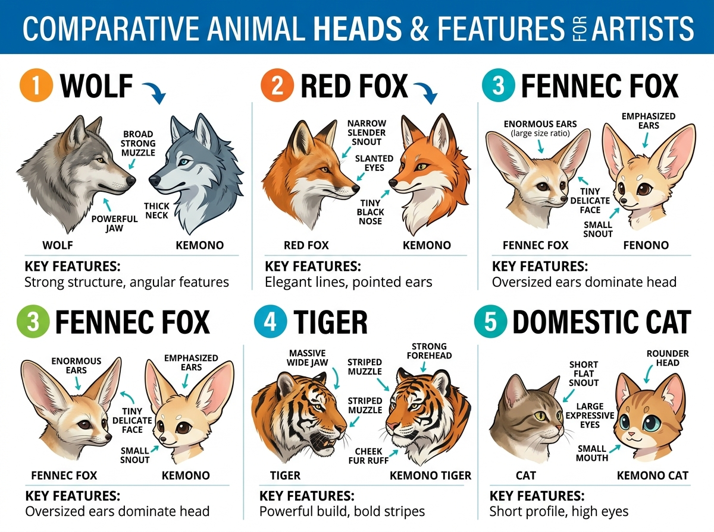
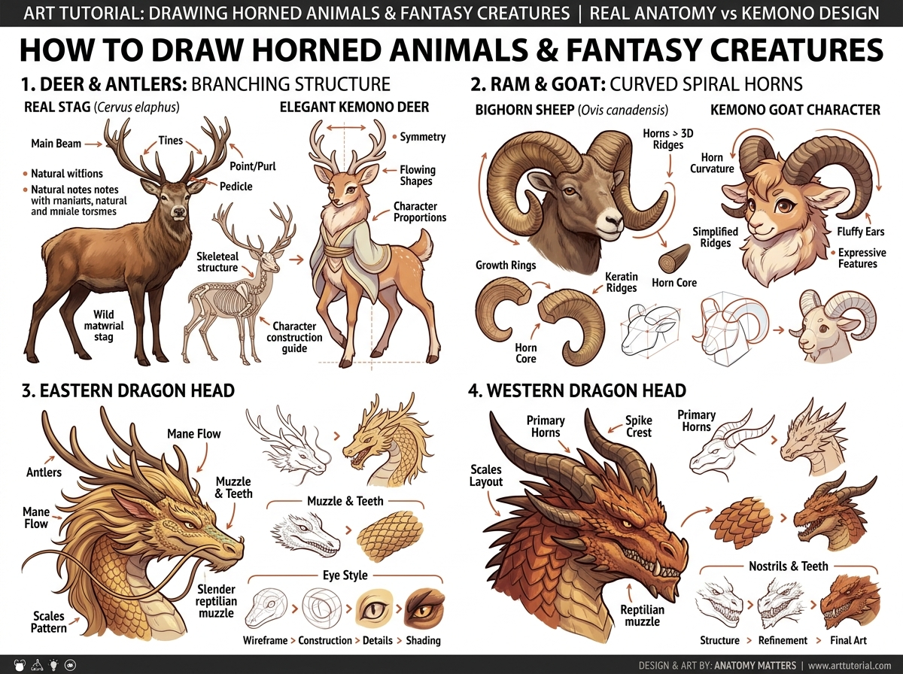

# บทเรียนที่ 6.5: สารานุกรมสายพันธุ์สัตว์และสัตว์แฟนตาซี (Multi-Species & Fantasy Creatures)

ยินดีต้อนรับสู่คลังความหลากหลายของสายพันธุ์ค่ะ! เมื่อน้องวาดโครงสร้างพื้นฐานเป็นแล้ว ขั้นตอนถัดไปคือการดึง **"เอกลักษณ์ของแต่ละสัตว์ (Species Identity)"** ออกมาให้เด่นชัด เพื่อให้คนดูมองปุ๊บก็รู้ทันทีว่าเป็นสายพันธุ์ไหน 🐺🦊🐯🦌🐉✨

---

## 🖼️ ภาพประกอบคลังสายพันธุ์ (Visual Reference Sheets)

### 🐾 ชาร์ตเปรียบเทียบตระกูลสุนัข แมว และจิ้งจอก

### 🦌 คลังสัตว์มีเขา กวาง แกะ และมังกรแฟนตาซี

---

## 📌 1. ผ่าเอกลักษณ์ตระกูลสุนัข แมว และจิ้งจอก

| สายพันธุ์ | สัตว์จริง (Real Animal) | ออกแบบเป็น Kemono / Furry | จุดสังเกตห้ามพลาด |
| :--- | :--- | :--- | :--- |
| **1. Wolf (หมาป่า)** | กะโหลกยาว มูเซิลกว้าง สันกรามแข็งแกร่ง ลำคอหนาเตอะ | สันหน้าเหลี่ยมคม คางมั่นคง แววตาดุดันหรือเท่ | เส้นกรามหนา ลำคอใหญ่กว่าหมาบ้าน |
| **2. Red Fox (จิ้งจอกแดง)** | มูเซิลเรียวแหลมยาว จมูกดำเม็ดเล็ก ตาสลัวเฉียงขึ้น | หน้าเรียวเป็นรูปสามเหลี่ยม ตาเรียวเจ้าเล่ห์ หูแหลมคม | สันจมูกแคบ หน้าเรียว หางฟูอลังการ |
| **3. Fennec Fox (จิ้งจอกทะเลทราย)**| หูขนาดมหึมา (เพื่อระบายความร้อน) หน้าเล็กจิ๋ว | หูยักษ์เด่นสะดุดตา ตาโตแบ๊ว หน้าผากกว้าง | หูใหญ่กินพื้นที่ 50% ของหัว หน้าเล็กน่าทะนุถนอม |
| **4. Tiger (เสือโคร่ง)** | กะโหลกหน้ากว้างมาก ขนข้างแก้มฟูหนาเป็นแผงคอ | หน้าผากกว้าง ขนข้างแก้มทรงพลัง ลายพาดกลอนหนา | ขนแก้มเป็นแผงหนา (Cheek Ruff) กรามกว้าง |
| **5. Domestic Cat (แมวบ้าน)** | มูเซิลแบนสั้น ตาโต เบ้าตาสูง จมูกติดริมฝีปาก | หน้านุ่มมน ตาโตกลมบ๊อก จมูกสามเหลี่ยมจิ๋ว | มูเซิลสั้นที่สุดในกลุ่ม สันจมูกมีรอยหักมุมเว้า |

---

## 📌 2. โครงสร้างสัตว์มีเขาและสิ่งมีชีวิตแฟนตาซี

### 1) เขากวาง (Deer & Antlers - Branching Structure)
- **Pedicle**: โคนกระดูกกะโหลกที่ดันเขางอกขึ้นมา
- **Main Beam**: ลำเขาหลักที่ทอดยาวโค้งขึ้นและโอบไปด้านหน้า
- **Tines**: กิ่งก้านที่แตกแขนงออกมาจากลำเขาหลัก ยิ่งกวางอายุมาก กิ่งก้านจะยิ่งซับซ้อน
- **สไตล์ Kemono**: นิยมวาดกวางให้มีลำคอยาวสง่างาม หูรูปใบไม้ และดวงตากวางที่โตหวาน (Doe Eyes)

### 2) เขาแกะและแพะ (Ram & Goat - Curved Spiral Horns)
- **วงแหวนการเติบโต (Growth Rings)**: ลอนคลื่นนูน 3D รอบเขาตามอายุ
- **เกลียวก้นหอย (Horn Curvature)**: วิ่งม้วนโค้งอ้อมหลังใบหูแล้ววนกลับมาชี้ไปข้างหน้า
- **เทคนิคการขึ้นโครง**: ใช้กล่องสี่เหลี่ยมดัดโค้ง (Bending Box) ก่อนปาดลอนนูน

### 3) มังกรตะวันออก vs มังกรตะวันตก (Eastern vs Western Dragons)
- **มังกรตะวันออก (Eastern Dragon - ลิ่วล้อเมฆา)**:
  - หัวยาวเรียวแบบสัตว์เลื้อยคลานโบราณ ผสมเขากวาง (Antlers)
  - แผงคอและหนวดเส้นยาวที่พลิ้วไหวตามสายลม (Flowing Mane & Whiskers)
- **มังกรตะวันตก (Western Dragon - เจ้าเวหาพ่นไฟ)**:
  - สันกะโหลกหนา แข็งแกร่ง สันคิ้วดุดัน
  - เขาหลักคู่ใหญ่ (Primary Horns) แทงชี้ไปด้านหลัง พร้อมครีบหนามแหลมตามแนวสันคอ
  - เกล็ดซ้อนทับกันแบบเกราะกระเบื้อง (Overlapping Scales Layout)

---

## ✏️ การบ้านและแบบฝึกหัด (Practice Drills)

1. **Drill 1: Fox vs Wolf Comparison (20 นาที)**: วาดหน้าหมาป่า 1 หน้า (เน้นกรามกว้าง มูเซิลใหญ่) และหน้าจิ้งจอก 1 หน้า (เน้นมูเซิลเรียว ตาเฉียง) เปรียบเทียบข้างกัน
2. **Drill 2: Spiral Horn Construction (20 นาที)**: ขึ้นโครงกล่องดัดโค้งเป็นเขาแกะภูเขา (Bighorn Ram) 1 คู่
3. **Drill 3: Fantasy Kemono / Dragon Character (30 นาที)**: ออกแบบตัวละคร Kemono มังกร หรือกวาง 1 ตัว โดยนำชิ้นส่วนเขาและเกล็ดมาประยุกต์ใช้

---

## 🔍 เช็กลิสต์ตรวจผลงาน (Self-Checklist)
- [ ] สัดส่วนมูเซิลของแต่ละสปีชีส์แตกต่างกันชัดเจน ไม่ใช่หน้าเดิมแล้วแค่เปลี่ยนสี
- [ ] โคนเขาเชื่อมต่อกับกะโหลกศีรษะอย่างมั่นคงตามแกนกระดูก
- [ ] เกล็ดมังกรจัดเรียงเป็นระเบียบตามแนวความโค้ง 3 มิติ
