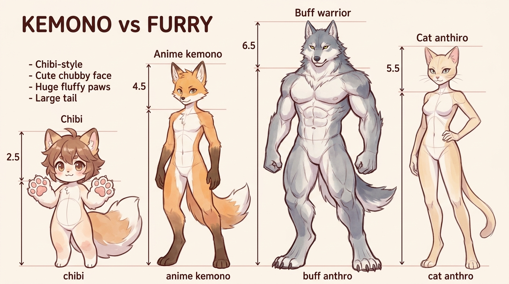

# บทเรียนที่ 6.6: สรีระ Kemono หลากสไตล์ (Kemono Body Types & Proportions)

ยินดีต้อนรับสู่บทเรียนที่จะพาน้องๆ ก้าวข้ามสัดส่วนมาตรฐาน เพื่อออกแบบตัวละคร Kemono ให้มีเอกลักษณ์ รูปร่าง และบุคลิกที่หลากหลาย ตั้งแต่ตัวจิ๋วน่ากอดไปจนถึงนักรบกำยำทรงพลังค่ะ! 🐾✨



---

## 📌 สรุปหลักการสำคัญ (Core Concepts)

1. **สเกลช่วงหัว (Head-Count Proportion) คือตัวกำหนดอารมณ์ของตัวละคร**: จำนวนช่วงหัวจะบอกทันทีว่าตัวละครนั้นเป็นสาย น่ารัก (Chibi), คล่องแคล่ว (Standard), ทรงพลัง (Muscular) หรือ สง่างาม (Slender)
2. **การปรับสัดส่วนอวัยวะสัตว์ตามบอดี้**: เมื่อสเกลตัวเปลี่ยน ขนาดของ **"หู หาง มูเซิล และอุ้งเท้า"** จะต้องปรับสัดส่วนตาม ไม่ใช่ใช้ขนาดเดิมทุกแบบ
3. **Shape Language ประจำรูปร่าง**: วงกลม (น่ารัก เป็นมิตร) $\rightarrow$ สี่เหลี่ยมคางหมู/ลูกบาศก์ (แข็งแกร่ง หนักแน่น) $\rightarrow$ สามเหลี่ยมหัวกลับ (ว่องไว คล่องตัว)

---

## 🧩 เจาะลึก 4 สไตล์สรีระ Kemono (Step-by-Step Breakdown)

```
[ Chibi 2.5 Heads ]    [ Standard 4.5 Heads ]    [ Muscular 6.5 Heads ]    [ Slender 5.5 Heads ]
     ( O )                     ( O )                     ( O )                     ( O )
    /  |  \                   /  |  \                   /=====\                   /  |  \
   (_______)                  |     |                  |  อก  |                   |     |
    /     \                   | เชิง |                  | หนาม |                   \ เชิง/
   (_)   (_)                  /     \                   /     \                   /     \
   อุ้งเท้าโต                 /       \                 /  ขา  \                 /  ขา  \
                             (_)     (_)                กล้ามโต                 เพรียวยาว
```

---

### 1. สไตล์ชิบิ / มินิ (Chibi & Petite: 2 - 3 ช่วงหัว)
* **บุคลิก**: น่ารัก ไร้เดียงสา อ่อนนุ่ม ชวนให้เอ็นดู
* **สัดส่วน**:
  - หัวโต คิดเป็น 40-50% ของความสูงทั้งหมด
  - กรงอกและเอวรวมกันเป็น **"หยดน้ำหรือเมล็ดถั่ว (Bean Shape)"** นุ่มนิ่ม ไม่มีรอยคอดเอว
  - แขนขาสั้นป้อม ไร้รอยข้อต่อที่ซับซ้อน
* **เอกลักษณ์ Kemono เฉพาะตัว**:
  - **มูเซิล (Snout)**: สั้นมาก ปลายจมูกเล็กรูปสามเหลี่ยมคว่ำ หรือวาดจมูกติดกับปากเลย
  - **ดวงตา**: โตเป็นพิเศษ แววตาเป็นประกาย
  - **อุ้งเท้า & หาง**: อุ้งมือและหางจะ **"ใหญ่กว่าปกติ (Exaggerated)"** หางฟูกลมโตช่วยเพิ่มความนุ่มนิ่ม $200\%$

---

### 2. สไตล์มาตรฐานอนิเมะญี่ปุ่น (Standard Anime Kemono: 4 - 5 ช่วงหัว)
* **บุคลิก**: ตัวเอกการ์ตูน คล่องแคล่ว มีชีวิตชีวา สดใส และสมดุล
* **สัดส่วน**:
  - หัวขนาดปานกลาง มีทรวดทรงลำตัวชัดเจน (กระดูกไหปลาร้า กรงอก เอว และสะโพก)
  - แขนขายาวพอเหมาะ มีสัดส่วนของกล้ามเนื้อเบาๆ
* **เอกลักษณ์ Kemono เฉพาะตัว**:
  - **มูเซิล (Snout)**: ยื่นออกมาปานกลาง (มุมมอง 3/4 ยื่นประมาณครึ่งหนึ่งของความกว้างแก้ม)
  - **ขา Digitigrade**: ข้อเท้าลอยสูงกำลังดี มีความสปริงตัวแบบแมวหรือสุนัขจิ้งจอก
  - **สมดุล Anthro**: 60% สัตว์ + 40% คน สามารถสวมใส่ชุดนักเรียน ชุดฮู้ด หรือชุดผจญภัยได้อย่างกลมกลืน

---

### 3. สไตล์กำยำ / บึกบึน (Muscular / Buff Anthro: 6 - 7 ช่วงหัว)
* **บุคลิก**: ผู้พิทักษ์ นักรบ บอสใหญ่ แข็งแกร่ง น่าเกรงขาม
* **สัดส่วน**:
  - สัดส่วนหัวต่อตัวเล็ก (หัว 1 ส่วน : ตัว 6-7 ส่วน) ทำให้ลำตัวดูกว้างและใหญ่โต
  - **โครงสร้างรูปสามเหลี่ยมหัวกลับ**: กรงอกหนา กล้ามเนื้ออก (Pecs) กว้าง ไหล่หนา (Deltoid) และปีกหลัง (Lats) แผ่กว้าง
  - ลำคอสั้นและหนามาก โดยมีกล้ามเนื้อ Trapezius เชื่อมตั้งแต่หลังหูลงมาถึงหัวไหล่
* **เอกลักษณ์ Kemono เฉพาะตัว**:
  - **มูเซิล (Snout)**: กว้าง สันจมูกหนา กรามเหลี่ยมทรงพลัง มักมีฟันเขี้ยวล่างโผล่พ้นริมฝีปาก
  - **อุ้งมือและกรงเล็บ**: ฝ่ามือหนา ข้อนิ้วใหญ่ กรงเล็บหนาคม ไม่เน้นความนุ่มฟูแต่เน้นความแกร่ง
  - **ขา Digitigrade**: กล้ามเนื้อน่องและต้นขาหนาแน่น รองรับน้ำหนักตัวขนาดมหาศาล

---

### 4. สไตล์เพรียวระหง / สง่างาม (Slender & Feminine: 5.5 - 6 ช่วงหัว)
* **บุคลิก**: คล่องตัว ปราดเปรียว สง่างาม ลึกลับ (เหมาะกับเสือดาว จิ้งจอก นกฟลามิงโก หรือแมววิเชียรมาศ)
* **สัดส่วน**:
  - โครงสร้างกระดูกเรียวยาว เอวคอด (Hourglass Shape) ไหล่แคบกว่าสไตล์ Muscular
  - ลำคอยาวระหง แขนและนิ้วมือเรียว
* **เอกลักษณ์ Kemono เฉพาะตัว**:
  - **มูเซิล (Snout)**: แหลมยาวเรียว สันจมูกบางเฉียบ
  - **ดวงตา**: หางตาเชิดขึ้น (Cat-eyes) คิ้วเรียวโก่ง
  - **ขา Digitigrade**: ช่วงขาเพรียวยาว ก้าวย่างอย่างเงียบกริบดั่งนักล่าในเงามืด

---

## ⚠️ ข้อผิดพลาดที่พบบ่อย (Common Pitfalls)

1. **วาดหัวขนาดเท่าเดิมแต่ยืดแค่แขนขา**: ถ้าตัวละครโตขึ้นเป็น 6-7 ช่วงหัว ขนาดหัวต้องเล็กลงเมื่อเทียบกับลำตัว ไม่เช่นนั้นตัวละครจะดูเป็น "เด็กยืดร่าง" ไม่ใช่ผู้ใหญ่กำยำ
2. **ละเลยความหนาของลำคอในสาย Muscular**: ตัวละครที่มีกล้ามตัวใหญ่ แต่คอบางเหมือนก้านไม้ขีด จะดูผิดธรรมชาติทันที ลำคอของสาย Buff ต้องหนาเกือบเท่าความกว้างของกะโหลก
3. **อุ้งเท้า Chibi ลีบเล็ก**: ชิบิน่ารักได้เพราะ "อุ้งมือและหางที่ใหญ่เกินจริง" ถ้าไปวาดย่ออุ้งเท้าให้เล็กตามตัว ความนุ่มฟูจะหายไปทันที

---

## ✏️ การบ้านและแบบฝึกหัด (Practice Drills)

1. **Drill 1: Head-Count Silhouette Drill (15 นาที)**  
   วาดโครงร่างหุ่นกล่อง (Mannequin) 3 สเกล: Chibi (2.5 หัว), Standard (4.5 หัว), และ Muscular (6.5 หัว) ยืนเรียงกัน เพื่อเปรียบเทียบขนาด
2. **Drill 2: Same Species, 3 Body Types (30 นาที)**  
   เลือกสปีชีส์ที่น้องชอบ 1 ชนิด (เช่น หมาป่า หรือ แมว) แล้วลองวาดตัวละครชนิดเดียวกันใน 3 สรีระ: Chibi, Standard, และ Buff
3. **Drill 3: Dynamic Silhouette Contrast (30 นาที)**  
   วาดท่าแอ็กชันของสาย Slender (กระโดดพลิ้ว) เทียบกับสาย Buff (ทุบพื้นทรงพลัง) โดยเน้นความคมชัดของเงาดำ

---

## 🔍 เช็กลิสต์ตรวจผลงาน (Self-Checklist)
- [ ] นับช่วงหัวของตัวละครตรงตามเป้าหมาย (2.5 / 4.5 / 6.5 หัว)
- [ ] ขนาดของมูเซิลและอุ้งเท้าปรับให้เข้ากับสรีระ (ชิบิมูเซิลสั้นอุ้งเท้าโต, สายบัฟฟ์กรามเหลี่ยมคอหนา)
- [ ] รูปทรงรวม (Silhouette) สื่อถึงบุคลิกของตัวละครได้อย่างชัดเจนแม้ถมดำล้วน
