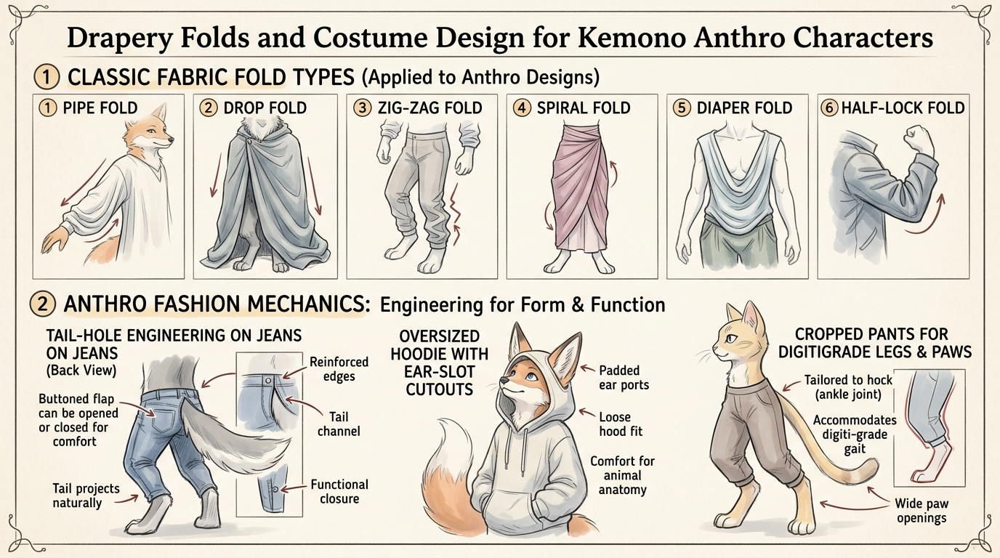

# บทเรียนที่ 6.7: รอยยับผ้าและวิศวกรรมเสื้อผ้า Kemono (Drapery & Kemono Fashion Design)

ยินดีต้อนรับสู่บทเรียนที่จะไขปริศนาคลาสสิกของชาว Kemono: **"หางฟูๆ ลอดออกจากกางเกงได้ยังไง? แล้วหูสัตว์ใส่หมวกแบบไหนถึงไม่อึดอัด?"** พร้อมปูรากฐานฟิสิกส์ของรอยยับผ้าสากลให้สวยงามมีมิติค่ะ! 🧵✨



---

## 📌 สรุปหลักการสำคัญ (Core Concepts)

1. **ผ้าไม่มีย่นมั่วซั่ว ทุกรอยยับเกิดจาก "จุดตรึง (Tension Points)" และ "แรงโน้มถ่วง (Gravity)"**: เมื่อผ้ายึดกับร่างกายตรงไหน รอยยับจะวิ่งแผ่ออกจากจุดนั้นเสมอ
2. **ความหนาของเนื้อผ้ากำหนดรูปทรงรอยยับ**: ผ้าบาง (ผ้าไหม, ชีฟอง) รอยยับจะถี่เล็กและแหลมคม; ผ้าหนา (เดนิม, หนัง, เสื้อกันหนาว) รอยยับจะใหญ่ หนานุ่ม และมีเหลี่ยมมุม
3. **วิศวกรรมเสื้อผ้า Kemono ต้องคำนึงถึงสรีระเฉพาะ**: หางต้องการช่องระบาย, หูต้องการช่องโผล่ และขา Digitigrade ต้องการทรงกางเกงที่ไม่รั้งข้อเท้า

---

## 🧩 เจาะลึกโครงสร้าง & ฟิสิกส์ (Step-by-Step Breakdown)

---

### ภาคที่ 1: กฎฟิสิกส์รอยยับผ้า 6 แบบสากล (The 6 Universal Folds)

```
1. Pipe Fold        2. Drop Fold        3. Zig-Zag Fold      4. Spiral Fold       5. Diaper Fold      6. Half-lock Fold
    | | |                 \ | /              \  /\  /             (====)               \______/             /------\
    | | |                  \|/                \/  \/              (====)                \____/             |  /\   |
   (ผ้าม่าน)             (ผ้าคลุมไหล่)       (ขากางเกงรัด)       (แขนเสื้อหมุน)       (ผ้าพันคอหย่อน)     (ข้อพับศอก/เข่า)
```

1. **Pipe Folds (รอยยับทรงท่อดิ่ง)**: 
   - เกิดเมื่อผ้าถูกหนีบไว้ด้านบน แล้วทิ้งตัวลงมาอิสระตามแรงดึงดูด
   - ตัวอย่าง: ชายกระโปรงพลีท, ผ้าม่าน, ชายเสื้อคลุม
2. **Drop Folds (รอยยับทิ้งตัวจากจุดเดียว)**:
   - เกิดจากจุดตรึงเพียงจุดเดียว แล้วเนื้อผ้าทิ้งตัวแผ่ออกเป็นรูปกรวยหรือตัว V
   - ตัวอย่าง: ผ้าคลุมหลังที่ติดเข็มกลัดไว้ที่อกข้างเดียว
3. **Zig-zag Folds (รอยยับซิกแซกสลับฟันปลา)**:
   - เกิดเมื่อท่อผ้ามีความยาวเกินกว่าระยะกระดูก ทำให้เกิดการพับทับซ้อนบีบอัดกัน
   - ตัวอย่าง: ขากางเกงยีนส์ที่กองอยู่เหนือข้อเท้า, ปลายแขนเสื้อกันหนาว
4. **Spiral Folds (รอยยับวนเกลียว)**:
   - เกิดเมื่อผ้าหุ้มรอบทรงกระบอกที่มีการบิดตัว (Twisting) หรือดึงรั้งตามทรงกล้ามเนื้อ
   - ตัวอย่าง: แขนเสื้อที่แนบตามท่อนแขน, ถุงเท้ายาว
5. **Diaper Folds (รอยยับเปลย้อยหย่อน)**:
   - เกิดระหว่าง **จุดตรึง 2 จุด** ที่รับน้ำหนัก แล้วปล่อยให้เนื้อผ้าตรงกลางห้อยย้อยลงมาเป็นรูปตัว U
   - ตัวอย่าง: ปกเสื้อคอถ่วง, ผ้าพันคอ, รอยย่นระหว่างหัวเข่าสองข้างเวลานั่ง
6. **Half-lock Folds (รอยยับย่นขบกันที่ข้อพับ)**:
   - เกิดเมื่อข้อต่อพับงอฉับพลัน (เช่น งอข้อศอก หรืองอเข่า) เนื้อผ้าด้านในจะถูกบีบอัดจนขอบผ้าสบกันเป็นสันนูน

---

### ภาคที่ 2: วิศวกรรมเสื้อผ้าสำหรับ Kemono (Costume Engineering)

```
      [ Ear-Slot Hoodie ]              [ Tail-Hole Mechanics ]             [ Digitigrade Pants ]
           /\      /\                        /-------------\                      |       |  (ต้นขา)
          /  \____/  \                      |  กางเกงเอวสูง  |                     \     /
         /   [ช่องหู]  \                     |   ( O ) รูหาง |                      \___/   (ข้อพับเข่า)
        (     ใบหน้า   )                     \____\_/______/                        \
                                             (มีกระดุมผ่าเปิดได้)                     \__   (ข้อเท้ายกสูง)
                                                                                       \__ (ปลายขาเต่อ)
```

#### 1. วิศวกรรมช่องเจาะหาง (Tail-Hole Mechanics)
หางสัตว์ไม่ใช่ท่อผอมๆ แต่มีโคนหางที่หนาและกระดิกไปมาตลอดเวลา:
* **แบบที่ A: รูเจาะเสริมยางยืด (Elastic Ring Hole)**: เจาะรูกลมเหนือตะเข็บก้นเล็กน้อย เย็บขอบยางยืด เหมาะกับหางขนาดเล็ก-กลาง (เช่น หนู กระต่าย หมาจิ้งจอกขนสั้น)
* **แบบที่ B: ผ่าตะเข็บหลังพร้อมกระดุม/ซิป (Back Button Slit)**: กางเกงผ่าร่องแนวดิ่งจากขอบเอวลงมาถึงโคนหาง เมื่อสวมกางเกงเสร็จค่อยติดกระดุมปิดเหนือหาง เหมาะสำหรับ **หางจิ้งจอกฟูใหญ่ หรือ หางหมาป่าหนา** ที่ลอดผ่านรูแคบๆ ไม่ได้!
* **แบบที่ C: กางเกงเอวต่ำเว้าหลัง (Low-Rise V-Back)**: ขอบกางเกงด้านหลังเว้าต่ำเป็นรูปตัว V เปิดพื้นที่กระดูกก้นกบให้หางเคลื่อนไหวอิสระ นิยมมากในสายสปอร์ต

#### 2. หมวกและฮู้ดเว้นช่องหูและเขา (Ear Pockets & Horn Accommodations)
* **ฮู้ดผ่าช่อง (Slotted Hoods)**: เจาะช่องขนานกับแนวสันกะโหลก ให้ใบหูโผล่ขึ้นมาอย่างอิสระ
* **หมวกทรงมีกระเป๋าครอบหู (Ear-Pouch Beanies)**: หมวกไหมพรมที่ถักกระเป๋ายื่นออกมาสองข้างเพื่อห่อหุ้มใบหูให้อบอุ่น
* **หมวกปีกกว้างเว้นช่องเขา (Notched Brim Hats)**: หมวกเวทมนตร์หรือหมวกคาวบอยที่บากปีกหมวกด้านข้าง เพื่อไม่ให้ชนกับเขากวางหรือเขาแกะ

#### 3. กางเกงและรองเท้าสำหรับขา Digitigrade
* **กางเกงขาสามส่วนเต่อ (Cropped Pants / Capris)**: ปลายขากางเกงต้องจบลง **เหนือข้อเท้า (Hock)** เล็กน้อย เพื่อไม่ให้ปลายผ้าไปรัดข้อต่อสปริง
* **ผ้าพันแข้งนักรบ (Gaiters & Leg Wraps)**: ใช้แถบผ้าพันรอบหน้าแข้งและส้นเท้า ช่วยเน้นเส้นสาย S-Curve ให้ดูเท่และทะมัดทะแมง
* **รองเท้าเปลือยส้น (Toe-Sole Footwear)**: สำหรับ Kemono ที่ต้องการสวมรองเท้า รองเท้าจะมีเฉพาะส่วนหุ้มปลายนิ้วและอุ้งเท้าหน้าเท่านั้น โดยเปิดส้นเท้าด้านหลังโล่งไว้

---

## ⚠️ ข้อผิดพลาดที่พบบ่อย (Common Pitfalls)

1. **วาดรอยยับเป็นเส้นขนมจีนทั่วทั้งตัว**: เสื้อผ้าต้องการ **"พื้นที่พักสายตา (Rest Areas)"** ส่วนที่ผ้าแนบตึงกับเนื้อจะเรียบเนียน ส่วนที่มีรอยยับจะอยู่เฉพาะบริเวณข้อพับและจุดตรึงเท่านั้น
2. **หางทะลุเนื้อผ้าออกมาเฉยๆ**: ห้ามวาดหางลอยออกมาจากกางเกงโดยไม่มีรอยตะเข็บ ขอบยางยืด หรือรอยยับรอบโคนหางเด็ดขาด เพราะจะดูเหมือนหางปลอมแปะกราฟิก
3. **ลืมความหนาของผ้าที่ขอบเสื้อ (Hem Thickness)**: คอเสื้อ ปลายแขน และชายกระโปรง มีความหนาแบบ 3 มิติเสมอ อย่าลากเป็นเส้นเดี่ยวบางเฉียบ

---

## ✏️ การบ้านและแบบฝึกหัด (Practice Drills)

1. **Drill 1: The 6 Folds Sheet (20 นาที)**  
   วาดตัวอย่างรอยยับผ้าทั้ง 6 แบบ (Pipe, Drop, Zig-zag, Spiral, Diaper, Half-lock) ลงในกระดาษแผ่นเดียวกัน พร้อมระบุจุด Tension Point ด้วยจุดสีแดง
2. **Drill 2: Tail-Hole Pants Design (25 นาที)**  
   วาดตัวละคร Kemono จากด้านหลัง กำลังสวมกางเกงยีนส์ที่มีช่องผ่ากระดุมรองรับหางฟู พร้อมใส่รอยยับดึงรั้งรอบโคนหาง
3. **Drill 3: Full Costume Integration (35 นาที)**  
   วาดตัวละคร Kemono ครึ่งตัว สวมเสื้อฮู้ดเจาะช่องหู และผ้าพันคอที่มีรอยยับ Diaper Fold ซ้อนกันอย่างมีมิติ

---

## 🔍 เช็กลิสต์ตรวจผลงาน (Self-Checklist)
- [ ] รอยยับทุกเส้นมีทิศทางพุ่งออกจากจุดตรึง (Tension Point) อย่างมีเหตุผล
- [ ] มีช่องเปิดสำหรับหางและหูที่สมเหตุสมผลตามหลักวิศวกรรมเครื่องแต่งกาย
- [ ] ขากางเกงไม่ขัดขวางการเคลื่อนไหวของข้อเท้า Digitigrade
- [ ] มีการแบ่งสัดส่วนระหว่างพื้นที่เรียบตึง (Rest Area) และพื้นที่รอยยับ (Detail Area) อย่างสมดุล
