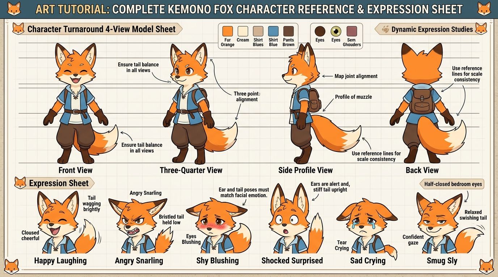

# บทเรียนที่ 6.8: การออกแบบ Model Sheet 4 ทิศ และแผ่นรวมอารมณ์ Expression Sheet (Kemono Character Design & Model Sheet)

ยินดีต้อนรับสู่บทเรียนระดับมาสเตอร์ที่จะช่วยให้น้องสร้าง **"บัตรประชาชนและพิมพ์เขียวประจำตัวละคร (Character Reference Sheet)"** ให้กับ Original Character (OC) หรือ Fursona ของตัวเองอย่างเป็นระบบ เพื่อนำไปใช้วาดคอมมิค แอนิเมชัน หรือส่งคอมมิชชันได้อย่างแม่นยำ ไม่เพี้ยนแม้แต่มิลลิเมตรเดียวค่ะ! 🦊🐾✨



---

## 📌 สรุปหลักการสำคัญ (Core Concepts)

1. **Model Sheet คือ "คัมภีร์คงความสม่ำเสมอ (Consistency Bible)"**: ช่วยให้น้องวาดตัวละครตัวเดิมซ้ำได้เป็นร้อยๆ หน้า โดยสัดส่วน ความสูง และตำแหน่งลวดลายไม่เพี้ยน
2. **กฎเส้นบอกระดับความสูง (Horizontal Alignment Lines)**: การวาดตัวละครหมุนรอบทิศ จะต้องตีเส้นบรรทัดแนวนอนเทียบระดับอวัยวะสำคัญเสมอ: ปลายหู, สันคิ้ว, ปลายจมูก, หัวไหล่, เอว, เป้ากางเกง, หัวเข่า, และข้อเท้า
3. **ภาษากายของ Kemono ไม่ได้อยู่ที่หน้า แต่อยู่ที่ "หูและหาง" ด้วยเสมอ**: อารมณ์ของตัวละครสัตว์จะสมบูรณ์ได้เมื่อ **"สีหน้า + องศาใบหู + จังหวะการแกว่งของหาง"** เคลื่อนไหวไปในทิศทางเดียวกัน
4. **กฎสี 60-30-10 ในการวาง Color Palette**: สีขนหลัก 60%, สีเสื้อผ้า/ลายขนรอง 30%, และสีเน้นดวงตา/อัญมณี 10%

---

## 🧩 เจาะลึกขั้นตอนสร้าง Model Sheet (Step-by-Step Breakdown)

---

### ภาคที่ 1: การวาด Turnaround 4 มุมมอง (4-View Alignment)

```
[ เส้นแนวขนาน ]      [ 1. Front View ]      [ 2. 3/4 View ]      [ 3. Side Profile ]      [ 4. Back View ]
--- ปลายหู ---------------- /\ ------------------ /\ ------------------ /\ ------------------- /\ --------
--- สันคิ้ว -------------- (=O=) ---------------- ( O ) ---------------- (  > ----------------- (   ) --------
--- หัวไหล่ ------------- /=====\ -------------- /=====\ --------------- /===\ ---------------- /=====\ -------
--- โคนหาง ----------------- | ------------------- | ------------------ ( _/~\ ---------------- ( O ) (โคน) --
--- ข้อเท้า -------------- (_) (_) -------------- (_) (_) --------------- (_) ----------------- (_) (_) ------
```

1. **หน้าตรง (Front View)**:
   - วาดในท่ายืนมาตรฐาน (A-Pose หรือ T-Pose เบาๆ) เท้าแยกกว้างเท่าช่วงไหล่ ปลายแขนทิ้งห่างจากลำตัวเล็กน้อย เพื่อให้เห็นรูปทรงเอวและสะโพกชัดเจน
   - หางให้ปัดเอียงออกด้านข้างเล็กน้อย เพื่อให้มองเห็นความยาวและความฟูของหางในมุมหน้าตรง
2. **มุมหัน 3/4 (Three-Quarter View)**:
   - ตีเส้นขนานจากภาพหน้าตรงมาประกบทุกจุด
   - บิดลำตัวและใบหน้า $45^\circ$ แสดงมิติความลึกของมูเซิล (Snout) และการซ้อนทับของแก้มกับเบ้าตา
3. **มุมมองด้านข้างตรง (Side Profile View)**:
   - จุดสำคัญที่สุดคือ **"ความยาวและมุมลาดเอียงของมูเซิล (Snout Profile)"**
   - แสดงแนวกระดูกสันหลัง S-Curve, การยื่นของหน้าอก และมุมหักของข้อเท้า Digitigrade ที่ลอยสูงจากพื้น
   - หางทอดเหยียดออกไปด้านหลังอย่างเป็นธรรมชาติ
4. **มุมมองด้านหลัง (Back View)**:
   - แสดงลวดลายขนด้านหลังลำตัว ทรงผมด้านหลัง โครงสะบัก และ **"ช่องเจาะหาง (Tail-Hole) บนกางเกง"** ว่าติดตั้งอย่างไร

---

### ภาคที่ 2: ถอดรหัส 6 อารมณ์บน Expression Sheet (Face + Ears + Tail)

| อารมณ์ | ดวงตาและปาก (Face) | องศาใบหู (Ears) | ท่าทางของหาง (Tail) |
| :--- | :--- | :--- | :--- |
| **1. ดีใจ / หัวเราะ (Happy Laughing)** | ตาหยีโค้งเป็นสระอิ ปากอ้ากว้างเห็นลิ้นและเขี้ยว | หูกระดิกชี้ไปข้างหน้าอย่างตื่นตัว สดใส | หางชูสูงและสะบัดแกว่งไปมาอย่างรวดเร็ว (Wagging) |
| **2. โกรธจัด / ขู่ฟ่อ (Angry Snarling)** | คิ้วขมวดกดต่ำ ตาเบิกกว้าง ย่นจมูก แยกเขี้ยวเห็นเหงือก | **หูลู่แนบแบนไปด้านหลัง (Pinned Back)** เพื่อป้องกันการบาดเจ็บ | ขนหางพองฟู (Bristled) กดหางต่ำ ขนานกับพื้น |
| **3. เขินอาย / ขวยเขิน (Shy Blushing)** | หลุบตาต่ำ แก้มแดงระเรื่อ ปากเม้มเล็กๆ | ปลายหูตกพับลงด้านข้างเล็กน้อยด้วยความประหม่า | หางม้วนเข้ามาแนบหว่างขา หรือเอาปลายหางมาปิดหน้า |
| **4. ตกใจ / ประหลาดใจ (Shocked Surprised)** | รูม่านตาหดเล็กลง ตาโตเบิกกว้าง ปากอ้าค้างเป็นตัว O | **หูทั้งสองข้างตั้งชัน $90^\circ$** ชี้ตรงขึ้นฟ้า | หางตั้งตรงดิ่ง ขนสะดุ้งพองตัวฉับพลัน |
| **5. เศร้าสร้อย / ร้องไห้ (Sad Crying)** | หัวคิ้วยกขึ้น น้ำตาคลอเบ้า ริมฝีปากเบะสั่น | **หูลู่ตกห้อยลงมาข้างแก้ม (Drooping Ears)** เหมือนร่มหุบ | หางลู่ตกแนบพื้น ปลายหางนิ่งสนิทไร้เรี่ยวแรง |
| **6. เจ้าเล่ห์ / มั่นใจ (Smug Sly)** | หรี่ตาข้างหนึ่ง (Bedroom eyes) มุมปากยกยิ้มข้างเดียว | หูข้างหนึ่งตั้งตรง อีกข้างเอียงกระดิกอย่างขี้เล่น | หางแกว่งช้าๆ เป็นจังหวะเยือกเย็น สง่างาม |

---

### ภาคที่ 3: องค์ประกอบของ Reference Sheet ระดับมืออาชีพ

เมื่อจะจัดแผ่น Ref Sheet ส่งคนอื่น ให้จัดวางองค์ประกอบ 5 อย่างนี้ในแผ่นเดียว:
1. **Turnaround ตัวละครเต็มตัว** (หน้าตรง + หัน 3/4 + ด้านหลัง)
2. **Color Palette Swatches**: กล่องสี่เหลี่ยมระบุโค้ดสี/เฉดสีของ ขน, ดวงตา, เสื้อผ้า และปุ่มเนื้อ Nikukyu ชัดเจน
3. **Close-up Zoom Details**: ภาพซูมขยายจุดเฉพาะ เช่น รูปร่างของดวงตา, ลวดลายบนอุ้งเท้า, หรือเครื่องประดับพิเศษ
4. **Expression Icons**: ภาพหน้าแสดงอารมณ์ 2-3 อารมณ์ประจำตัวละคร
5. **Character Bio Box**: ชื่อ, สปีชีส์, ส่วนสูง, เพศ, อุปนิสัยสั้นๆ 2 บรรทัด

---

## ⚠️ ข้อผิดพลาดที่พบบ่อย (Common Pitfalls)

1. **ไม่ตีเส้นบรรทัดเทียบความสูง**: วาดหน้าตรงสูง 150 cm พอวาดด้านข้างตัวละครกลับยืดเป็น 170 cm หรือหูเล็กลงครึ่งหนึ่ง ต้องใช้เส้น Guide เสมอ
2. **หูและหางอยู่นิ่งท่าเดิมทุกอารมณ์**: ถ้าน้องวาดหน้าโกรธแต่หูยังตั้งน่ารัก อารมณ์ภาพจะขัดแย้งทันที จำไว้ว่า "หูและหางคือกระจกสะท้อนหัวใจของสัตว์"
3. **ใส่สีมากเกินไป (Over-coloring)**: ตัวละครที่ดีไม่ควรมีสีหลักเกิน 3-4 สี ถ้าใส่สีรุ้งเปรอะไปทั้งตัว จะทำให้จำยากและวาดยากมากในระยะยาว

---

## ✏️ การบ้านและแบบฝึกหัด (Practice Drills)

1. **Drill 1: The 4-Height Alignment Drill (30 นาที)**  
   ร่างเส้นบรรทัด 8 เส้น แล้ววาดศีรษะ Kemono ตัวโปรดหมุน 3 มุม (หน้าตรง, 3/4, ด้านข้าง) ให้ดวงตา จมูก และหูตรงแนวกันเป๊ะ
2. **Drill 2: The Ear & Tail Emotion Duo (25 นาที)**  
   วาดเฉพาะส่วน "หู + หาง" ของตัวละครเดียวกัน ใน 3 อารมณ์: (1) ดีใจสุดขีด (2) โกรธจัด (3) กลัวจนตัวสั่น
3. **Drill 3: Complete Fursona / OC Ref Sheet (60 นาที)**  
   ออกแบบ Reference Sheet ตัวละครของตัวเอง 1 แผ่น มี Turnaround หน้า-หลัง, พาเลทสี 4 สี และภาพ Expression 3 อารมณ์

---

## 🔍 เช็กลิสต์ตรวจผลงาน (Self-Checklist)
- [ ] ความสูงของข้อต่อและอวัยวะตรงกันทุกมุมมองใน Turnaround
- [ ] องศาของใบหูและท่าทางของหางสอดคล้องกับอารมณ์บนใบหน้า
- [ ] มีกล่อง Color Swatches ระบุสีขนและเครื่องแต่งกายอย่างชัดเจน
- [ ] ลวดลายขน (Markings) มีความต่อเนื่องถูกต้องเมื่อมองจากหน้าไปหลัง
