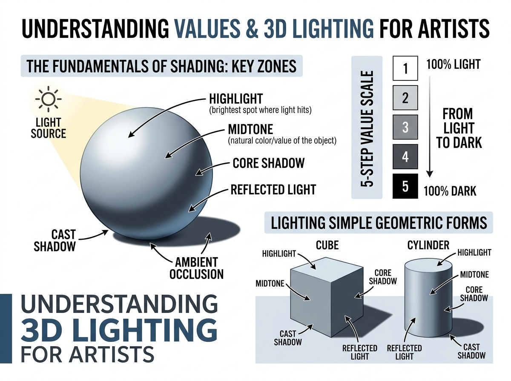

# บทเรียนที่ 7.1: ค่าน้ำหนักและแสงเงา 3 มิติ (Understanding Values & 3D Shading)

> *"ยินดีต้อนรับสู่โลกของแสงเงาจ้ะ! ไม่ว่าเส้นร่างของน้องจะสวยแค่ไหน ถ้าขาดความเข้าใจเรื่องค่าน้ำหนัก (Value) ภาพก็จะดูแบนเหมือนกระดาษ 2D ทันที... แต่เมื่อน้องเข้าใจฟิสิกส์ของแสงและแยก 'ครอบครัวแสง' ออกจาก 'ครอบครัวเงา' ได้อย่างถูกต้อง น้องจะสามารถเนรมิตภาพวาดธรรมดาให้มีมวล มีมิติ และมีชีวิตชีวาขึ้นมาได้ทันทีเลยล่ะ มาลุยไปด้วยกันนะ!"*  
> — **พี่สาว Lighting & Shading Sensei**

---

## 🖼️ ภาพประกอบบทเรียน (Visual Reference)

---

## 📌 1. ฟิสิกส์พื้นฐานของแสงและ "กฎเหล็กสองครอบครัว" (The Two Families Rule)

*(ดูภาพประกอบด้านบน: โซน "The Fundamentals of Shading: Key Zones")*

ก่อนที่เราจะเริ่มลงมือระบายเงา เราต้องเข้าใจฟิสิกส์เบื้องต้นของแสงก่อนว่า **"แสงเดินทางเป็นเส้นตรง (Light Travels in Straight Lines)"**

เมื่อลำแสงจากแหล่งกำเนิดแสงหลัก (Key Light) พุ่งเข้ากระทบวัตถุ พื้นผิวของวัตถุจะถูกแบ่งออกเป็น **2 ครอบครัวใหญ่** อย่างชัดเจนเด็ดขาด:
- 🌟 **LIGHT FAMILY (ครอบครัวแสง)**: ระนาบที่หันหน้าเข้าหาแสงโดยตรง (Highlight และ Midtone)
- 🌑 **SHADOW FAMILY (ครอบครัวเงา)**: ระนาบที่หันหลังให้แสง โดยมีแนวรอยต่อเรียกว่า **Terminator Line** (เส้นแบ่งกลางวัน/กลางคืน)

> [!IMPORTANT]
> ### ⚖️ กฎเหล็กที่ห้ามละเมิดเด็ดขาด (The Golden Value Rule)
> **"ส่วนที่สว่างที่สุดของเงา (Lightest Shadow) จะต้องมืดกว่า ส่วนที่มืดที่สุดของแสง (Darkest Halftone) เสมอ!"**  
> หากน้องวาดแสงสะท้อน (Reflected Light) ในเงาสว่างจ้าจนไปแข่งกับมิดโทนในฝั่งแสง มิติของภาพจะพังทลายทันทีและดูแบนราบทันตา

---

## 🌓 2. ผ่าโครงสร้าง 6 โซนแสงเงาหลัก (The 6 Essential Value Zones)
*(ดูภาพประกอบด้านบน: ลูกบอลทรงกลมและลูกศรชี้แต่ละตำแหน่ง)*

เมื่อวัตถุทรงกลมได้รับแสงทิศทาง 45 องศา จะเกิดการกระจายตัวของค่าน้ำหนักออกเป็น **6 โซนสำคัญ** ดังนี้:

### 1) ไฮไลต์ (Highlight / Specular Reflection)
- **ตำแหน่ง**: จุดบนพื้นผิวที่ทำมุมสะท้อนลำแสงจากแหล่งกำเนิดแสงเข้าสู่ดวงตาของผู้ดูโดยตรง
- **ลักษณะ**: เป็นจุดที่สว่างที่สุด ค่าเกือบขาวบริสุทธิ์ ขอบเขตจะเล็กและคมตามความมันวาวของวัสดุ (วัตถุด้านไฮไลต์จะฟุ้ง วัตถุมันเงาไฮไลต์จะคมกริบ)

### 2) มิดโทน / ฮาล์ฟโทน (Midtone / Halftone)
- **ตำแหน่ง**: ระนาบที่ค่อยๆ เอียงทำมุมเฉียงกับลำแสง
- **ลักษณะ**: เป็นบริเวณที่แสดง **"สีแท้จริง (Local Color)"** และลวดลายของวัตถุได้ชัดเจนและถูกต้องที่สุด ยิ่งระนาบเอียงหนีแสงมากเท่าไร ค่าน้ำหนักก็จะยิ่งเข้มขึ้นเรื่อยๆ จนถึงแนวขอบเงา

### 3) เงามืดแกนกลาง (Core Shadow & Terminator Line)
- **ตำแหน่ง**: แนวเส้นแบ่ง (Terminator) บริเวณที่แสงเดินทางพาดผ่านไปเป็นเส้นสัมผัสสุดท้าย และหันหลังให้แสงโดยสมบูรณ์
- **ลักษณะ**: **เป็นส่วนที่มืดที่สุดบนตัวฟอร์มของวัตถุ (Form Shadow)** เพราะไม่ได้รับแสงหลัก และอยู่ไกลจากแสงสะท้อนของพื้นที่สุด

### 4) แสงสะท้อนรอง (Reflected Light / Bounce Light)
- **ตำแหน่ง**: อยู่ภายในซีกเงามืด ด้านที่หันเข้าหาพื้นหรือวัตถุข้างเคียง
- **ลักษณะ**: เกิดจากแสงหลักพุ่งไปตกกระทบพื้นแล้วเด้งย้อนกลับขึ้นมาสัมผัสวัตถุ **จำไว้เสมอว่าแสงสะท้อนนี้ยังคงเป็นสมาชิกของ "ครอบครัวเงา"** ดังนั้นห้ามลงสว่างจนกลายเป็นสีขาวเด็ดขาด!

### 5) เงาตกทอด (Cast Shadow)
- **ตำแหน่ง**: เงาที่ตัววัตถุไปบดบังแสงไม่ให้ส่องถึงพื้นหรือวัตถุด้านหลัง
- **ลักษณะ**: ประกอบด้วย 2 ส่วนย่อย:
  - **Umbra (เงามืดสนิท)**: อยู่ใกล้ฐานวัตถุที่สุด มีขอบคมและเข้มที่สุด
  - **Penumbra (เงามัวรอบนอก)**: ยิ่งทอดยาวออกไปไกล แสงบรรยากาศจะแทรกเข้ามา ทำให้ขอบเงาจะยิ่งเบลอฟุ้งและจางลง

### 6) แอมเบียนต์ ออกคลูชัน (Ambient Occlusion - AO)
- **ตำแหน่ง**: หลืบแคบ รอยพับ จุดสัมผัสแนบสนิทระหว่างวัตถุกับพื้น หรือซอกหลืบที่แสงแวดล้อมส่องเข้าไปไม่ถึง
- **ลักษณะ**: เป็นจุดที่ **มืดและดำที่สุดในภาพ (Value 0-1)** ช่วย "ยึด (Anchor)" วัตถุไม่ให้ดูลอยเคว้งคว้างกลางอากาศ

---

## 🎚️ 3. การควบคุมน้ำหนักด้วยบันได 5 ระดับ (5-Step Value Scale)

เพื่อป้องกันปัญหาภาพดู "เทาหม่นไปหมด" หรือ "คอนทราสต์แตกเกินไป" พี่สาวขอแนะนำให้ฝึกคุมน้ำหนักด้วย **ระบบบันได 5 ขั้น (5-Step Value Scale)** ก่อนจะเกลี่ยเนียน:

| ขั้น (Value Step) | ช่วงน้ำหนัก | โซนแสงเงาที่รองรับ | บทบาทในภาพ |
| :---: | :---: | :--- | :--- |
| **Step 1** | ขาว (90% - 100%) | **Highlight** | จุดสะท้อนสว่างสุด ดึงดูดสายตา |
| **Step 2** | เทาสว่าง (70% - 85%) | **Light Halftone** | ระนาบรับแสงหลัก ทิศทางของแสง |
| **Step 3** | เทากลาง (45% - 65%) | **Dark Halftone / Local Value** | สีเนื้อแท้ของวัตถุ จุดเชื่อมต่อฟอร์ม |
| **Step 4** | เทาเข้ม (20% - 35%) | **Core Shadow & Reflected Light** | เงามืดบนตัวฟอร์ม ให้ความรู้สึก 3 มิติ |
| **Step 5** | ดำสนิท (0% - 15%) | **Cast Shadow Core & Occlusion (AO)** | หลืบมืดและเงาใต้ฐาน ยึดวัตถุให้มีน้ำหนัก |

> [!TIP]
> ### 👁️ เทคนิค Squint Test (หรี่ตาตรวจงาน)
> ทุกครั้งที่ลงค่าน้ำหนัก ให้ลอง **"หรี่ตาลงครึ่งหนึ่ง"** เพื่อตัดทอนรายละเอียดปลีกย่อยออก ถ้าหรี่ตาแล้วน้องยังแยกขอบเขตระหว่าง "ฝั่งสว่าง" กับ "ฝั่งมืด" ได้อย่างเด็ดขาด แสดงว่า Value Structure ของน้องแข็งแรงมากแล้วจ้ะ!

---

## 🧊 4. การปั้นเงาบนรูปทรงเรขาคณิต สู่โครงสร้างใบหน้าและร่างกาย (Form Shading to Anatomy)

ร่างกายและใบหน้ามนุษย์/สัตว์ ไม่ได้เป็นก้อนซับซ้อนที่เดาทางไม่ได้ แต่ประกอบขึ้นจากรูปทรงพื้นฐาน 3 ชนิดที่ผสมผสานกัน:

| รูปทรงพื้นฐาน | พฤติกรรมการไล่เงา (Edge) | ตำแหน่งที่พบบนใบหน้าและร่างกาย |
| :--- | :--- | :--- |
| **Sphere (ทรงกลม)** | ขอบเงานุ่มนวล (Soft Edge) ไล่โทนเนียนเป็นวงโค้ง | โหนกแก้ม, ปลายจมูก, หน้าผาก, ลูกตา, พวงแก้ม Kemono, กล้ามเนื้อหัวไหล่ |
| **Cube (ลูกบาศก์)** | ขอบเงาคมกริบ (Hard Edge) เปลี่ยนระนาบตัดชัดเจน | กล่องมูเซิล (Muzzle), กรามล่าง, สันจมูก, กล่องเชิงกราน, ทรงเหลี่ยมของเล็บ |
| **Cylinder (ทรงกระบอก)** | ลูกผสม (Axis Edge) นุ่มตามแนวขวาง คมตามแนวตั้ง | ลำคอ, ท่อนแขน, ต้นขา, ลำตัวช่วงเอว, นิ้วมือ, หางสัตว์ |

### 1) Sphere (ขอบนุ่ม / Soft Edge)
- แสงเปลี่ยนมุมทีละนิดตามความโค้งมน ไร้เหลี่ยมมุมหักศอก
- **การนำไปใช้**: เวลาระบายแก้ม ปลายคาง หรือพวงแก้มกลมๆ ของตัวละคร Kemono ต้องเกลี่ยเงาให้นุ่มนวล ห้ามตัดเส้นแข็ง

### 2) Cube (ขอบคม / Hard Edge)
- แสงส่องกระทบระนาบหนึ่งเต็มๆ ในขณะที่ระนาบข้างเคียงหักเลี้ยว 90 องศาหนีแสงทันที
- **การนำไปใช้**: สันจมูกด้านบนจะสว่าง ขณะที่ระนาบข้างจมูกจะมืดลงทันที ช่วยสร้างความคมชัดและดั้งโด่งเป็นทรง

### 3) Cylinder (ลูกผสม / Axis Edge)
- ตามแนวแกนยาวของกระบอก น้ำหนักจะเท่าเดิมตลอดทั้งเส้น แต่ตามแนวขวางจะไล่เฉดตามความโค้ง
- **การนำไปใช้**: แขน ขา และลำคอ โดยเฉพาะใต้คางเมื่อลำคอโดนหัวบดบัง จะเกิด Cast Shadow ขอบคมพาดลงบน Cylinder ที่มีเงานุ่มของตัวเอง

---

## ⚠️ 5. ข้อผิดพลาดที่พบบ่อย (Common Pitfalls & Fixes)

### ❌ ข้อผิดพลาดที่ 1: Pillow Shading (เงาหมอนก้นบุ๋ม)
- **อาการ**: ระบายตรงกลางสว่าง แล้วเอาสีเข้มไล่เฉดตามขอบนอกของวัตถุทุกทิศทาง
- **สาเหตุ**: ไม่ได้กำหนดทิศทางแสง คิดแค่ว่า "ขอบต้องเข้มเพื่อตัดเส้น"
- **วิธีแก้**: กำหนดลูกศรทิศทางแสง (Light Direction Arrow) ไว้มุมกระดาษทุกครั้ง แสงมาจากไหน ด้านตรงข้ามต้องมืดที่สุดเสมอ

### ❌ ข้อผิดพลาดที่ 2: Monotone Shadow (เงาน้ำหนักเดียวแบนราบ)
- **อาการ**: ปาดสีเทาหรือสีดำทับโซนเงาทั้งหมดด้วยน้ำหนักเดียว ไร้ Core Shadow, ไร้ Reflected Light
- **สาเหตุ**: ไม่แยกความต่างระหว่าง Form Shadow และ Cast Shadow
- **วิธีแก้**: เติม Core Shadow ที่เข้มกว่าตามแนวสันขอบ และเว้นแสงสะท้อนบางๆ จากพื้นเข้ามา

### ❌ ข้อผิดพลาดที่ 3: แสงสะท้อนสว่างเกินไป (Blown-out Bounce Light)
- **อาการ**: ใส่แสงสะท้อนสีขาวจั๊วะจนเงามืดดูโปร่งแสงเหมือนลูกแก้ว
- **วิธีแก้**: ย้อนกลับไปดูกฎเหล็กข้อที่ 1 แสงสะท้อนต้องเข้มกว่ามิดโทนเสมอ มันแค่ "มืดน้อยกว่า Core Shadow เล็กน้อย" เท่านั้นจ้ะ

### ❌ ข้อผิดพลาดที่ 4: ใช้สีดำทึบปาดเงา (Muddy Shadows)
- **อาการ**: ใช้สีดำ 100% หรือสีเทาหม่นปาดลงบนสีผิว ทำให้ผิวตัวละครดูสกปรกเหมือนเปื้อนโคลน
- **วิธีแก้**: ในบทเรียนถัดไปเราจะลงลึกเรื่องสี แต่จำหลักการไว้ก่อนว่า "เงาไม่ใช่สีดำ แต่เป็นสีที่มีค่า Value ต่ำลงและได้รับอิทธิพลจากสีแวดล้อม"

---

## ✏️ 6. แบบฝึกหัดพัฒนาฝีมือ (Practice Drills)

ฝึกเป็นประจำสม่ำเสมอตามลำดับนี้นะคะ อย่าเพิ่งข้ามขั้นน้า:

### 🎯 Drill 1: ไล่แถบ 5-Step Value Scale & Sphere (20 นาที)
1. ตีกล่องสี่เหลี่ยม 5 ช่องเท่าๆ กัน ระบายไล่น้ำหนักจากขาวสุด (Step 1) ไปดำสนิท (Step 5) ห้ามใช้แอร์บรัช ให้ใช้บรัชทึบเพื่อคุมค่า Value แต่ละช่องให้ชัด
2. วาดวงกลม 1 วง กำหนดแสงจากมุมบนซ้าย 45 องศา ระบาย 6 โซนแสงเงาให้ครบถ้วน

### 🎯 Drill 2: กล่อง ทรงกระบอก และทรงกลม 3D (30 นาที)
1. วาด Cube, Sphere, Cylinder เรียงกันบนระนาบพื้นเดียวกัน
2. กำหนดทิศทางแสงเดียวให้ตกกระทบทั้ง 3 ชิ้น
3. ฝึกวาด **Cast Shadow ที่เชื่อมโยงกัน** (เช่น เงาของลูกบาศก์พาดไปทับทรงกระบอก)

### 🎯 Drill 3: แปลงโครงสร้างกะโหลกเป็นระนาบแสงเงา (40 นาที)
1. วาดโครงหน้าตัวละครหรือ Kemono Head (กะโหลกทรงกลม + กล่องมูเซิล)
2. กำหนดแสงด้านข้าง (Rim Light / Side 45 Light)
3. ระบายเงาโดยระบุให้ชัดว่าส่วนไหนคือ Sphere Shading (แก้ม/หน้าผาก) และส่วนไหนคือ Cube Shading (สันจมูก/มูเซิล)

---

## 🔍 เช็กลิสต์ตรวจผลงานด้วยตนเอง (Self-Checklist by Lighting Sensei)

ก่อนส่งงานหรือก้าวไปบทถัดไป ลองกางเช็กลิสต์นี้ตรวจงานของตัวเองดูนะจ๊ะ:

- [ ] **1. แยกสองครอบครัวชัดเจน**: เมื่อหรี่ตาดู สามารถแบ่งโซนรับแสงและโซนเงามืดออกจากกันได้ในทันที
- [ ] **2. ไม่ละเมิดกฎ Value**: แสงสะท้อน (Reflected Light) ในเงา ไม่สว่างเกินกว่า Midtone บนระนาบรับแสง
- [ ] **3. ครบ 6 โซนแสงเงา**: มี Highlight, Midtone, Core Shadow, Reflected Light, Cast Shadow และ Ambient Occlusion
- [ ] **4. ขอบเงาถูกต้องตามฟอร์ม**: ระนาบโค้งมนใช้ขอบนุ่ม (Soft Edge) ส่วนระนาบหักมุมใช้ขอบคม (Hard Edge)
- [ ] **5. เงาตกทอดสมจริง**: Cast Shadow ขอบคมและเข้มที่โคน แล้วค่อยๆ เบลอฟุ้งเมื่อห่างตัววัตถุ
- [ ] **6. มีจุดทิ้งน้ำหนัก (AO)**: มีเงาหลืบดำสนิทใต้จุดสัมผัสพื้น ป้องกันวัตถุดูลอยเคว้ง

---

[⬅️ บทเรียนที่ 6.8: Model Sheet 4 ทิศ และรวมอารมณ์](../06-kemono-and-anthro/08-character-model-sheet-and-expressions.md) | [📖 สารบัญหลัก](../../README.md) | [บทเรียนที่ 7.2: การจัดแสงภาพยนตร์และบรรยากาศแวดล้อม ➡️](02-cinematic-lighting-and-moods.md)
