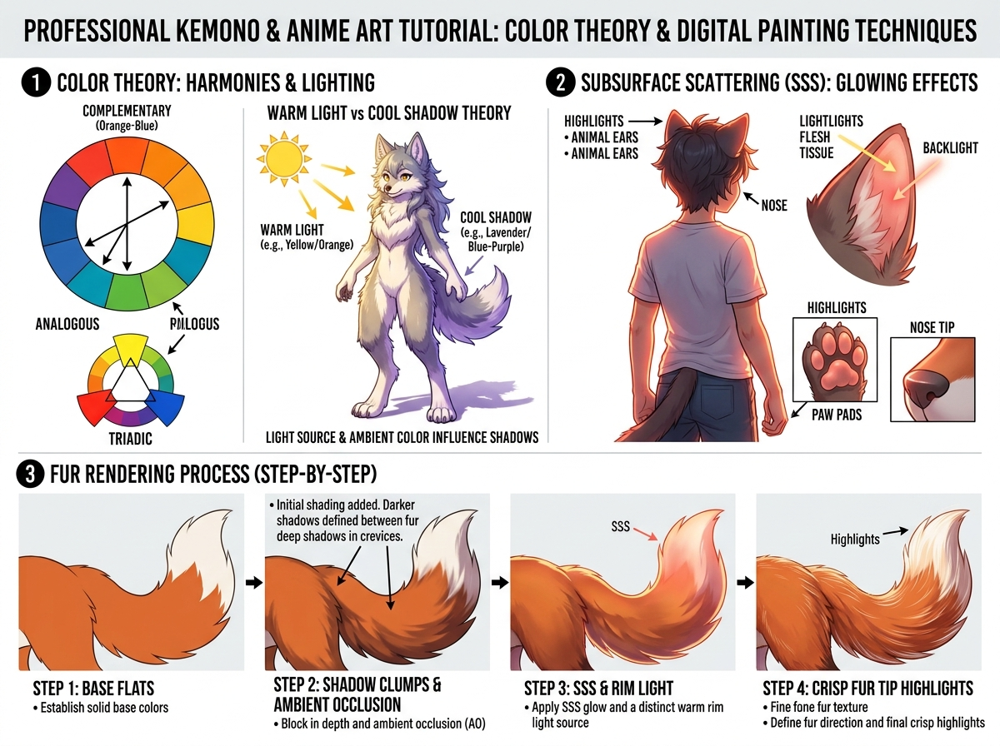

# บทเรียนที่ 8.1: ทฤษฎีสี แสงอุ่น-เงาเย็น และการลงสีขนมีชีวิต (Color Theory & Kemono Fur Rendering)

ยินดีต้อนรับสู่โลกแห่งสีสันอันมีชีวิตชีวาค่ะ! 🎨🐾✨ การลงสีไม่ใช่แค่การเทสีลงในช่องว่าง แต่คือการถ่ายทอด **"อุณหภูมิของแสง (Temperature)"** และ **"ความนุ่มฟูของเส้นขน (Fur Texture)"** ออกมาให้สัมผัสได้ผ่านสายตา

---

## 📌 สรุปหลักการสำคัญ (Core Concepts)

1. **กฎแสงอุ่น vs เงาเย็น (Warm Light vs Cool Shadow Theory)**:
   - แสงแดดธรรมชาติกลางวันมักเป็น **"แสงอุ่น (Warm Yellow/Orange)"**
   - ส่งผลให้เงาที่เกิดขึ้นในซีกตรงข้ามจะถูกเติมเต็มด้วยแสงบรรยากาศท้องฟ้า กลายเป็น **"เงาเย็น (Cool Lavender/Blue-Purple)"** เสมอ!
   - ⚠️ *ห้ามเอาสีดำมาปาดเงาเด็ดขาด!* ให้เลื่อนแถบสี (Hue Shift) ไปทางโทนม่วง/น้ำเงิน แล้วลดความสว่างลง ภาพจะสดใสมีชีวิตชีวา
2. **แสงเรืองทะลุใบหูและจมูก (Subsurface Scattering - SSS)**:
   - ผิวหนัง หูสัตว์ จมูก และอุ้งเท้า เป็นเนื้อเยื่อกึ่งโปร่งแสงที่มีเส้นเลือดหล่อเลี้ยง
   - เมื่อแสงส่องมาจากด้านหลัง (Backlight) ลำแสงจะทะลุเนื้อเยื่อและเปล่งประกายสี **ส้ม/ชมพูเรื่อ (Glowing SSS Effect)** บริเวณขอบใบหู
3. **การเรนเดอร์ขน 4 จังหวะ (4-Step Fur Rendering Process)**:
   - ไม่ต้องนั่งระบายเส้นขนทีละเส้น ให้ปูสีพื้น $\rightarrow$ กั้นเงาช่อใหญ่ $\rightarrow$ เติมแสงทะลุ SSS $\rightarrow$ สะกิดไฮไลต์ปลายขน

---

## 🧩 เจาะลึก 3 หมวดหมู่หลัก (Detailed Breakdown)

### 1. วงล้อสีและการจัดชุดสี (Color Harmonies)
ดูแผนผังโซนที่ 1 ซ้ายมือ:
- **Complementary (สีตรงข้าม)**: ส้ม-น้ำเงิน, แดง-เขียว ช่วยสร้างความโดดเด่นสะดุดตา
- **Analogous (สีข้างเคียง)**: ส้ม-เหลือง-เขียวอ่อน ให้ความกลมกลืน นุ่มนวล สบายตา
- **Triadic (สีสามเหลี่ยม)**: แดง-เหลือง-น้ำเงิน สร้างความมีพลังและสนุกสนานแบบอนิเมะ

### 2. เทคนิคลงสีแสงทะลุเนื้อเยื่อ (Subsurface Scattering - SSS)
ดูภาพประกอบโซนที่ 2 ด้านขวาบน:
- **ใบหู (Animal Ears)**: ตรงกลางใบหูมีกระดูกอ่อนและเส้นเลือด เวลาแสงแดดย้อนมาจากด้านหลัง ให้ปาดสี **ส้มแสดอมชมพูสด (High Saturation Orange-Pink)** บริเวณขอบในของใบหู
- **อุ้งเท้า & ปลายจมูก (Paw Pads & Nose Tip)**: แต้มแสงสะท้อนโทนชมพูอมส้มตามรอยพับขอบเนื้อ จะทำให้อุ้งเท้านุ่มนิ่มน่าสัมผัสขึ้น 200%!

### 3. กระบวนการลงสีขนแบบ Step-by-Step (Fur Rendering Process)
ดูแถวที่ 3 ด้านล่างสุด:
- **Step 1: Base Flats (ลงสีพื้นเรียบ)**: เทสีแท้จริงของขน (Local Color) ให้เต็มโครงสร้าง
- **Step 2: Shadow Clumps & Ambient Occlusion (กั้นเงาช่อขน)**: ปาดเงาสีม่วงอ่อน/น้ำตาลอมม่วงตามร่องซอกช่อขน เพื่อสร้างมิติความลึก (AO)
- **Step 3: SSS & Rim Light (ใส่แสงทะลุและแสงขอบ)**: แต้มสีส้มเรื่อ SSS ตรงจุดเชื่อมต่อระหว่างแสงกับเงา และลากเส้น Rim Light ขอบนอก
- **Step 4: Crisp Fur Tip Highlights (สะกิดไฮไลต์ปลายขน)**: ใช้บรัชหัวคมสะกิดเส้นไฮไลต์สีทอง/ขาวเฉพาะบริเวณยอดปลายช่อขนเท่านั้น

---

## ✏️ การบ้านและแบบฝึกหัด (Practice Drills)

1. **Drill 1: Warm Light & Cool Shadow Ball (15 นาที)**: วาดลูกบอลสีขาวใต้แสงแดดสีเหลือง แล้วระบายเงาด้วยสีม่วงพาสเทล (ห้ามใช้สีดำ)
2. **Drill 2: Glowing Ear Study (20 นาที)**: วาดหูแมวหรือหูสุนัขจิ้งจอก 1 ข้างที่มีแสงแดดย้อนด้านหลัง พร้อมลงสีแสงทะลุ SSS สีส้มชมพูเรื่อ
3. **Drill 3: Fluffy Tail Rendering (30 นาที)**: สเก็ตช์หางจิ้งจอกฟูๆ 1 พวง แล้วลงสีตามกระบวนการ 4 สเต็ป (Base -> Shadow -> SSS -> Highlights)

---

## 🔍 เช็กลิสต์ตรวจผลงาน (Self-Checklist)
- [ ] สีเงาไม่ได้ใช้สีดำหรือเทาหม่น แต่มีการขยับ Hue ไปทางสีเย็น (ม่วง/น้ำเงิน)
- [ ] ขอบใบหูหรืออุ้งเท้ามีแสงเรือง SSS สีส้มชมพูเพิ่มความมีชีวิตชีวา
- [ ] ขนไม่ได้ถูกระบายเป็นเส้นฝอยรก แต่คงรูปทรงช่อใหญ่ที่มีแสงเงาชัดเจน
