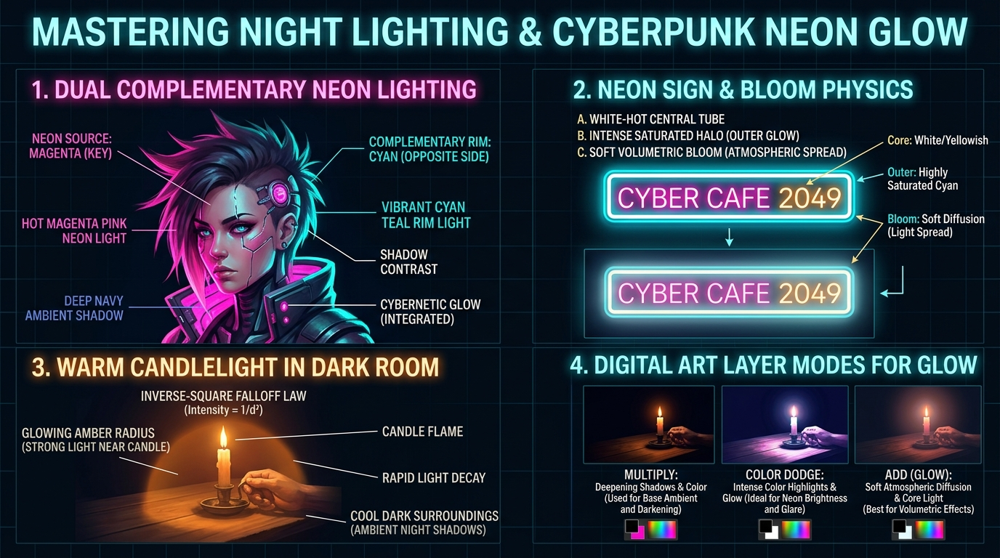

# บทเรียนที่ 8.2: แสงราตรี นีออนไซเบอร์พังก์ และแสงสังเคราะห์ (Night Lighting & Cyberpunk Neon Glow)

ยินดีต้อนรับสู่บทเรียนที่จะพาน้องๆ หลบหลีกแสงแดดกลางวันเข้าสู่ **"ราตรีกาลอันทรงเสน่ห์และมหานครไซเบอร์พังก์เรืองแสง"**! เรียนรู้การจัดแสงสังเคราะห์หลากสี แสงนีออนสาดกระทบใบหน้า และแสงเทียนอบอุ่นในห้องมืดมิดระดับภาพยนตร์ค่ะ! 🌆🌌🔮💡✨



---

## 📌 สรุปหลักการสำคัญ (Core Concepts)

1. **กลางคืนไม่ใช่สีดำมืดสนิท (Night is NOT Pure Black)**: ในงานศิลปะ กลางคืนคือ **"โลกของสีน้ำเงินเข้ม สีคราม และสีม่วง (Deep Navy & Indigo)"** มีแสงกระจายจากท้องฟ้าและดวงจันทร์ (Moonlight Ambient) คอยประคองมิติเสมอ ห้ามเทสีดำ 100% ทับภาพเด็ดขาด
2. **แสงคู่ตรงข้ามไซเบอร์พังก์ (Dual Complementary Lighting)**: สูตรสำเร็จความเท่ระดับโลก: ด้านหนึ่งสาดด้วย **แสงสีชมพูบานเย็น (Hot Magenta Key Light)** อีกด้านหนึ่งสาดด้วย **แสงสีฟ้าอมเขียว (Cyan/Teal Rim Light)** โดยมีเงาสีน้ำเงินเข้มคั่นตรงกลาง
3. **โครงสร้าง 3 ชั้นของหลอดนีออน (Neon Tube & Bloom)**: 
   - แกนกลางหลอด = สีขาวอมเหลืองสว่างจ้า ($100\%$ White Core)
   - วงรัศมีชั้นนอก = สีอิ่มตัวสูงสุด (Highly Saturated Color Halo)
   - แสงฟุ้งในอากาศ = หมอกเรืองแสงนุ่มนวล (Soft Volumetric Bloom)
4. **กฎการถดถอยของแสงไฟ (Inverse-Square Law Falloff)**: แสงเทียนหรือหลอดไฟขนาดเล็กจะมีรัศมีความสว่างลดลงอย่างรวดเร็วเป็นเท่าทวีคูณ ทำให้เกิดวงแสงสีส้มทองเข้มข้นรอบตัวเทียน และจมหายไปในความมืดรอบข้างทันที

---

## 🧩 เจาะลึกเทคนิคแสงราตรี (Step-by-Step Breakdown)

---

### ภาคที่ 1: การบีบอัดค่าน้ำหนักฉากราตรี (Night Value Compression)

```
[ บันได Value ปกติกลางวัน (1 ถึง 10) ]
[ 1 ][ 2 ][ 3 ][ 4 ][ 5 ][ 6 ][ 7 ][ 8 ][ 9 ][ 10 ] (เต็มสเกล)

[ บันได Value ในฉากราตรี (Night Compression) ]
[ 1 ][ 2 ][ 3 ][ 4 ] -------------------------> [ 10 (เฉพาะหลอดนีออน) ]
(โทน 80% ของภาพจะอัดแน่นอยู่ในโซนเข้ม 1-4 เพื่อสร้างบรรยากาศมืดลึกลับ)
```

- ในฉากกลางวัน ค่าน้ำหนักจะกระจายทั่วทั้งสเกล
- แต่ในฉากกลางคืน **80% ของภาพจะถูกบีบอัดให้อยู่ในโซนเข้ม (Low-Key Value: 1-4)**
- จะมีเพียงแค่ **"แหล่งกำเนิดแสงนีออนหรือแสงเปลวไฟเท่านั้น"** ที่แตะค่า Value สูงสุด 10 เพื่อให้เกิดคอนทราสต์เตะตาทันที

---

### ภาคที่ 2: แสงคู่ตรงข้ามไซเบอร์พังก์ (Dual Complementary Neon)

ดูแผนภาพเปรียบเทียบในภาพประกอบส่วนที่ 1:
1. **Key Light (แหล่งกำเนิดแสงหลัก - สีชมพู Magenta)**:
   - สาดเข้าด้านข้างของใบหน้าตัวละครประมาณ $45^\circ$
   - ย้อมผิว สันจมูก ริมฝีปาก และเส้นผมด้านนั้นให้เปล่งประกายสีชมพูอมม่วงสดใส
2. **Rim Light (แสงขอบตัดหลัง - สีฟ้า Cyan/Teal)**:
   - สาดมาจากด้านหลังฝั่งตรงข้าม ($180^\circ$ สวนทางกับแสงหลัก)
   - ตัดขอบสันกราม ใบหู และปลายเส้นผมด้วยสีฟ้าไซยานคมกริบ
3. **Ambient Shadow (เงามืดคั่นกลาง - Deep Navy)**:
   - บริเวณกึ่งกลางใบหน้าที่แสงทั้งสองส่องไม่ถึง จะเป็นเงาสีน้ำเงินเข้มลึก ช่วยแยกสีทั้งสองไม่ให้ชนกันจนเละ

---

### ภาคที่ 3: โครงสร้างหลอดนีออนและป้ายไฟ (Neon Sign & Bloom Physics)

```
[ Step A: แกนท่อขาวจ้า ]  ==>  [ Step B: รัศมีสีอิ่มตัว ]  ==>  [ Step C: ละอองแสงฟุ้ง Bloom ]
      ==============                ==============               (==============)
      |   WHITE    |               (   CYAN/PINK  )             ((   SOFT GLOW  ))
      ==============                ==============               (==============)
```

1. **Step A: แกนหลอดแก้ว**: วาดเส้นหรือตัวหนังสือด้วยสีขาวสว่างเกือบ 100%
2. **Step B: รัศมีรอบหลอด (Outer Glow)**: เพิ่มสโตรกหรือแอร์บรัชสีนีออนเข้มข้น (ความอิ่มตัว Saturation 100%) โอบล้อมรอบตัวอักษร
3. **Step C: Volumetric Bloom (แสงฟุ้ง)**: สร้างเลเยอร์ใหม่ด้านบนสุด ปรับโหมดเป็น `Add (Glow)` หรือ `Color Dodge` ใช้บรัชนุ่มขนาดใหญ่แตะสีนีออนจางๆ พ่นทับตัวอักษรและฉากหลังรอบข้าง

---

### ภาคที่ 4: แสงเทียนอุ่นในเงามืด (Warm Candlelight in Dark Room)

1. **Inverse-Square Law**: แสงเทียนไม่มีพลังพอจะส่องสว่างทั้งห้อง แสงจะสว่างจ้าเฉพาะใน **"รัศมี 1-2 ฟุตรอบเปลวไฟ"**
2. **Color Contrast สุดขั้ว**:
   - ใบหน้า มือ และโต๊ะที่อยู่ใกล้เทียน = ได้รับแสงสีส้มทองอมเหลืองเข้มข้น อบอุ่น นุ่มนวล
   - ด้านหลังและผนังห้องที่อยู่ห่างออกไป = ถูกความมืดสีเทาอมครามเย็นเยียบกลืนกินอย่างรวดเร็ว

---

### ภาคที่ 5: สูตรลับการใช้ Digital Layer Modes สำหรับแสงเรือง

| โหมดเลเยอร์ (Blend Mode) | หน้าที่ในการทำแสงราตรี | วิธีใช้งานที่เหมาะสม |
| :--- | :--- | :--- |
| **`Multiply` (คูณ)** | ย้อมทั้งภาพให้เข้าสู่บรรยากาศกลางคืน | เทสีน้ำเงินเข้ม/ม่วงเข้มลงบนเลเยอร์นี้ ปรับ Opacity 60-80% ทับงานวาดทั้งหมด |
| **`Color Dodge` (ดอดจ์สี)** | ดึงความอิ่มตัวและแสงสะท้อนนีออนบนผิวโลหะ/ผิวหนัง | ใช้สีนีออนปาดเบาๆ บริเวณที่แสงกระทบวัตถุ จะได้แสงที่สว่างและสีสดจัดจ้าน |
| **`Add (Glow) / Linear Dodge`** | สร้างแกนแสงจ้าและละอองหมอกเรืองรอง (Bloom) | ใช้แอร์บรัชนุ่มพ่นแสงฟุ้งรอบหลอดไฟ แสงดาบเลเซอร์ หรือดวงตาไซบอร์ก |

---

## ⚠️ ข้อผิดพลาดที่พบบ่อย (Common Pitfalls)

1. **ใช้สีดำสนิทถมเงาทั้งภาพ**: จะทำให้ภาพดูแบนและแห้งแล้ง เงากลางคืนต้องมีอุณหภูมิสี (Color Temperature) เสมอ เช่น สีน้ำเงินเข้ม สีม่วง หรือสีเขียวหัวเป็ด
2. **เปิดแสงนีออนสว่างเท่ากันทั้งภาพจนแสบตา**: ภาพไซเบอร์พังก์ต้องการ "พื้นที่มืด (Negative Space)" เพื่อพักสายตา ถ้าสว่างวาบทั้งภาพจะสูญเสียจุดโฟกัสทันที
3. **แสงนีออนไม่สาดลงบนตัวละคร**: ป้ายไฟนีออนสว่างมาก แต่ตัวละครที่ยืนอยู่ข้างใต้กลับมืดสนิท จะดูเหมือนตัดต่อภาพไม่เนียน ต้องมีแสงสะท้อนสีนีออนย้อมผิวและเสื้อผ้าเสมอ

---

## ✏️ การบ้านและแบบฝึกหัด (Practice Drills)

1. **Drill 1: The Glowing Neon Tube (20 นาที)**  
   เขียนตัวอักษรหรือสัญลักษณ์ 1 ชิ้น ให้กลายเป็นป้ายไฟนีออนเรืองแสงสมบูรณ์แบบ 3 ชั้น (แกนขาว, รัศมีสีสด, แสงฟุ้ง Bloom)
2. **Drill 2: Cyberpunk Character Portrait (35 นาที)**  
   วาดภาพพอร์ตเทรตตัวละคร Kemono หรือไซบอร์ก 1 ตัว จัดแสงแบบ Dual Complementary: ด้านซ้ายแสงชมพู Magenta, ด้านขวาแสงฟ้า Cyan
3. **Drill 3: Solitary Candle in the Dark (35 นาที)**  
   วาดมือหรือตัวละครกำลังประคองเปลวเทียนในห้องมืดสนิท โดยแสดงการไล่ระดับแสงที่ตกกระทบฝ่ามือตามกฎ Inverse-Square Law

---

## 🔍 เช็กลิสต์ตรวจผลงาน (Self-Checklist)
- [ ] ค่าน้ำหนักรวมของภาพอยู่ในโทนเข้ม (Low-Key) โดยมีแสงนีออนเป็นจุดสว่างสูงสุด
- [ ] มีการใช้คู่สีแสงที่ตัดกันอย่างทรงพลัง (เช่น ชมพู vs ฟ้า หรือ ส้ม vs น้ำเงิน)
- [ ] หลอดนีออนมีแกนสีขาวและมีรัศมีเรืองรองฟุ้ง (Bloom) เข้าสู่บรรยากาศ
- [ ] มีแสงสะท้อนสีนีออนสาดกระทบผิวและเสื้อผ้าของตัวละครอย่างสมจริง
