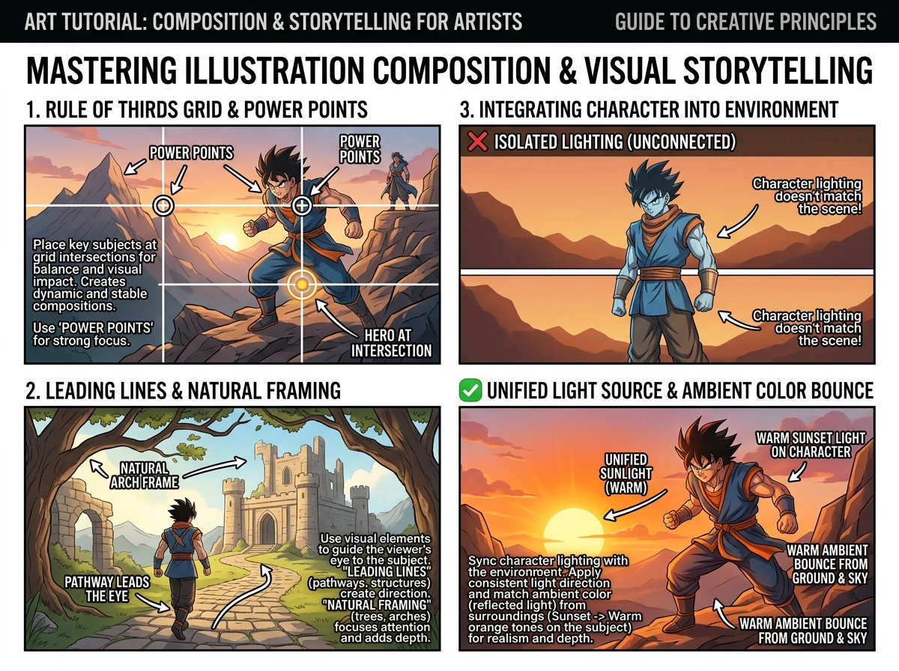

# บทเรียนที่ 9.1: การจัดองค์ประกอบภาพ เล่าเรื่องราว และรวมตัวละครเข้ากับฉาก (Mastering Composition & Storytelling)

ยินดีต้อนรับสู่บทเรียนขั้นสูงสุดของการเป็นนักวาดภาพประกอบ (Illustrator) ค่ะ! 🌄✨ เมื่อน้องวาดคน สัตว์ สิ่งของ ตึก และต้นไม้เป็นแล้ว ขั้นตอนสุดท้ายคือการนำทุกอย่างมา **"ร้อยเรียงเข้าด้วยกันเป็นภาพวาดสมบูรณ์แบบ 1 ภาพ ที่มีเรื่องราวและอารมณ์ความรู้สึก"**

---

## 📌 สรุปหลักการสำคัญ (Core Concepts)

1. **กฎ 3 ส่วนและจุดทรงพลัง (Rule of Thirds Grid & Power Points)**:
   - ตีตาราง 9 ช่อง (เส้นตัด 4 จุด) จุดตัดเหล่านี้คือ **"จุดทรงพลัง (Power Points)"**
   - ⚠️ *อย่าวางตัวละครไว้กึ่งกลางภาพเป๊ะๆ ตลอดเวลา* การวางตัวละครเยื้องไปบนจุดตัดจะสร้างไดนามิก ความตื่นเต้น และทิ้งพื้นที่ให้ฉากหลังได้เล่าเรื่อง
2. **เส้นนำสายตาและกรอบธรรมชาติ (Leading Lines & Natural Framing)**:
   - ใช้ถนน ทางเดิน แม่น้ำ หรือแนวเงา ทอดสายตาผู้ชมตรงไปยังตัวละคร
   - ใช้กิ่งไม้ พุ่มซากุระ หรือซุ้มประตู ทำหน้าที่เป็น **"กรอบรูปธรรมชาติ (Natural Arch Frame)"**
3. **การกลืนตัวละครเข้ากับสภาพแวดล้อม (Unified Light & Ambient Color Bounce)**:
   - ❌ **Isolated Lighting (ผิด)**: ตัวละครแสงขาวธรรมดา แต่ฉากหลังเป็นท้องฟ้าพระอาทิตย์ตกสีส้ม ทำให้ตัวละครดูลอยเหมือนสติกเกอร์แปะทับ
   - ✔️ **Unified Lighting (ถูก)**: แสงแดดสีส้มของพระอาทิตย์ตกต้องสาดกระทบลงบนตัวละคร และมีแสงสะท้อนสีส้มอุ่นจากผืนดินสะท้อนย้อนเข้าใต้คางและขา

---

## 🧩 เจาะลึก 3 หัวใจของการจัดองค์ประกอบ (Detailed Breakdown)

### 1. การวางตำแหน่งตัวเอกด้วย Rule of Thirds
ดูภาพที่ 1 ซ้ายบน:
- วางตัวละครฮีโร่ไว้ตรง **จุดตัดด้านขวาล่าง (Hero at Intersection)**
- ปล่อยให้ **ยอดเขาและพระอาทิตย์ตก** ครอบครองพื้นที่ 2/3 ซ้ายบน
- ผลลัพธ์: ภาพเกิดความสมดุล (Visual Balance) และมีความรู้สึกลึกล้ำ น่าค้นหา

### 2. เทคนิคการใช้เส้นนำสายตาและกรอบภาพ (Leading Lines & Framing)
ดูภาพที่ 2 ซ้ายล่าง:
- **Natural Arch Frame**: กิ่งไม้และใบไม้ด้านบน + โขดหินด้านล่าง โค้งโอบเป็นกรอบรูปธรรมชาติ ช่วยบีบสายตาผู้ชมไม่ให้หลุดออกนอกภาพ
- **Pathway Leads the Eye**: ทางเดินหินทอดโค้งจากมุมมองข้างหน้า วิ่งนำสายตาผ่านแผ่นหลังตัวละคร มุ่งตรงเข้าสู่ประตูเมืองปราสาท

### 3. เทคนิคแสงรวมเป็นหนึ่ง (Unified Light Source & Ambient Bounce)
ดูการเปรียบเทียบในภาพที่ 3 ฝั่งขวา:
- **ภาพบน (❌ Isolated Lighting)**: ตัวละครสีซีดฟ้าเย็น ไม่เข้ากับฉากหลังพระอาทิตย์ตกสีส้มแดง
- **ภาพล่าง (✔️ Unified Lighting)**: 
  - **Warm Sunlight**: ใส่แสงไฮไลต์สีทองส้มตามขอบบนของศีรษะ ไหล่ และกล้ามเนื้อตัวละคร
  - **Warm Ambient Bounce**: เงาด้านล่างของตัวละครมีแสงสะท้อนสีส้มแดงจากพื้นดินและท้องฟ้าสะท้อนเข้ามา
  - ผลลัพธ์: ตัวละครยืนอยู่ **"ในโลกใบนั้นจริงๆ"** อย่างแนบเนียนและทรงพลัง

---

## ✏️ การบ้านและแบบฝึกหัด (Practice Drills)

1. **Drill 1: Thumbnail Sketches (20 นาที)**: ตีกรอบสี่เหลี่ยมผืนผ้าขนาดเล็ก 3 กรอบ (ขนาดเท่านามบัตร) แล้วร่าง Thumbnail กฎ 3 ส่วน 3 ไอเดีย (วางตัวละครซ้าย กลาง ขวา)
2. **Drill 2: Framing & Leading Path (25 นาที)**: วาดภาพร่างที่มีทางเดินโค้งและซุ้มกิ่งไม้ นำสายตาไปสู่ตัวละครหรือปราสาทปลายทาง
3. **Drill 3: Masterpiece Sketch (40 นาที)**: นำตัวละครโปรดของน้อง 1 ตัว (คนหรือ Kemono) มายืนในฉากธรรมชาติยามเย็น พร้อมลงแสงแดดพระอาทิตย์ตกให้กลืนเป็นเนื้อเดียวกับฉาก

---

## 🔍 เช็กลิสต์ตรวจผลงาน (Self-Checklist)
- [ ] ตัวละครหลักอยู่บนจุดตัดของ Rule of Thirds หรือมีเส้นนำสายตาชี้เข้าหา
- [ ] มีการใช้ฉากหน้า (Foreground เช่น กิ่งไม้) ช่วยสร้างมิติความลึก
- [ ] สีและอุณหภูมิแสงบนตัวละครสอดคล้องกับสีของท้องฟ้าและสภาพแวดล้อม
