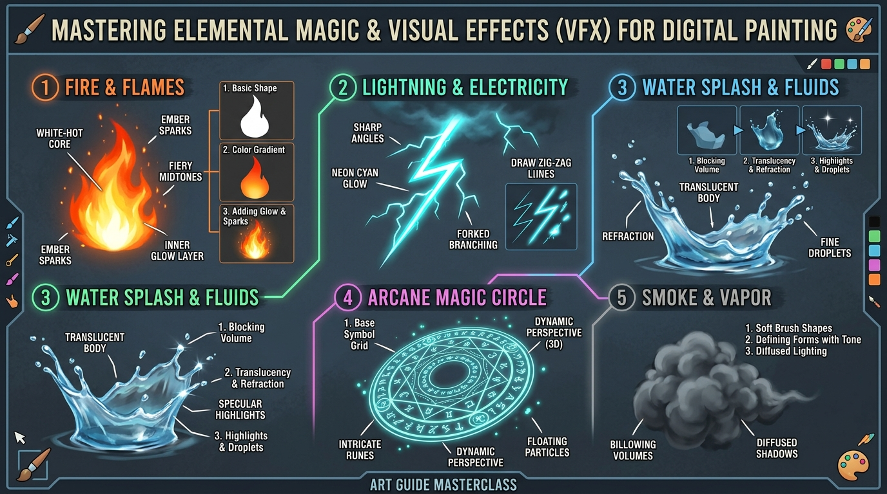

# บทเรียนที่ 9.2: เอฟเฟกต์ พลังเวท และธาตุธรรมชาติ (VFX, Magic & Elemental Effects)

ยินดีต้อนรับสู่บทเรียนที่จะเติมพลังชีวิต ความอลังการ และความตื่นตาตื่นใจให้กับภาพวาด! ปลดปล่อยพลังไฟบรรลัยกัลป์ สายฟ้าฟาด วงแหวนเวทมนตร์โบราณ และละอองน้ำกระเซ็นระดับมาสเตอร์พีซค่ะ 🔮⚡🔥



---

## 📌 สรุปหลักการสำคัญ (Core Concepts)

1. **เอฟเฟกต์พลังงานคือ "แหล่งกำเนิดแสงในตัวเอง (Self-Illuminating Light)"**: เปลวไฟ สายฟ้า และเวทมนตร์เรืองแสง **ไม่มีเงาตกกระทบบนตัวเอง** แต่ตัวมันจะทำหน้าที่เป็น Key Light สาดแสงสีใส่ตัวละครและฉากรอบข้าง
2. **Shape Language ประจำธาตุ**:
   - 🔥 **ไฟ (Fire)**: รูปทรงหยดน้ำพลิ้วไหว ปลายแหลมสะบัดขึ้นสู่ฟ้าตามกระแสอากาศร้อน
   - ⚡ **สายฟ้า (Lightning)**: เส้นหักมุมซิกแซกฉับพลัน แหลมคม ไร้ความโค้งมน
   - 💧 **น้ำ (Water)**: หยดน้ำทรงกลมมน ผิวตึง และมีความโปร่งใสมองทะลุ
   - ✨ **เวทมนตร์ (Magic)**: ลวดลายเรขาคณิต วงกลม วงรี ดาว และอักขระโบราณที่หมุนวน
3. **เทคนิคเลเยอร์แห่งแสงในดิจิทัล**: การใช้โหมดผสมสี **`Add (Glow)`**, **`Color Dodge`**, และ **`Screen`** ควบคู่กับ Airbrush ฟุ้งละมุน

---

## 🧩 เจาะลึก 5 มหาธาตุเอฟเฟกต์ (Step-by-Step Breakdown)

```
[ 🔥 เปลวไฟ (Fire) ]       [ ⚡ สายฟ้า (Lightning) ]     [ 💧 ละอองน้ำ (Water) ]       [ 🔮 วงแหวนเวท (Magic) ]
        /\                      \                             _--_                       /-------------\
       /  \  (ขอบส้มแดง)          \__                          /  () \ (ไฮไลต์)            |  *   *   *  |
      / /\ \                        \  (หักมุมฉับพลัน)         \______/ (โปร่งใส)          |   ( O ) *   |
     | (  ) | (แกนขาวเหลืองร้อน)       \                       o  .  o (หยดกระเซ็น)        |  *   *   *  |
      \____/                         \_                                                   \_____________/
```

---

### 1. เปลวไฟและการระเบิด (Fire & Explosions)
* **โครงสร้าง 3 ชั้นของเปลวไฟ**:
  1. **Core (แกนในสุด - ร้อนที่สุด)**: สีขาวอมเหลืองสว่างจ้า ($100\%$ Luminosity)
  2. **Body (เนื้อไฟชั้นกลาง)**: สีส้มทองอิ่มตัวสูง สว่างและพลิ้วไหว
  3. **Edge (เปลือกนอกสุด - เย็นที่สุด)**: สีแดงทับทิมจนถึงน้ำตาลเข้ม ค่อยๆ สลายตัวเป็นควันดำ
* **เทคนิคสะบัดเปลวไฟ**: วาดฐานไฟหนาแน่น แล้วแยกยอดเปลวไฟเป็นช่อเล็กๆ ที่หลุดลอยขึ้นด้านบน (Sparks & Embers)

---

### 2. สายฟ้าและกระแสไฟฟ้า (Lightning & Electricity)
* **พฤติกรรมสายฟ้า**: อิเล็กตรอนวิ่งหาเส้นทางที่ต้านทานน้อยที่สุด ทำให้เกิดเส้นหักมุมเฉียบพลัน
* **ขั้นตอน 3 สเต็ปสร้างสายฟ้าเทพเจ้า**:
  1. ลากเส้นแกนสายฟ้าหลักด้วยบรัชแข็งสีขาวล้วน ($100\%$ White) หักมุมแบบซิกแซกแหลม
  2. ลากเส้นแขนงย่อย (Branches) แตกกิ่งก้านออกมาจากข้อต่อ โดยเส้นแขนงต้องบางกว่าเส้นหลัก
  3. ก็อปปี้เลเยอร์ $\rightarrow$ ใส่ Gaussian Blur ฟุ้งๆ $\rightarrow$ ย้อมสีฟ้า/ม่วง/เขียวนีออน ปรับโหมดเป็น `Add (Glow)`

---

### 3. น้ำ ของเหลว และคลื่นน้ำกระเซ็น (Water Splash & Drops)
* **พฤติกรรมน้ำ**: น้ำไม่มีสีในตัวเอง แต่มันสะท้อนแสงรอบข้างและหักเหสิ่งที่อยู่เบื้องหลัง
* **สูตรลับวาดน้ำให้ดูเปียกจริง**:
  - ขึ้นรูปทรงหยดน้ำด้วยการตวัดเส้นโค้งมน (Teardrop shape)
  - ตรงกลางของหยดน้ำให้ระบายสีโปร่งใส เห็นพื้นผิวด้านหลัง 70%
  - **แต้มไฮไลต์ขอบขาวคมกริบ**: ตรงจุดที่แสงตกกระทบผิวด้านบน และแสงสะท้อนรองที่ก้นหยดน้ำ

---

### 4. วงแหวนเวทมนตร์และอักขระเรืองแสง (Magic Circles & Runes)
* **การซ้อนมิติใน Perspective**:
  - อย่าวาดวงแหวนเวทเป็นวงกลม 2D แบนๆ! ให้ใช้เครื่องมือ Transform/Perspective บิดระนาบวงแหวนให้เอียงเป็น **วงรี 3 มิติ** นอนอยู่บนพื้น หรือลอยขนานกับฝ่ามือของตัวละคร
* **การจัดองค์ประกอบวงแหวน**:
  - วงกลมขอบนอกหนา $\rightarrow$ วงแหวนตัวอักษรโบราณ/ละติน/รูน $\rightarrow$ ดาว 5 แฉกหรือ 6 แฉกตรงกลาง $\rightarrow$ อณูละอองเวทมนตร์ (Magic Dust Particles) ลอยฟุ้งรอบๆ

---

### 5. ควัน ฝุ่น และลมกระแทก (Smoke & Impact Dust)
* **ควันมีปริมาตรแบบ 3 มิติ (Volume)**:
  - วาดกลุ่มควันเป็น **"ก้อนเมฆทรงกลมที่เบียดทับซ้อนกัน (Overlapping Puffs)"**
  - มีด้านสว่างและด้านเงาชัดเจนเหมือนก้อนหินนุ่ม
  - เมื่อควันเริ่มจางหาย ให้ลดทอนความทึบแสง (Opacity) และสลายขอบให้ฟุ้งกระจายไปกับอากาศ

---

## ⚠️ ข้อผิดพลาดที่พบบ่อย (Common Pitfalls)

1. **วาดไฟแล้วใส่เงาดำบนเปลวไฟ**: ไฟคือแสงสว่าง ไม่สามารถมีเงาดำทอดลงบนตัวมันเองได้เด็ดขาด! มีเพียงควันที่อยู่เหนือไฟเท่านั้นที่มีเงา
2. **วาดสายฟ้าเป็นเส้นคลื่นงอๆ มนๆ**: สายฟ้าต้องหักมุมฉับพลัน (Sharp Angles) ยิ่งหักมุมเฉียบเท่าไหร่ สายฟ้าจะยิ่งดูมีพลังทำลายล้างสูง
3. **ลืมใส่แสงตกกระทบร่างกาย (Cast Light)**: เมื่อตัวละครถือลูกไฟหรือดาบสายฟ้า ใบหน้า แขน และเสื้อผ้าของตัวละครด้านที่หันหาเอฟเฟกต์ **จะต้องถูกย้อมด้วยสีส้มหรือสีฟ้าของพลังนั้นเสมอ**

---

## ✏️ การบ้านและแบบฝึกหัด (Practice Drills)

1. **Drill 1: The 4 Elements Study (30 นาที)**  
   วาดเอฟเฟกต์ 4 ชิ้นลงในแผ่นเดียวกัน: (1) ลูกไฟลอยกลางอากาศ (2) กระแสสายฟ้าฟาด (3) น้ำกระเซ็นเป็นมงกุฎหยดน้ำ (4) กลุ่มควันระเบิด
2. **Drill 2: 3D Magic Circle (25 นาที)**  
   ออกแบบวงแหวนเวทมนตร์ 1 วง แล้วดัด Perspective ให้นอนราบบนพื้นใต้เท้าตัวละคร พร้อมใส่เอฟเฟกต์เรืองแสง Add (Glow)
3. **Drill 3: Spellcaster in Action (45 นาที)**  
   วาดตัวละคร Kemono หรือจอมเวท 1 คน กำลังร่ายมนตร์ลูกไฟหรือสายฟ้า โดยสาดแสงสะท้อนจากพลังเวทลงบนใบหน้าและเส้นขนอย่างสมจริง

---

## 🔍 เช็กลิสต์ตรวจผลงาน (Self-Checklist)
- [ ] เอฟเฟกต์มีแกนกลางสว่างจ้า และไม่มีเงาตกทับตัวมันเอง
- [ ] เส้นสายฟ้าหักมุมคมชัด ไม่มนเลื้อย
- [ ] วงแหวนเวทมนตร์เอียงสอดคล้องกับระนาบ Perspective ของฉาก
- [ ] มีแสงสีกระทบ (Cast Light) สาดลงบนตัวละครและสภาพแวดล้อมรอบข้าง

---

[⬅️ บทเรียนที่ 9.1: การจัดองค์ประกอบภาพและเล่าเรื่อง](01-composition-and-storytelling.md) | [📖 สารบัญหลัก](../../README.md) | [บทเรียนที่ 9.3: มุมกล้องไดนามิก การย่นระยะ 3D และเลนส์ภาพยนตร์ ➡️](03-dynamic-camera-and-foreshortening.md)
