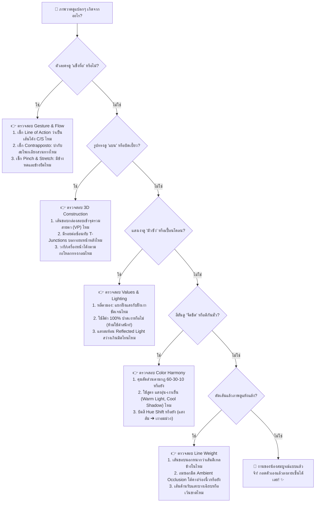

# 🩺 ผังต้นไม้วินิจฉัยและแก้ปัญหางานวาด (Visual Diagnostic Flowchart)

เวลาน้องวาดรูปเสร็จแล้วรู้สึกว่า *"เอ๊ะ ทำไมภาพมันดูแปลกๆ จัง แต่บอกไม่ถูกว่าติดตรงไหน?!"*  
อย่าเพิ่งขยำกระดาษทิ้งนะจ๊ะ! ให้เดินตาม **"ผังต้นไม้วินิจฉัยโรคงานวาด (Art Diagnostic Tree)"** ด้านล่างนี้ น้องจะชี้ชัดจุดบกพร่องและวิธีแก้ได้ภายใน 60 วินาทีแน่นอนจ้ะ! 🔍✨

---

## 🌳 ผังการวินิจฉัยหลัก (Master Diagnostic Flowchart)

---

## 📋 เช็กลิสต์ตรวจด่วน 60 วินาที (The 60-Second Scan)

| คำถามวินิจฉัย | ถ้าตอบว่า "ใช่" ให้ทำสิ่งนี้ทันที | ลิงก์บทเรียนอ้างอิง |
| :--- | :--- | :--- |
| **1. ท่ายืนดูเหมือนหุ่นยนต์เสาไฟ?** | ลบเส้นลำตัว แล้วลากเส้นโค้ง Line of Action 1 เส้นใหม่ ให้สะโพกและไหล่เอียงสวนกัน | [บทเรียน 0.2](curriculum/00-fundamentals/02-gesture-drawing-and-flow.md) |
| **2. วาดตาสองข้างแล้วหน้าดูเบี้ยว?** | ตรวจดูตาข้างที่ไกล ต้องแคบลงในแนวนอน และมีสันจมูกบังหัวตา | [คู่มือ Do's & Don'ts](visual-dos-and-donts-guide.md) |
| **3. ขาสัตว์ดูเหมือนขามนุษย์ยืดๆ?** | ดึงข้อเท้า Hock ให้ลอยสูงขึ้นจากพื้น แล้วดันหัวเข่าพุ่งไปข้างหน้าเป็นรูปตัว Z | [บทเรียน 6.2](curriculum/06-kemono-and-anthro/02-paws-and-digitigrade.md) |
| **4. เงาทำให้หน้าตัวละครดูสกปรก?** | ลบสีดำออก แล้วใช้สีม่วง/น้ำเงินหม่นบนเลเยอร์ Multiply ที่ Opacity 40% | [บทเรียน 7.1](curriculum/07-values-and-lighting/01-values-and-form-shading.md) |
| **5. ตัวละครกลืนหายไปกับฉากหลัง?** | เติม **Rim Light** สีสว่างเลาะตามแนวหาง ขนแก้ม และไหล่ด้านหลัง | [บทเรียน 7.2](curriculum/07-values-and-lighting/02-cinematic-lighting-and-moods.md) |
| **6. ขนดูเหมือนหนามแหลมคม?** | ลบเส้นฝอยเดี่ยวๆ ออก แล้วรวมขนเป็นช่อริบบิ้นก้อนใหญ่ 3-4 ช่อ | [บทเรียน 6.3](curriculum/06-kemono-and-anthro/03-ears-tails-and-fur.md) |

---

> 💡 **กฎทองจากพี่สาว:**  
> *"เมื่อมีปัญหาในการลงสี มักเกิดจาก Value; เมื่อมีปัญหาในแสงเงา มักเกิดจาก Form; เมื่อมีปัญหาใน Form มักเกิดจาก Gesture"*  
> ถ้าแก้ที่ปลายทางแล้วยังไม่สวย ให้ถอยหลังกลับมาแก้ที่กระดุมเม็ดแรกเสมอจ้ะ! 🌸
